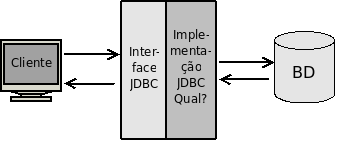
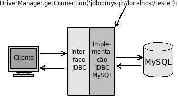
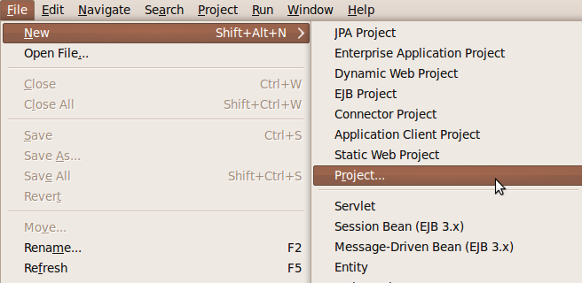
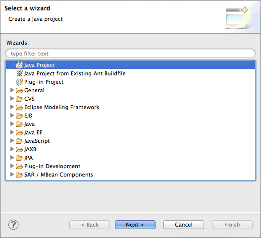
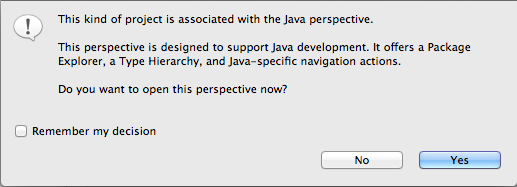
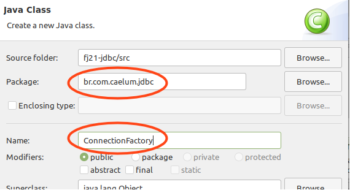
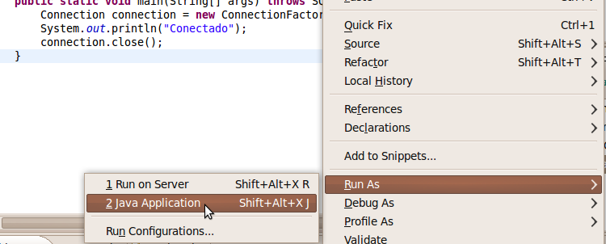
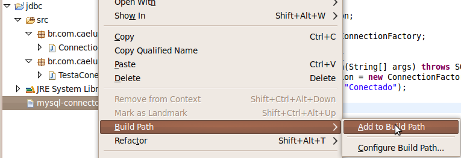
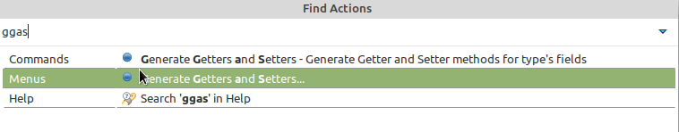
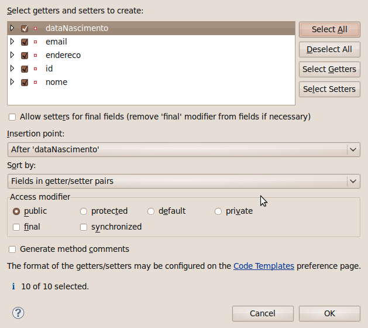

# Bancos de dados e JDBC
_"O medo é o pai da moralidade" -- Friedrich Wilhelm Nietzsche_

Ao término desse capítulo, você será capaz de:

* conectar-se a um banco de dados qualquer através da API JDBC;
* criar uma fábrica de conexões usando o design pattern __Factory__;
* pesquisar dados através de __queries__;
* encapsular suas operações com bancos de dados através de DAO - Data Access
Object.


## Por que usar um banco de dados?

Muitos sistemas precisam manter as informações com as quais eles trabalham
para permitir consultas futuras, geração de relatórios ou possíveis alterações nas informações.
Para que esses dados sejam mantidos para sempre, esses sistemas geralmente guardam
essas informações em um banco de dados, que as mantém de forma organizada e prontas para consultas.

A maioria dos bancos de dados comerciais  são os chamados relacionais, que é uma forma
de trabalhar e pensar diferente ao paradigma orientado a objetos.


O **MySQL** é o banco de dados que usaremos durante o curso. É um dos mais importantes bancos
de dados relacionais, e é gratuito, além de ter uma instalação fácil para todos os sistemas operacionais.
Depois de instalado, para acessá-lo via terminal, fazemos da seguinte forma:

```
mysql -u root -p
```

Digitando a senha em seguida, caso haja. Se o usuário `root` não tiver senha, o
comando acima não precisa do `-p`.

> **Banco de dados**
>
> Para aqueles que não conhecem um banco de dados, é recomendado ler um pouco sobre o assunto e
> também ter uma base de SQL para começar a usar a API JDBC.


O processo de armazenamento de dados é também chamado de **persistência**. A biblioteca
de persistência em banco de dados relacionais do Java é chamada JDBC (_Java DataBase Connectivity_), e também existem diversas
ferramentas  do tipo  **ORM** (_Object Relational Mapping_) que  facilitam bastante o uso do JDBC.
Neste momento, focaremos nos conceitos e no uso do JDBC. Veremos um pouco da ferramenta de ORM
Hibernate ao final deste mesmo curso e, no curso FJ-25, com muitos detalhes, recursos e tópicos avançados.

## Persistindo através de Sockets?


Para conectar-se a um banco de dados, poderíamos abrir _sockets_ diretamente com o servidor que
o hospeda, por exemplo, um Oracle ou MySQL, e nos comunicarmos com ele através de seu protocolo proprietário.

Mas você conhece o protocolo proprietário de algum banco de dados? Conhecer um protocolo complexo
em profundidade é difícil, trabalhar com ele é muito trabalhoso.

Uma segunda ideia seria utilizar uma API específica para cada banco de dados. Antigamente, no PHP, por exemplo,
a única maneira de acessar o Oracle era através de funções como `oracle_connect`, `oracle_result`,
e assim por diante. O MySQL tinha suas funções análogas, como `mysql_connect`. Essa abordagem
facilita muito nosso trabalho por não precisarmos entender o protocolo de cada banco, mas faz com
que tenhamos de conhecer uma API um pouco diferente para
cada tipo de banco. Além disso, caso precisemos trocar de banco de dados um dia, precisaremos
trocar todo o nosso código para refletir a função correta de acordo com o novo banco de dados que
estamos utilizando.

## A conexão em Java


A conexão a um banco de dados é feita de maneira elegante com Java. Para evitar que cada banco
tenha a sua própria API e um conjunto de classes e métodos, temos um único conjunto
de interfaces muito bem definidas que devem ser implementadas. Esse conjunto de interfaces
fica dentro do pacote `java.sql` e nos referiremos a ele como **JDBC**.



Entre as diversas interfaces deste pacote, existe a interface `Connection`, que define métodos para
executar uma query (como um `insert` e `select`), comitar transação, fechar a conexão, entre outros.
Caso queiramos trabalhar com o MySQL, precisamos de classes concretas que implementem essas interfaces
do pacote `java.sql`.

Esse conjunto de classes concretas é quem fará a ponte entre o código cliente que usa a API JDBC
e o banco de dados. São essas classes que sabem se comunicar através do protocolo proprietário do
banco de dados. Esse conjunto de classes recebe o nome de **driver**. Todos os principais bancos
de dados do mercado possuem **drivers JDBC** para que você possa utilizá-los com Java. O nome
driver é análogo ao que usamos para impressoras: como é impossível que um sistema operacional saiba
conversar com todo tipo de impressora existente, precisamos de um driver que faça o papel de "tradutor"
dessa conversa.




Para abrir uma conexão com um banco de dados, precisamos utilizar sempre um driver. A classe
`DriverManager` é a responsável por se comunicar com todos os drivers que você deixou
disponível. Para isso, invocamos o método estático `getConnection` com uma `String` que indica
a qual banco desejamos nos conectar.

Essa `String` - chamada de  **String de conexão JDBC** - que utilizaremos para
acessar o MySQL tem sempre a seguinte forma:

```
jdbc:mysql://ip/nome_do_banco
```

Devemos substituir `ip` pelo IP da máquina do servidor e `nome_do_banco` pelo nome do banco
de dados a ser utilizado.

Seguindo o exemplo da linha acima e tudo que foi dito até agora, seria possível rodar o exemplo abaixo e
receber uma conexão para um banco MySQL, caso ele esteja rodando na mesma máquina:

``` java
public class JDBCExemplo {
    public static void main(String[] args) throws SQLException {
        Connection conexao = DriverManager.getConnection(
          "jdbc:mysql://localhost/fj21");
        System.out.println("Conectado!");
        conexao.close();
    }
}
```

Repare que estamos deixando passar a `SQLException`, que é uma exception _checked_, lançada
por muitos dos métodos da API de JDBC. Numa aplicação real devemos utilizar `try/catch` nos
lugares que julgamos haver possibilidade de recuperar de uma falha com o banco de dados.
Também precisamos tomar sempre cuidado para fechar todas as conexões que foram abertas.

Ao testar o código acima, recebemos uma exception. A conexão não pôde ser aberta.
Recebemos a mensagem:

```
java.sql.SQLException: No suitable driver found for 
    jdbc:mysql://localhost/fj21
```

Por quê?

O sistema ainda não achou uma implementação de **driver JDBC** que pode ser usada para
abrir a conexão indicada pela URL `jdbc:mysql://localhost/fj21`.

O que precisamos fazer é adicionar o driver do MySQL ao _classpath_, ou seja, o arquivo **.jar** contendo a
implementação JDBC do MySQL (_mysql connector_) precisa ser colocado em um lugar visível pelo
seu projeto ou adicionado  à variável de ambiente `CLASSPATH`. Como usaremos o Eclipse, depois de adicionar o jar do driver JDBC do MySQL na pasta do projeto, faremos
isso através de um clique da direita em nosso projeto, _Build Path_ e em
_Add to Build Path_. Veremos isto passo a passo nos exercícios.

> **E o Class.forName?**
>
> Até a versão 3 do JDBC, antes de chamar o `DriverManager.getConnection()` era necessário registrar o driver
> JDBC que iria ser utilizado através do método `Class.forName("com.mysql.jdbc.Driver")`, no caso do MySQL,
> que carregava essa classe, e essa se comunicava com o `DriverManager`.
>
> A partir do JDBC 4, que está presente no Java 6, esse passo não é mais necessário. Mas lembre-se: caso você utilize JDBC em um projeto com Java 5 ou anterior, será preciso fazer o registro do Driver JDBC, carregando a sua classe, que vai se registrar no `DriverManager`.
>
> Isso também pode ser necessário em alguns servidores de aplicação e web, como no Tomcat 7 ou posterior, por proteção para possíveis vazamentos de memória:
>
> http://bit.ly/18BpDfG


### Alterando o banco de dados
Teoricamente, basta alterar as duas `Strings` que escrevemos para mudar de um banco para outro. Porém,
não é tudo tão simples assim! O código `SQL` que veremos a seguir pode funcionar em um banco e não em
outros. Depende de quão aderente ao padrão `ANSI SQL` é seu banco de dados.

Isso só causa dor de cabeça e existem projetos que resolvem isso, como é o caso do
Hibernate (www.hibernate.org) e da especificação JPA (Java Persistence API). Veremos um pouco
do Hibernate ao final desse curso e bastante sobre ele no FJ-25.

### Drivers de outros bancos de dados
Os drivers podem ser baixados normalmente no site do fabricante do banco de dados.

Alguns casos, como no Microsoft SQL Server, existem outros grupos que desenvolvem o driver em
http://jtds.sourceforge.net . Enquanto isso, você pode achar o driver do MYSQL (chamado de
__mysql connector__) no site http://www.mysql.org.


## Fábrica de Conexões
Em determinado momento de nossa aplicação, gostaríamos de ter o controle sobre a construção dos
objetos da nossa classe. Muito pode ser feito através do construtor, como saber quantos objetos
foram instanciados ou fazer o log sobre essas instanciações.

Às vezes, também queremos controlar um processo muito repetitivo e trabalhoso, como abrir uma conexão
com o banco de dados. Tomemos como exemplo a classe a seguir, que seria responsável por abrir uma conexão
com o banco:

``` java
public class ConnectionFactory {
    public Connection getConnection() {
        try {
            return DriverManager.getConnection(
          "jdbc:mysql://localhost/fj21", "root", "<SENHA DO BANCO AQUI>");
        } catch (SQLException e) {
            throw new RuntimeException(e);
        }
    }
}
```

Assim, sempre que quisermos obter uma conexão com o banco no nosso código, usaremos o comando a seguir:

``` java
Connection con = new ConnectionFactory().getConnection();
```

Note que o método `getConnection()` é uma fábrica de conexões, isto é, ele cria novas
conexões para nós. Basta invocar o método e recebemos uma conexão pronta para uso, não
importando de onde ela veio e eventuais detalhes de criação. Portanto, vamos chamar a
classe de `ConnectionFactory` e o método de `getConnection`.

Encapsulando dessa forma, podemos mais tarde mudar a obtenção de conexões, para, por exemplo,
usar um mecanismo de _pooling_, que é fortemente recomendável em uma aplicação real.

> **Tratamento de Exceções**
>
> Repare que estamos fazendo um `try/catch` em `SQLException` e relançando-a como uma `RuntimeException`.
> Fazemos isso para que o seu código que chamará a fábrica de conexões não fique acoplado com a API de JDBC.
> Toda vez que tivermos que lidar com uma `SQLException`, vamos relançá-las como `RuntimeException`.
>
> Poderíamos ainda criar nossa própria exceção para indicar que ocorreu um erro dentro da nossa Factory,
> algo como uma `ConnectionFactoryException`.


## Design Patterns


Orientação a objetos resolve as grandes dores de cabeça que tínhamos na programação procedural,
restringindo e centralizando responsabilidades.

Mas alguns problemas não podemos resolver simplesmente com orientação a objetos, pois não existe palavra
chave para uma funcionalidade tão específica.

Alguns desses pequenos problemas aparecem com tanta frequência que as pessoas desenvolvem uma solução
"padrão" para ele. Com isso, ao nos defrontarmos com um desses problemas clássicos, podemos rapidamente
implementar essa solução genérica com uma ou outra modificação, de acordo com nossa necessidade.
Essas soluções padrões tem o nome de  __**Design Patterns**__ (**Padrões de Projeto**).

A melhor maneira para aprender o que é um __Design Pattern__ é vendo como surgiu sua necessidade.

A nossa `ConnectionFactory` implementa o design pattern `Factory`, que prega o encapsulamento da
construção (fabricação) de objetos complicados.

> **A bíblia dos Design Patterns**
>
> O livro mais conhecido de __Design Patterns__ foi escrito em 1995 e tem trechos de código em C++ e
> Smalltalk. Mas o que realmente importa são os conceitos e os diagramas que fazem desse livro
> independente de qualquer linguagem. Além de tudo, o livro é de leitura agradável.
>
> **Design Patterns, Erich Gamma _et al._**


## Exercícios: ConnectionFactory


1. Nos computadores da Caelum, clique no ícone do Eclipse no Desktop;
  > **Baixando o Eclipse em casa**
  >
  > Estamos usando o Eclipse for Java EE Developers. Você pode obtê-lo direto no site do Eclipse em
  > www.eclipse.org

  

  * Feche a tela de _Welcome_ caso ela apareça

  * Vamos criar um projeto no Eclipse chamado `fj21-jdbc`.

  * Vá em **File -> New -> Project**:

  

  * Selecione **Java Project** e clique em **Next**:

  

  * Coloque o nome do projeto como **fj21-jdbc** e clique em **Finish**:

  

  * Uma nova janela surgirá perguntando se você quer criar um novo **module-info.java**, clique em **Don't Create**

  * Aceite a mudança de perspectiva:

  
2. 
  Copie o driver do `MySQL` para o seu projeto.

  * no seu Desktop, clique no atalho **Atalho para arquivos do cursos**;
  * copie a pasta **21** para o seu Desktop;
  * entre na pasta **21/projeto-jdbc/mysql** do Desktop, clique com o botão direito do mouse no driver do MySQL e copie;
  * vá para sua pasta principal (`home`);
  * entre no diretório workspace, `fj21-jdbc`;
  * clique com o botão direito do mouse e cole o driver aqui: você acaba de colocar o arquivo ".jar" no seu projeto.
3. Vamos criar a classe que fabrica conexões:

  * Clique em **File -> New -> Class**.

  * Crie-a no pacote `br.com.caelum.jdbc` e nomeie-a como `ConnectionFactory`.

  

  * Clique em **Finish**

  * No código, crie o método `getConnection`, que retorna uma nova conexão. Quando perguntado,
  importe as classes do pacote `java.sql` (__cuidado__ para não importar NADA de `com.mysql`).
  * Preste atenção aos parâmetros do método `getConnection`, o último é a senha do usuário que estamos usando, no caso o **root**. Esse usuário está configurado com a senha `""` (aspas vazias).

``` java
  public Connection getConnection() {
      try {
          return DriverManager.getConnection(
  "jdbc:mysql://localhost/fj21", "root", "");
      } catch (SQLException e) {
          throw new RuntimeException(e);
      }
  }
```
1. Crie uma classe chamada `TestaConexao` no pacote `br.com.caelum.jdbc.teste`.
  Todas as nossas classes de teste deverão ficar nesse pacote.

  * Crie um método `main` dentro da classe. Use o atalho do Eclipse para ajudar.

  * Dentro do `main`, fabrique uma conexão usando a `ConnectionFactory` que criamos.
  Vamos apenas testar a abertura da conexão e depois fechá-la com o método `close`:

``` java
      Connection connection = new ConnectionFactory().getConnection();
      System.out.println("Conexão aberta!");
      connection.close();
```

  * Trate os erros com throws. ( Use: Ctrl + 1 e escolha "`add throws declaration`").

1. Antes de testar a conexão com o banco de dados através da classe `TestaConexao`, verifique se o banco de dados `fj21` existe.

   * Abra o terminal e digite:

``` bash
  mysql -u root
```

  Lembrando que, se houver senha para logar com o banco, é preciso escrever
  `mysql -u root -p` e, em seguida, digitar a senha do banco de dados.

   * Dentro do MySQL, procure pelo banco de dados `fj21` com o comando:

``` sql
  show databases;
```
  
  Se ele não existir, crie com o comando:

``` sql
  create database fj21;
```

2. Rode a sua classe `TestaConexao` pelo Eclipse.

  * Clique da direita na sua classe `TestaConexao`

  * Escolha **Run as**, **Java Application** (caso prefira, aprenda a tecla de atalho para
  agilizar nas próximas execuções)

  
1. A aplicação não funciona pois o driver não foi encontrado? Esquecemos de
  colocar o JAR no __classpath__! (_Build Path_ no Eclipse)

  * Clique no seu projeto com o botão da direita e escolha _Refresh_ (ou pressione **F5**).
  * Selecione o seu driver do MySQL, clique da direita e escolha **Build Path**,
  **Add to Build Path**:

  

  * Rode novamente sua aplicação `TestaConexao` agora que colocamos o driver no classpath.


## A tabela Contato


Para criar uma tabela nova, primeiro devemos acessar o terminal e fazer o comando para
logarmos no mysql:

``` bash
  mysql -u root
```

se não houver senha, ou

``` bash
  mysql -u root -p
```

se houver, digitando em seguida a senha, que o instrutor dirá qual é.

Nos preparamos para usar o banco de dados **fj21**:

``` sql
  use fj21;
```

A seguinte tabela será usada nos exemplos desse capítulo:

``` sql
  create table contatos (
    id BIGINT NOT NULL AUTO_INCREMENT,
    nome VARCHAR(255),
    email VARCHAR(255),
    endereco VARCHAR(255),
    dataNascimento DATE,
    primary key (id)
  );
```

No banco de dados relacional, é comum representar um contato (entidade) em uma tabela de contatos.

## Javabeans


O que são Javabeans? A pergunta que não quer se calar pode ser respondida muito facilmente uma vez que
uma das maiores confusões feitas aí fora é entre Javabeans e Enterprise Java Beans (EJB).


Javabeans são classes que possuem o construtor sem argumentos e métodos de acesso do tipo `get` e
`set`! Mais nada! Simples, não? Já os EJBs costumam ser javabeans com características mais avançadas e são
o assunto principal do curso FJ-31  da Caelum.

Podemos usar _beans_ em diversas situações, como em classes que representam nosso modelo de dados.


A seguir, você vê um exemplo de uma classe JavaBean que seria equivalente ao nosso modelo de entidade
do banco de dados:

``` java
  package br.com.caelum.jdbc.modelo;

  public class Contato {

      private Long id;
      private String nome;
      private String email;
      private String endereco;
      private Calendar dataNascimento;

    // métodos get e set para id, nome, email, endereço e dataNascimento

    public String getNome() {
      return this.nome;
    }
    public void setNome(String novo) {
      this.nome = novo;
    }

    public String getEmail() {
      return this.email;
    }
    public void setEmail(String novo) {
      this.email = novo;
    }

    public String getEndereco() {
      return this.endereco;
    }
    public void setEndereco(String novo) {
      this.endereco = novo;
    }

    public Long getId() {
      return this.id;
    }
    public void setId(Long novo) {
      this.id = novo;
    }

    public Calendar getDataNascimento() {
      return this.dataNascimento;
    }
    public void setDataNascimento(Calendar dataNascimento) {
      this.dataNascimento = dataNascimento;
    }
  }
```

A especificação JavaBeans é muito grande e mais informações sobre essa vasta área que é a base dos
componentes escritos em Java pode ser encontrada em:

http://docs.oracle.com/javase/tutorial/javabeans/

> **Métodos getters e setters**
>
> Um erro muito comum cometido pelos desenvolvedores Java é a criação dos métodos getters e setters
> indiscriminadamente, sem ter a real necessidade da existência de tais métodos.
>
> Existe um artigo no blog da Caelum que trata desse assunto:
> http://blog.caelum.com.br/2006/09/14/nao-aprender-oo-getters-e-setters/
>
> Os cursos FJ-11 e FJ-22 também mostram isso claramente, quando criam algumas entidades
> que não possuem apenas getters e setters.


Se você quer saber mais sobre Enterprise Java Beans (EJB), a Caelum oferece o curso FJ-31. Não os
confunda com Java Beans!

## Inserindo dados no banco


Para inserir dados em uma tabela de um banco de dados entidade-relacional, basta usar a cláusula
**INSERT**. Precisamos especificar quais os campos que desejamos atualizar e os valores.

Primeiro o código SQL:

``` java
  String sql = "insert into contatos " +
          "(nome,email,endereco, dataNascimento)" +
          " values ('" + nome + "', '" + email + "', '" + 
          endereco + "', '"+ dataNascimento +"')";
```

O exemplo acima possui três pontos negativos que são importantíssimos. O primeiro é que o programador
que não escreveu o código original não consegue bater o olho e entender o que está escrito. O que o
código acima faz? Lendo rapidamente fica difícil. Mais difícil ainda é saber se faltou uma vírgula,
um fecha parênteses talvez? E ainda assim, esse é um caso simples. Existem tabelas com 10, 20, 30 e
até mais campos, tornando inviável entender o que está escrito no SQL misturado com as concatenações.

Outro problema é o clássico "preconceito contra Joana D'arc", formalmente chamado de **SQL Injection**.
O que acontece quando o contato a ser adicionado possui no nome uma aspas simples? O código SQL se
quebra todo e para de funcionar ou, pior ainda, o usuário final é capaz de alterar seu código SQL para
executar aquilo que ele deseja (SQL injection)... tudo isso porque escolhemos aquela linha de código
e não fizemos o escape de caracteres especiais.

Mais um problema que enxergamos aí é na data. Ela precisa ser passada como uma `String` e no formato
que o banco de dados entenda, portanto, se você possui um objeto `java.util.Calendar`, que é o nosso
caso, você precisará fazer a conversão desse objeto para a String.

Por esses três motivos não usaremos código SQL como mostrado anteriormente. Vamos imaginar algo mais
genérico e um pouco mais interessante:

``` java
  String sql = "insert into contatos " +
              "(nome,email,endereco,dataNascimento) " +
              "values (?,?,?,?)";
```

Existe uma maneira em Java de escrever o código SQL como no primeiro exemplo dessa seção (com
concatenações de `String`). Essa maneira não será ensinada durante o curso pois é uma péssima prática
que dificulta a manutenção do seu projeto.

Perceba que não colocamos os pontos de interrogação de brincadeira, mas sim porque realmente não sabemos
o que desejamos inserir. Estamos interessados em executar aquele código mas não sabemos ainda quais são
os **parâmetros** que utilizaremos nesse código SQL que será executado, chamado de `statement`.


As cláusulas são executadas em um banco de dados através da interface `PreparedStatement`. Para receber
um `PreparedStatement` relativo à conexão, basta chamar o método `prepareStatement`, passando como
argumento o comando SQL com os valores vindos de variáveis preenchidos com uma interrogação.

``` java
  String sql = "insert into contatos " +
                  "(nome,email,endereco,dataNascimento) " +
                  "values (?,?,?,?)";
  PreparedStatement stmt = connection.prepareStatement(sql);
```

Logo em seguida, chamamos o método `setString` do `PreparedStatement` para preencher os valores que
são do tipo `String`, passando a posição (começando em 1) da interrogação no SQL e o valor que deve
ser colocado:

``` java
  // preenche os valores
  stmt.setString(1, "Caelum");
  stmt.setString(2, "contato@caelum.com.br");
  stmt.setString(3, "R. Vergueiro 3185 cj57");
```

Precisamos definir também a data de nascimento do nosso contato, para isso, precisaremos de um objeto
do tipo `java.sql.Date` para passarmos para o nosso `PreparedStatement`. Nesse exemplo, vamos passar
a data atual. Para isso, vamos passar um `long` que representa os milissegundos da data atual para
dentro de um `java.sql.Date`, que é o tipo suportado pela API JDBC. Vamos utilizar a classe
`Calendar` para conseguirmos esses milissegundos:

``` java
  java.sql.Date dataParaGravar = new java.sql.Date(
          Calendar.getInstance().getTimeInMillis());
  stmt.setDate(4, dataParaGravar);
```

Por fim, uma chamada a `execute()` executa o comando SQL:

``` java
  stmt.execute();
```

Imagine todo esse processo sendo escrito toda vez que desejar inserir algo no banco? Ainda não
consegue visualizar o quão destrutivo isso pode ser?

Veja o exemplo abaixo, que abre uma conexão e insere um contato no banco:

``` java
  public class JDBCInsere {

      public static void main(String[] args) throws SQLException {

          // conectando
          Connection con = new ConnectionFactory().getConnection();

          // cria um preparedStatement
          String sql = "insert into contatos" +
                  " (nome,email,endereco,dataNascimento)" +
                  " values (?,?,?,?)";
          PreparedStatement stmt = con.prepareStatement(sql);

          // preenche os valores
          stmt.setString(1, "Caelum");
          stmt.setString(2, "contato@caelum.com.br");
          stmt.setString(3, "R. Vergueiro 3185 cj57");
          stmt.setDate(4, new java.sql.Date(
                  Calendar.getInstance().getTimeInMillis()));

          // executa
          stmt.execute();
          stmt.close();

          System.out.println("Gravado!");

          con.close();
      }
  }
```

### Para saber mais: Fechando a conexão propriamente
Não é comum utilizar JDBC diretamente hoje em dia. O mais praticado é o uso de alguma API de
ORM como a **JPA** ou o **Hibernate**. Tanto na JDBC quanto em bibliotecas ORM deve-se prestar
atenção no momento de fechar a conexão.

O exemplo dado acima não a fecha caso algum erro ocorra no momento de inserir um dado no banco de
dados. O comum é fechar a conexão em um bloco `finally`:

``` java
   public class JDBCInsere {
        public static void main(String[] args) throws SQLException {
          Connection con = null;
      try {
              con = new ConnectionFactory().getConnection();
  
        // faz um monte de operações.
        // que podem lançar exceptions runtime e SQLException
      } catch(SQLException e) {
        System.out.println(e);
      } finally {
              con.close();
            }
        }
    }
```

Dessa forma, mesmo que o código dentro do `try` lance exception, o `con.close()`
será executado. Garantimos que não deixaremos uma conexão pendurada sem uso.
Esse código pode ficar muito maior se quisermos ir além. Pois o que acontece no caso
de `con.close` lançar uma exception? Quem a tratará?

Trabalhar com recursos caros, como conexões, sessões, threads e arquivos, sempre deve ser
muito bem pensado. Deve-se tomar cuidado para não deixar nenhum desses recursos abertos,
pois poderá vazar algo precioso da nossa aplicação. Como veremos durante o curso, é importante
centralizar esse tipo de código em algum lugar, para não repetir uma tarefa complicada como
essa.

Além disso, há a estrutura do Java 7 conhecida como _try-with-resources_. Ela permite
declarar e inicializar, dentro do `try`, objetos que implementam `AutoCloseable`.
Dessa forma, ao término do `try`, o próprio compilador inserirá instruções para invocar
o `close` desses recursos, além de se precaver em relação a exceções que podem surgir
por causa dessa invocação. Nosso código ficaria mais reduzido e organizado, além do
escopo de `con` só valer dentro do `try`:

``` java
  try(Connection con = new ConnectionFactory().getConnection()) {
    // faz um monte de operações.
    // que podem lançar exceptions runtime e SQLException
  } catch(SQLException e) {
    System.out.println(e);
  }
```


### Para saber mais: A má prática Statement
Em vez de usar o `PreparedStatement`, você pode usar uma interface mais simples chamada
`Statement`, que simplesmente executa uma cláusula SQL no método `execute`:

``` java
    Statement stmt = con.createStatement();
    stmt.execute("INSERT INTO ...");
    stmt.close();
```

Mas prefira a classe `PreparedStatement` que é mais rápida que `Statement` e deixa seu código
muito mais limpo.

Geralmente, seus comandos SQL conterão valores vindos de variáveis do programa Java; usando
`Statements`, você terá que fazer muitas concatenações, mas usando `PreparedStatements`, isso fica
mais limpo e fácil.

### Para saber mais: JodaTime
A API de datas do Java, mesmo considerando algumas melhorias da `Calendar` em relação a `Date`, ainda
é muito pobre. Na versão 8 do Java temos uma API nova, a `java.time`, que facilita bastante o trabalho. Ela é baseada na  excelente biblioteca de datas chamada JodaTime.

## DAO - Data Access Object


Já foi possível sentir que colocar código SQL dentro de suas classes de lógica é algo nem um pouco
elegante e muito menos viável quando você precisa manter o seu código.

Quantas vezes você não ficou bravo com o programador responsável por aquele código ilegível?

A ideia a seguir é remover o código de acesso ao banco de dados de suas classes de lógica e colocá-lo
em uma classe responsável pelo acesso aos dados. Assim o código de acesso ao banco de dados fica em um
lugar só, tornando mais fácil a manutenção.

Que tal se pudéssemos chamar um método adiciona que adiciona um `Contato` ao banco?

Em outras palavras quero que o código a seguir funcione:

``` java
      // adiciona os dados no banco
      Misterio bd = new Misterio();
      bd.adiciona("meu nome", "meu email", "meu endereço", meuCalendar);
```

Tem algo estranho nesse código. Repare que todos os parâmetros que estamos passando são as
informações do contato. Se contato tivesse 20 atributos, passaríamos 20 parâmetros? Java é orientado
a `Strings`? Vamos tentar novamente: em outras palavras quero que o código a seguir funcione:

``` java
      // adiciona um contato no banco
      Misterio bd = new Misterio();

      // método muito mais elegante
      bd.adiciona(contato);
```

Tentaremos chegar ao código anterior: seria muito melhor e mais elegante poder chamar um único método
responsável pela inclusão, certo?

``` java
  public class TestaInsere {

    public static void main(String[] args) {

        // pronto para gravar
        Contato contato = new Contato();
        contato.setNome("Caelum");
        contato.setEmail("contato@caelum.com.br");
        contato.setEndereco("R. Vergueiro 3185 cj87");
        contato.setDataNascimento(Calendar.getInstance());

        // grave nessa conexão!!!
        Misterio bd = new Misterio();

        // método elegante
        bd.adiciona(contato);

        System.out.println("Gravado!");
    }
  }
```

O código anterior já mostra o poder que alcançaremos: através de uma única classe seremos capazes de
acessar o banco de dados e, mais ainda, somente através dessa classe será possível acessar os dados.


Esta ideia, inocente à primeira vista, é capaz de isolar todo o acesso a banco em classes bem simples,
cuja instância é um **objeto** responsável por **acessar** os **dados**. Da responsabilidade deste objeto
surgiu o nome de **Data Access Object** ou simplesmente **DAO**, um dos mais famosos padrões de
projeto (_design pattern_).

O que falta para o código acima funcionar é uma classe chamada `ContatoDao` com um método chamado
`adiciona`. Vamos criar uma que se conecta ao banco ao construirmos uma instância dela:

``` java
  public class ContatoDao {

    // a conexão com o banco de dados
    private Connection connection;

    public ContatoDao() {
      this.connection = new ConnectionFactory().getConnection();
    }
  }
```


Agora que todo `ContatoDao` possui uma conexão com o banco, podemos focar no método `adiciona`, que
recebe um `Contato` como argumento e é responsável por adicioná-lo através de código SQL:

``` java
  public void adiciona(Contato contato) {
      String sql = "insert into contatos " +
              "(nome,email,endereco,dataNascimento)" +
              " values (?,?,?,?)";

      try {
          // prepared statement para inserção
          PreparedStatement stmt = con.prepareStatement(sql);

          // seta os valores

          stmt.setString(1,contato.getNome());
          stmt.setString(2,contato.getEmail());
          stmt.setString(3,contato.getEndereco());
          stmt.setDate(4, new Date(
                  contato.getDataNascimento().getTimeInMillis()));

          // executa
          stmt.execute();
          stmt.close();
      } catch (SQLException e) {
          throw new RuntimeException(e);
      }
  }
```

Encapsulamos a `SQLException` em uma `RuntimeException` mantendo a ideia anterior da
`ConnectionFactory` de desacoplar o código de API de JDBC.

## Exercícios: Javabeans e ContatoDao
1. Crie a classe de `Contato` no pacote `br.com.caelum.jdbc.modelo`. Ela será nosso
  JavaBean para representar a entidade do banco. Deverá ter id, nome, email, endereço e
  uma data de nascimento.

  Coloque os atributos na classe e gere os getters e setters para cada atributo:

``` java
  public class Contato {
    private Long id;
    private String nome;
    private String email;
    private String endereco;
    private Calendar dataNascimento;
  }
```

  **Dica:** use o atalho do Eclipse para gerar os getters e setters. Aperte `Ctrl + 3`,
  digite `ggas` que é a abreviação de `Generate getters and setters` e selecione todos os
  getters e setters.

  
  
1. Vamos desenvolver nossa classe de DAO. Crie a classe `ContatoDao` no pacote
  `br.com.caelum.jdbc.dao`. Seu papel será gerenciar a conexão e inserir Contatos no
  banco de dados.

  Para a conexão, vamos criá-la no construtor e salvar em um atributo:

``` java
  public class ContatoDao {

    // a conexão com o banco de dados
    private Connection connection;

    public ContatoDao() {
      this.connection = new ConnectionFactory().getConnection();
    }

  }
```

  Use o Eclipse para ajudar com os imports! (atalho _Ctrl + Shift + O_)

  O próximo passo é criar o método de adição de contatos. Ele deve receber um objeto do
  tipo `Contato` como argumento e encapsular totalmente o trabalho com o banco de dados.
  Internamente, use um `PreparedStatement` como vimos na aula para executar o SQL:

``` java
  public void adiciona(Contato contato) {
      String sql = "insert into contatos " +
              "(nome,email,endereco,dataNascimento)" +
              " values (?,?,?,?)";

      try {
          // prepared statement para inserção
          PreparedStatement stmt = connection.prepareStatement(sql);

          // seta os valores
          stmt.setString(1,contato.getNome());
          stmt.setString(2,contato.getEmail());
          stmt.setString(3,contato.getEndereco());
          stmt.setDate(4, new Date(
                  contato.getDataNascimento().getTimeInMillis()));

          // executa
          stmt.execute();
          stmt.close();
      } catch (SQLException e) {
          throw new RuntimeException(e);
      }
  }
```

  **ATENÇÃO: Lembre-se de importar as classes de SQL do pacote `java.sql`, inclusive a classe Date!**

1. Antes de testar a inserção de um contato no banco de dados, verifique se a tabela `contatos` existe.

   * Abra o terminal e digite:

``` bash
  mysql -u root
```

  Lembrando que, se houver senha para logar com o banco, é preciso escrever
  `mysql -u root -p` e, em seguida, digitar a senha do banco de dados.

   * Dentro do MySQL, liste todas as tabelas já criadas com o comando:

``` sql
  show tables;
```

  Procure pela tabela `contatos`. Se ela não existir, crie com o comando:

``` sql
  create table contatos (
    id BIGINT NOT NULL AUTO_INCREMENT,
    nome VARCHAR(255),
    email VARCHAR(255),
    endereco VARCHAR(255),
    dataNascimento DATE,
    primary key (id)
  );
```

  (Dica: esse código encontra-se no arquivo `contatos.sql` na
  pasta `21/projeto-jdbc`)

1. Para testar nosso DAO, desenvolva uma classe de testes com o método `main`. Por exemplo,
  uma chamada `TestaInsere` no pacote `br.com.caelum.jdbc.teste`. Gere o `main` pelo
  Eclipse.

  O nosso programa de testes deve, dentro do `main`, criar um novo objeto `Contato` com
  dados de teste e chamar a nova classe `ContatoDao` para adicioná-lo ao banco de dados:

``` java
  // pronto para gravar
  Contato contato = new Contato();
  contato.setNome("Caelum");
  contato.setEmail("contato@caelum.com.br");
  contato.setEndereco("R. Vergueiro 3185 cj57");
  contato.setDataNascimento(Calendar.getInstance());

  // grave nessa conexão!!!
  ContatoDao dao = new ContatoDao();

  // método elegante
  dao.adiciona(contato);

  System.out.println("Gravado!");
```

  Execute seu programa e veja se tudo correu bem.
1. Verifique se o contato foi adicionado. Abra o terminal e digite:

``` sql
    mysql -u root
    use fj21;
    select * from contatos;
```

  Lembrando que se houver senha para o usuário `root`, o primeiro comando deve ser: `mysql -u root -p`.
  Digite `exit` para sair do console do MySQL.


## Fazendo pesquisas no banco de dados


Para pesquisar também utilizamos a interface `PreparedStatement` para montar nosso comando
SQL. Mas como uma pesquisa possui um retorno (diferente de uma simples inserção),
usaremos o método `executeQuery` que retorna todos os registros de uma determinada query.


O objeto retornado é do tipo `ResultSet` do JDBC, o que nos permite navegar por seus registros através
do método  `next`. Esse método retornará `false` quando chegar ao fim da pesquisa, portanto ele é
normalmente utilizado para fazer um laço nos registros:

``` java
  // pega a conexão e o Statement
  Connection con = new ConnectionFactory().getConnection();
  PreparedStatement stmt = con.prepareStatement("select * from contatos");

  // executa um select
  ResultSet rs = stmt.executeQuery();

  // itera no ResultSet
  while (rs.next()) {
  }

  rs.close();
  stmt.close();
  con.close();
```

Para retornar o valor de uma coluna no banco de dados, basta chamar um dos métodos `get` do
`ResultSet`, dentre os quais, o mais comum: `getString`.

``` java
  // pega a conexão e o Statement
  Connection con = new ConnectionFactory().getConnection();
  PreparedStatement stmt = con.prepareStatement("select * from contatos");

  // executa um select
  ResultSet rs = stmt.executeQuery();

  // itera no ResultSet
  while (rs.next()) {
    String nome = rs.getString("nome");
    String email = rs.getString("email")

    System.out.println(nome + " _ " + email);
  }

  stmt.close();
  con.close();
```

> **Recurso Avançado: O cursor**
>
> Assim como o cursor do banco de dados, só é possível mover para o próximo registro. Para permitir um
> processo de leitura para trás é necessário especificar na abertura do `ResultSet` que tal cursor
> deve ser utilizado.


Mas, novamente, podemos aplicar as ideias de **DAO** e criar um método `getLista()` no nosso
`ContatoDao`. Mas o que esse método retornaria? Um `ResultSet`? E teríamos o código de manipulação
de `ResultSet` espalhado por todo o código? Vamos fazer nosso `getLista()` devolver algo mais
interessante, uma lista de `Contato`:

``` java
  PreparedStatement stmt = this.connection
          .prepareStatement("select * from contatos");
  ResultSet rs = stmt.executeQuery();

  List<Contato> contatos = new ArrayList<Contato>();

  while (rs.next()) {

      // criando o objeto Contato
      Contato contato = new Contato();
      contato.setNome(rs.getString("nome"));
      contato.setEmail(rs.getString("email"));
      contato.setEndereco(rs.getString("endereco"));

      // montando a data através do Calendar
      Calendar data = Calendar.getInstance();
      data.setTime(rs.getDate("dataNascimento"));
      contato.setDataNascimento(data);

      // adicionando o objeto à lista
      contatos.add(contato);
  }

  rs.close();
  stmt.close();

  return contatos;
```

## Exercícios: Listagem
1. Crie o método `getLista` na classe `ContatoDao`. Importe `List` de `java.util`:

``` java
  public List<Contato> getLista() {
      try {
          List<Contato> contatos = new ArrayList<Contato>();
          PreparedStatement stmt = this.connection.
                  prepareStatement("select * from contatos");
          ResultSet rs = stmt.executeQuery();

          while (rs.next()) {
              // criando o objeto Contato
              Contato contato = new Contato();
              contato.setId(rs.getLong("id"));
              contato.setNome(rs.getString("nome"));
              contato.setEmail(rs.getString("email"));
              contato.setEndereco(rs.getString("endereco"));

              // montando a data através do Calendar
              Calendar data = Calendar.getInstance();
              data.setTime(rs.getDate("dataNascimento"));
              contato.setDataNascimento(data);

              // adicionando o objeto à lista
              contatos.add(contato);
          }
          rs.close();
          stmt.close();
          return contatos;
      } catch (SQLException e) {
          throw new RuntimeException(e);
      }
  }
```

1. Vamos usar o método `getLista` para listar todos os contatos do nosso banco de dados.

  Crie uma classe chamada `TestaLista` com um método `main`:

  * Crie um ContatoDao:

``` java
  ContatoDao dao = new ContatoDao();
```
  * Liste os contatos com o DAO:

``` java
  List<Contato> contatos = dao.getLista();
```

  * Itere nessa lista e imprima as informações dos contatos:

``` java
  for (Contato contato : contatos) {
      System.out.println("Nome: " + contato.getNome());
      System.out.println("Email: " + contato.getEmail());
      System.out.println("Endereço: " + contato.getEndereco());
      System.out.println("Data de Nascimento: " + 
                  contato.getDataNascimento().getTime() + "\n");
  }
```

1. Rode o programa anterior clicando em **Run** > **Run as** > **Java Application** (aproveite para aprender a tecla de atalho para executar a aplicação).


## Um pouco mais...


* Assim como o MySQL existem outros bancos de dados gratuitos e __opensource__ na internet. O HSQLDB
é um banco desenvolvido em Java que pode ser acoplado a qualquer aplicação e libera o cliente da
necessidade de baixar qualquer banco de dados antes da instalação de um produto Java!

* O Hibernate tomou conta do mercado e virou febre mundial pois não se faz necessário escrever uma
linha de código SQL!

* Se um projeto não usa nenhuma das tecnologias de ORM (**O**bject **R**elational **M**apping) disponíveis,
o mínimo a ser feito é seguir o DAO.


## Exercícios opcionais
1. A impressão da data de nascimento ficou um pouco estranha. Para formatá-la, pesquise sobre a classe
  `SimpleDateFormat`.
1. Crie uma classe chamada DAOException que estenda de `RuntimeException` e utilize-a no seu
  `ContatoDao`.
1. Use cláusulas `where` para refinar sua pesquisa no banco de dados. Por exemplo:
  `where nome like 'C%'`
1. Crie o método `pesquisar` que recebe um id (int) e retorna um objeto do tipo `Contato`.


### Desafios
1. Faça conexões para outros tipos de banco de dados disponíveis.


## Outros métodos para o seu DAO
Agora que você já sabe usar o `PreparedStatement` para executar qualquer tipo de código SQL e
`ResultSet` para receber os dados retornados da sua pesquisa fica simples, porém maçante, escrever o
código de diferentes métodos de uma classe típica de DAO.

Veja primeiro o método `altera`, que recebe um `contato` cujos valores devem ser alterados:

``` java
public void altera(Contato contato) {
    String sql = "update contatos set nome=?, email=?, endereco=?," +
            "dataNascimento=? where id=?";
    try {
        PreparedStatement stmt = connection.prepareStatement(sql);
        stmt.setString(1, contato.getNome());
        stmt.setString(2, contato.getEmail());
        stmt.setString(3, contato.getEndereco());
        stmt.setDate(4, new Date(contato.getDataNascimento()
                .getTimeInMillis()));
        stmt.setLong(5, contato.getId());
        stmt.execute();
        stmt.close();
    } catch (SQLException e) {
        throw new RuntimeException(e);
    }
}
```

Não existe nada de novo nas linhas acima. Uma execução de query! Simples, não?

O código para remoção: começa com uma query baseada em um contato, mas usa somente o id dele
para executar a query do tipo delete:

``` java
public void remove(Contato contato) {
    try {
        PreparedStatement stmt = connection.prepareStatement("delete " +
                "from contatos where id=?");
        stmt.setLong(1, contato.getId());
        stmt.execute();
        stmt.close();
    } catch (SQLException e) {
        throw new RuntimeException(e);
    }
}
```

## Exercícios opcionais - Alterar e remover
1. Adicione o método para alterar contato no seu `ContatoDao`.

``` java
  public void altera(Contato contato) {
      String sql = "update contatos set nome=?, email=?,"+
              "endereco=?, dataNascimento=? where id=?";

      try {
          PreparedStatement stmt = connection
                  .prepareStatement(sql);
          stmt.setString(1, contato.getNome());
          stmt.setString(2, contato.getEmail());
          stmt.setString(3, contato.getEndereco());
          stmt.setDate(4, new Date(contato.getDataNascimento()
                  .getTimeInMillis()));
          stmt.setLong(5, contato.getId());
          stmt.execute();
          stmt.close();
      } catch (SQLException e) {
          throw new RuntimeException(e);
      }
  }
```

1. Adicione o método para remover contato no seu `ContatoDao`

``` java
  public void remove(Contato contato) {
      try {
          PreparedStatement stmt = connection
                  .prepareStatement("delete from contatos where id=?");
          stmt.setLong(1, contato.getId());
          stmt.execute();
          stmt.close();
      } catch (SQLException e) {
          throw new RuntimeException(e);
      }
  }
```

1. Use os métodos criados anteriormente para fazer testes com o seu banco de dados: atualize e
  remova um contato.
1. Crie uma classe chamada Funcionario com os campos id (Long), nome, usuario e senha (String).
1. Crie uma tabela no banco de dados chamada funcionarios.
1. Crie uma classe DAO para Funcionario.
1. Use-a para instanciar novos funcionários e colocá-los no seu banco.
