# O que é Java EE?
_"Ensinar é aprender duas vezes." -- Joseph Joubert_

Ao término desse capítulo, você será capaz de:

* Entender o que é o Java Enterprise Edition;
* Diferenciar um Servidor de Aplicação de um Servlet Container;
* Instalar um Servlet Container como o Apache Tomcat;
* Configurar um Servlet Container dentro do Eclipse.


## Como o Java EE pode te ajudar a enfrentar problemas

As aplicações Web de hoje em dia já possuem regras de negócio bastante complicadas. Codificar
essas muitas regras já representam um grande trabalho. Além dessas regras, conhecidas como
requisitos funcionais de uma aplicação, existem outros requisitos que precisam ser atingidos
através da nossa infraestrutura: persistência em banco de dados, transação, acesso remoto,
web services, gerenciamento de threads, gerenciamento de conexões HTTP, cache de objetos,
gerenciamento da sessão web, balanceamento de carga, entre outros. São chamados de
**requisitos não-funcionais**.

Se formos também os responsáveis por escrever código que trate desses outros requisitos,
teríamos muito mais trabalho a fazer. Tendo isso em vista, a Sun criou uma série de especificações que,
quando implementadas, podem ser usadas por desenvolvedores para tirar proveito e reutilizar
toda essa infraestrutura já pronta.


O **Java EE** (Java Enterprise Edition) consiste de uma série de especificações bem detalhadas,
dando uma receita de como deve ser implementado um software que faz cada um desses serviços
de infraestrutura.

Veremos no decorrer desse curso vários desses serviços e como utilizá-los, focando no ambiente
de desenvolvimento web através do Java EE. Veremos também conceitos muito importantes,
para depois conceituar termos fundamentais como **servidor de aplicação** e **containers**.

Porque a Sun faz isso? A ideia é que você possa criar uma aplicação que utilize esses serviços. Como
esses serviços são bem complicados, você não perderá tempo implementando essa parte do sistema. Existem
implementações tanto open source quanto pagas, ambas de boa qualidade.

Algum dia, você pode querer trocar essa implementação atual por uma que é mais rápida em determinados
pontos, que use menos memória, etc. Fazendo essa mudança de implementação você não precisará alterar
seu software, já que o Java EE é uma especificação muito bem determinada. O que muda é a implementação da
especificação: você tem essa liberdade, não está preso a um código e a especificação garante que
sua aplicação funcionará com a implementação de outro fabricante. Esse é um atrativo muito grande para
grandes empresas e governos, que querem sempre evitar o **vendor lock-in**: expressão usada quando
você está preso sempre nas mãos de um único fabricante.

> **Onde encontrar as especificações**
>
> O grupo responsável por gerir as especificações usa o site do Java Community Process:
> http://www.jcp.org/
>
> Lá você pode encontrar tudo sobre as __Java Specification Requests__ (JSR), isto é, os novos
> pedidos de bibliotecas e especificações para o Java, tanto para JavaSE, quanto EE e outros.
>
> Sobre o Java EE, você pode encontrar em:
> http://java.sun.com/javaee/


> **J2EE**
>
> O nome J2EE era usado nas versões mais antigas, até a 1.4. Hoje, o nome correto é Java EE,
> por uma questão de marketing, mas você ainda vai encontrar muitas referências ao antigo
> termo J2EE.


## Algumas especificações do Java EE
As APIs a seguir são as principais dentre as disponibilizadas pelo Java Enterprise:


* JavaServer Pages (JSP), Java Servlets, Java Server Faces (JSF)
(trabalhar para a Web, onde é focado este curso)

* Enterprise Javabeans Components (EJB) e Java Persistence API (JPA).
(objetos distribuídos, clusters, acesso remoto a objetos etc)

* Java API for XML Web Services (JAX-WS), Java API for XML Binding (JAX-B)
(trabalhar com arquivos xml e webservices)

* Java Autenthication and Authorization Service (JAAS)
(API padrão do Java para segurança)

* Java Transaction API (JTA)
(controle de transação no contêiner)

* Java Message Service (JMS)
(troca de mensagens assíncronas)

* Java Naming and Directory Interface (JNDI)
(espaço de nomes e objetos)

* Java Management Extensions (JMX)
(administração da sua aplicação e estatísticas sobre a mesma)


A última versão disponível da especificação do Java EE é a versão 7, lançada em 12 de junho
de 2013. É uma versão ainda muito recente, com poucas ferramentas e servidores disponíveis.
A versão mais usada no mercado é a versão 6, de 2009. Este curso é focado na versão 6 que você
encontrará no mercado e já apresentando as novidades do novo Java EE 7 que deve ganhar espaço
no mercado nos próximos anos.

Neste curso FJ-21, atacamos especialmente JSP e Servlets. No curso FJ-26, estuda-se com profundidade
JSF com CDI e JBoss Seam. No FJ-25 é apresentado em detalhe JPA com Hibernate e o EJB.
No FJ-36, estuda-se as especificações mais relacionadas a sistemas de alto desempenho:
EJB, JNDI, JMS, JAX-B além de Web Services (JAX-WS e JAX-RS).

JSP e Servlets são sem dúvida as especificações essenciais que todo desenvolvedor Java vai
precisar para desenvolver com a Web. Mesmo usando frameworks e bibliotecas que facilitam
o trabalho para a Web, conhecer bem essas especificações é certamente um diferencial, e
fará com que você entenda motivações e dificuldades, auxiliando na tomada de decisões
arquiteturais e de design.

## Servidor de Aplicação

Como vimos, o Java EE é um grande conjunto de especificações. Essas especificações,
quando implementadas, vão auxiliar bastante o desenvolvimento da sua aplicação, pois você
não precisará se preocupar com grande parte de código de infraestrutura, que demandaria
muito trabalho.

Como fazer o _"download do Java EE"_? O Java EE é apenas um grande PDF, uma especificação,
detalhando quais especificações fazem parte deste. Para usarmos o software, é necessário
fazer o download de uma **implementação** dessas especificações.

Existem diversas dessas implementações. Já que esse software tem papel de **servir** sua
aplicação para auxiliá-la com serviços de infraestrutura, esse software ganha o nome
de **servidor de aplicação**. A própria Sun/Oracle desenvolve uma dessas implementações,
o **Glassfish** que é open source e gratuito, porém não é o líder de mercado apesar de
ganhar força nos últimos tempos.

Existem diversos servidores de aplicação famosos compatíveis com a especificação do J2EE 1.4,
Java EE 5 e alguns já do Java EE 6. O JBoss é um dos líderes do mercado e tem a vantagem
de ser gratuito e open source. Alguns softwares implementam apenas uma parte dessas
especificações do Java EE, como o Apache Tomcat, que só implementa JSP e Servlets (como dissemos,
duas das principais especificações), portanto não é totalmente correto chamá-lo de servidor
de aplicação. A partir do Java EE 6, existe o termo "_application server web profile_",
para poder se referenciar a servidores que não oferecem tudo, mas um grupo menor de especificações,
consideradas essenciais para o desenvolvimento web.

Você pode ver uma lista de servidores Java EE 5 aqui:
http://java.sun.com/javaee/overview/compatibility-javaee5.jsp

E Java EE 6 aqui, onde a lista ainda está crescendo:
http://java.sun.com/javaee/overview/compatibility.jsp


Alguns dos servidores de aplicação mais conhecidos do mercado:


* Oracle/Sun, GlassFish Server Open Source Edition 4.0, gratuito, Java EE 7;
* RedHat, JBoss Application Server 7.x, gratuito, Java EE 6;
* Apache, Apache Geronimo, gratuito, Java EE 6 (não certificado);
* Oracle/BEA, Oracle WebLogic Server 8.x, Java EE 6;
* IBM, IBM WebSphere Application Server, Java EE 6;
* SAP, SAP NetWeaver Application Server ou SAP Web Application Server, Java EE 6 Web Profile;


Nos cursos da Caelum utilizamos o Apache Tomcat e o RedHat JBoss, mas todo
conhecimento adquirido aqui pode ser aplicado com facilidade para os outros
servidores compatíveis, mudando apenas a forma de configurá-los.

No curso FJ-36, estuda-se profundamente algumas das outras tecnologias envolvidas
no Java EE: o EJB, o JMS, o JAX-WS para Web Services e o JNDI.

## Servlet Container
O Java EE possui várias especificações, entre elas, algumas específicas para lidar
com o desenvolvimento de uma aplicação Web:


* Servlet
* JSP
* JSTL
* JSF


Um **Servlet Container** é um servidor que suporta essas funcionalidades, mas não necessariamente o
Java EE Web Profile nem o Java EE completo. É indicado a quem não precisa de tudo do Java EE e está interessado
apenas na parte web (boa parte das aplicações de médio porte encaixam-se nessa categoria).

Há alguns servlet containers famosos no mercado. O mais famoso é o Apache Tomcat, mas há outros como
o Jetty, que nós da Caelum usamos muito em projetos e o Google usa em seu cloud Google App Engine.


## Exercícios: Preparando o Tomcat
Para preparar o Tomcat na Caelum, siga os seguintes passos:
1. Entre na pasta **21/projeto-agenda/tomcat-9** do Desktop e selecione o arquivo do **apache-tomcat-9.x**;
	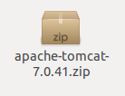
1. Dê dois cliques para abrir o Archive Manager do Linux;
	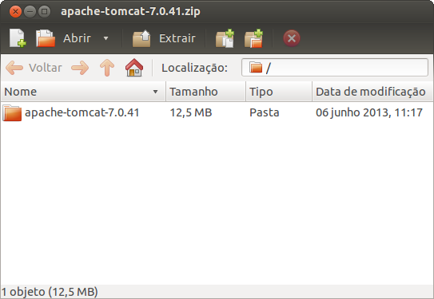
1. Clique em **Extract**;
1. Escolha o seu **Desktop** e clique em extract;
	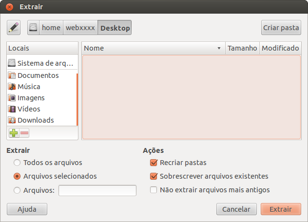
1. O resultado é uma pasta chamada **apache-tomcat-7.x**. Pronto, o tomcat já está instalado.
	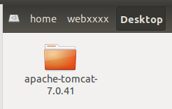


## Preparando o Tomcat em casa

Baixe o Tomcat 9 em `http://tomcat.apache.org/` na página de downloads da versão que escolher, você precisará de  uma "Binary Distribution". Mesmo no windows, dê preferência a versão **.zip**, para você entender melhor o processo de inicialização do servidor. A versão executável é apenas um _wrapper_ para executar a JVM, já que o Tomcat é 100% Java.

O Tomcat foi por muito tempo considerado a implementação padrão e referência das novas
versões da API de servlets. Ele também é o servlet container padrão utilizado pelo JBoss.
Ele continua em primeira posição no mercado, mas hoje tem esse lugar disputado pelo Jetty
e pelo Grizzly (esse último é o servlet container que faz parte do servidor de aplicação
da Oracle/Sun, o Glassfish).

Entre no diretório de instalação, de permissão de execução a todos os scripts dessa pasta e por fim execute o `startup.sh` para o servidor inicializar:

``` bash
	cd apache-tomcat<TAB>/bin
	sudo chmod +x *startup*.sh
	./startup.sh

	Using CATALINA_BASE:   /home/fsouto/Área de Trabalho/apache-tomcat-9.0.34
	Using CATALINA_HOME:   /home/fsouto/Área de Trabalho/apache-tomcat-9.0.34
	...
	Tomcat started.

```

Para para parar o servidor utilize o script `shutdown.sh`:

```
	cd apache-tomcat<TAB>/bin
	./shutdown.sh
```

Aprenderemos futuramente como iniciar o container de dentro do próprio Eclipse, por
comodidade e para facilitar o uso do debug.

### Tomcat no Windows
Para instalar o Tomcat no Windows basta executar o arquivo `.exe` que pode ser baixado no site do
Tomcat (como falamos, dê preferência ao zip). Depois disso, você pode usar os scripts `startup.bat`
e `shutdown.bat`, analogamente aos scripts do Linux.

Tudo o que vamos desenvolver neste curso funciona em qualquer ambiente compatível com o Java Enterprise
Edition, seja o Linux, Windows ou Mac OS.

## Outra opção: Jetty
O Jetty é uma outra implementação criada pela MortBay (http://jetty.mortbay.org) de Servlet Container e
HTTP Server.


Pequeno e eficiente, ele é uma opção ao Tomcat bastante utilizada devido a algumas de suas
características. Especialmente:


* facilmente embarcável;
* escalável;
* "plugabilidade": é fácil trocar as implementações dos principais
componentes da API.


O Jetty também costuma implementar, antes do Tomcat, ideias diferentes que ainda não estão na API de
servlets do Java EE. Uma dessas implementações pioneiras foi do uso dos chamados conectores NIO, por exemplo,
que permitiram uma performance melhor para o uso de AJAX.

O GUJ.com.br roda com o Jetty, em uma instalação customizada que pode ser lida aqui:
http://blog.caelum.com.br/2008/06/27/melhorando-o-guj-jetty-nio-e-load-balancing/

## Integrando o Tomcat no Eclipse

Sempre que estamos trabalhando com o desenvolvimento de uma aplicação queremos ser o mais produtivos possível,
e não é diferente com uma aplicação web. Uma das formas de aumentar a produtividade do desenvolvedor é
utilizar uma ferramenta que auxilie no desenvolvimento e o torne mais ágil, no nosso caso, uma IDE.

## O plugin WTP

O **WTP**, _Web Tools Platform_, é um conjunto de plugins para o Eclipse que auxilia o desenvolvimento de
aplicações Java EE, em particular, de aplicações Web. Contém desde editores para JSP, CSS, JS e HTML até
perspectivas e jeitos de rodar servidores de dentro do Eclipse.

Este plugin vai nos ajudar bastante com _content-assists_ e atalhos para tornar o desenvolvimento Web mais eficiente.

A versão de download Eclipse IDE for Java EE Developers já vem por padrão com o plugin. Sendo assim, basta ir no site do Eclipse e:


* Abra a página `www.eclipse.org/downloads`;
* Baixe o Eclipse IDE for Java EE Developers;
* Descompacte o arquivo e pronto.


## Exercícios: Configurando o Tomcat no Eclipse
Vamos primeiro configurar no WTP o servidor Tomcat que acabamos de descompactar.
1. Mude a perspectiva do Eclipse para **Java** (e não Java EE, por enquanto). Para isso, vá no canto
	direito superior e clique no botão:
	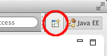

	Depois selecione **Java**:
	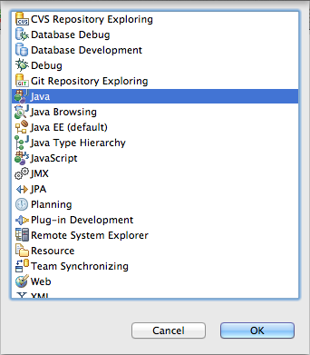
1. Abra a _View_ de **Servers** na perspectiva atual. Aperte **Ctrl + 3** e digite **Servers**:
	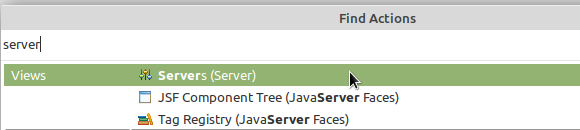
1. Clique com o botão direito dentro da aba Servers e vá em **New** > **Server**:
	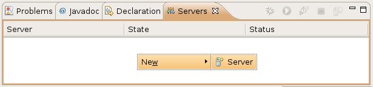
1. Selecione o **Apache Tomcat 9.0** e clique em **Next**:
	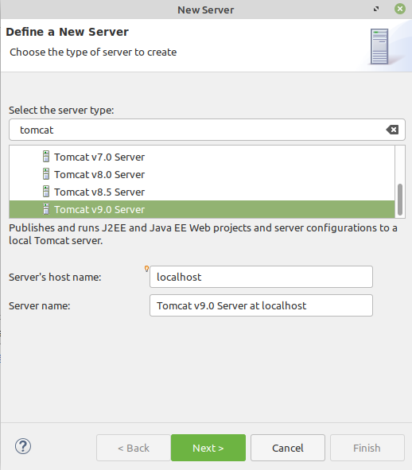
1. Na próxima tela, selecione o diretório onde você descompactou o Tomcat e clique em **Finish**:
	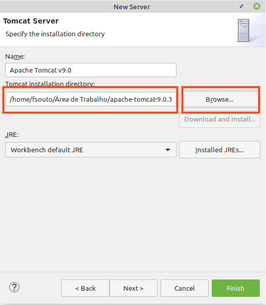
1. Por padrão, o WTP gerencia todo o Tomcat para nós e não permite que configurações sejam feitas por fora
	do Eclipse. Para simplificar, vamos desabilitar isso e deixar o Tomcat no modo padrão do próprio Tomcat. Na
	aba Servers, dê dois cliques no servidor Tomcat que uma tela de configuração se abrirá. Localize a seção
	**Server Locations**. Repare que a opção _use workspace metadata_ está marcada. Marque a opção **Use Tomcat installation**:
	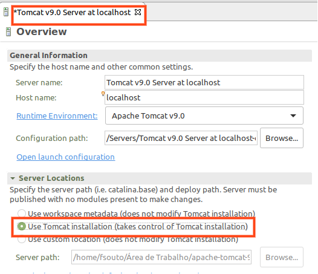
	Perceba que apareceu um asterisco na aba, salve e feche essa tela.
1. Selecione o servidor que acabamos de adicionar e clique em **Start** (ícone play verde na view servers):
	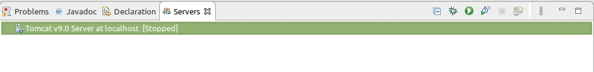
1. Abra o navegador e acesse a URL `http://localhost:8080/`
	Deve aparecer uma tela de mensagem do Tomcat.
	Pronto! O WTP está configurado para rodar com o Tomcat!
