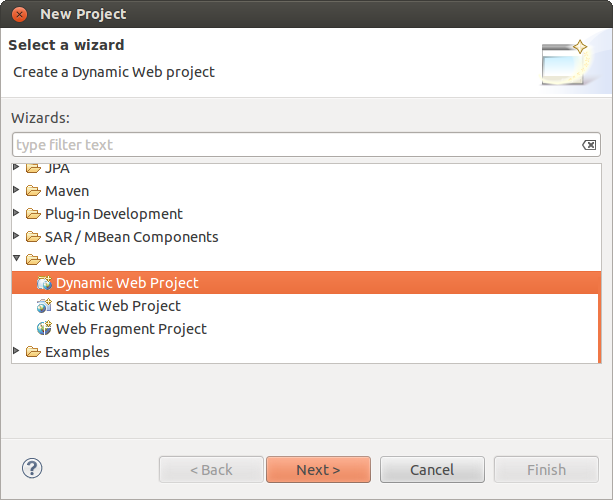
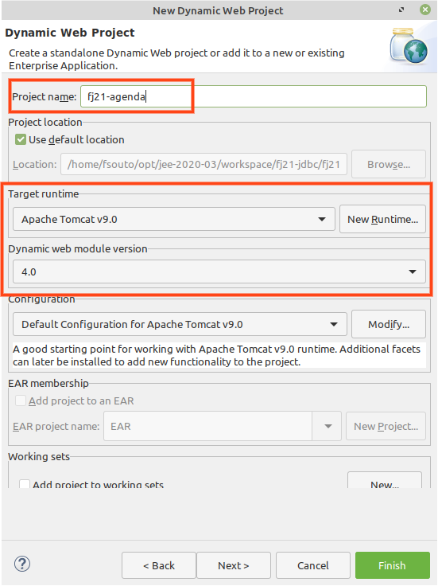
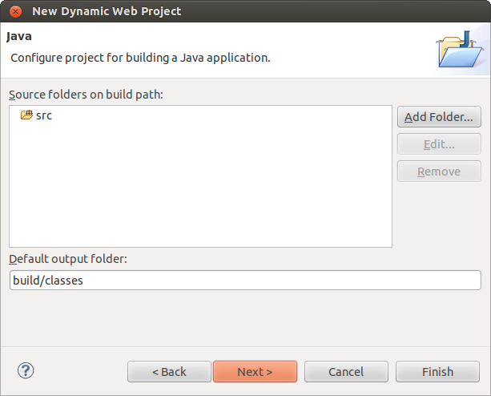
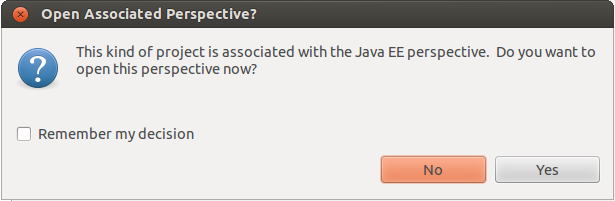
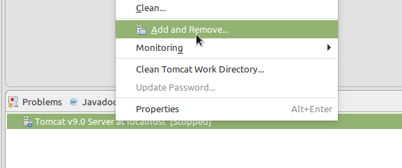
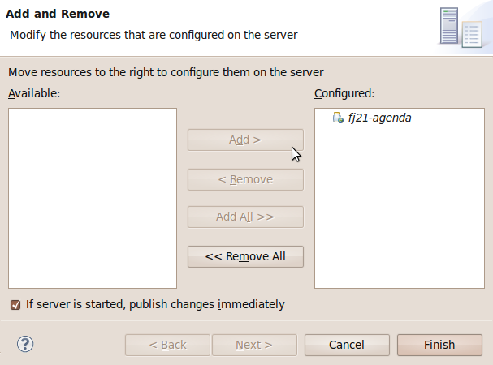
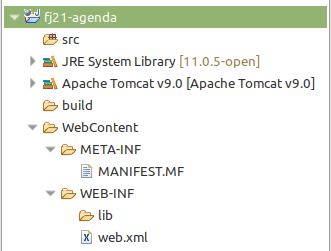

# Novo projeto Web usando Eclipse

_"São muitos os que usam a régua, mas poucos os inspirados." -- Platão_

Ao término desse capítulo, você será capaz de:

* criar um novo projeto Web no Eclipse;
* compreender quais são os diretórios importantes de uma aplicação Web;
* compreender quais são os arquivos importantes de uma aplicação Web;
* entender onde colocar suas páginas e arquivos estáticos.


## Novo projeto
Nesse capítulo veremos como, passo a passo, criar um novo projeto Web no Eclipse usando
os recursos do Eclipse JavaEE. Dessa forma não precisarmos iniciar o servlet container na mão,
além de permitir a configuração de um projeto, de suas bibliotecas, e de seu debug, de uma
maneira bem mais simples do que sem ele

## Exercícios: Novo projeto web


1. Vá em **New** > **Project** e selecione **Dynamic Web Project** e clique **Next**:
	
1. Coloque o nome do projeto como **fj21-agenda**, verifique se o _Target runtime_ está apontando
	para a versão do Tomcat que acabamos de configurar e se o _Dynamic web module version_ está
	configurado para **3.0**. Depois clique **Next**. **ATENÇÃO: NÃO CLIQUE EM _Finish_ AINDA!!!**
	
1. Clique em **Next** na configuração das pastas:
	
1. Na configuração _Web module_ marque o box **Generate web.xml deployment descriptor** e clique
	em **Finish**:
	
1. Se for perguntado sobre a mudança para a perspectiva Java EE, selecione **Não**.
	
1. O último passo é configurar o projeto para rodar no Tomcat que configuramos. Na aba **Servers**,
	clique com o botão direito no Tomcat e vá em **Add and Remove...**:
	
1. Basta selecionar o nosso projeto fj21-agenda e clicar em **Add**:
	
1. Dê uma olhada nas pastas que foram criadas e na estrutura do nosso projeto nesse instante.
	Vamos analisá-la em detalhes.


## Análise do resultado final

Olhe bem a estrutura de pastas e verá algo parecido com o que segue:



O diretório `src` já é velho conhecido. É onde vamos colocar nosso código fonte Java.
Em um projeto normal do Eclipse, essas classes seriam compiladas para a pasta `bin`,
mas no Eclipse é costume se usar a pasta `build` que vemos em nosso projeto.

Nosso projeto será composto de muitas páginas Web e vamos querer acessá-lo no navegador.
Já sabemos que o servidor é acessado pelo `http://localhost:8080`, mas como será que dizemos
que queremos acessar o nosso projeto e não outros projetos?


No Java EE, trabalhamos com o conceito de **contextos Web** para diferenciar sites ou
projetos distintos em um mesmo servidor. Na prática, é como uma _pasta virtual_ que,
quando acessada, remete a algum projeto em questão.

Por padrão, o Eclipse gera o **context name** com o mesmo nome do projeto; no nosso caso, **fj21-agenda**.
Podemos mudar isso na hora de criar o projeto ou posteriormente indo em
_Project > Properties  > Web Project Settings_ e mudando a opção **Context Root**. Repare que não é necessário
que o nome do contexto seja o mesmo nome do projeto.


Assim, para acessar o projeto, usaremos a URL: `http://localhost:8080/fj21-agenda/`

Mas o que será que vai aparecer quando abrirmos essa URL? Será que veremos todo o conteúdo do
projeto? Por exemplo, será possível acessar a pasta **src** que está dentro do nosso projeto?
Tomara que não, afinal todo nosso código fonte está lá.


Para solucionar isso, uma outra configuração é importante no Eclipse: o **Content Directory**. Ao invés
de abrir acesso a tudo, criamos uma pasta dentro do projeto e dizemos que ela é a raiz (root) do
conteúdo a ser exibido no navegador. No Eclipse, por padrão, é criada a pasta **WebContent**, mas
poderia ser qualquer outra pasta configurada na criação do projeto (outro nome comum de se usar é **web**).

Tudo que colocarmos na pasta `WebContent` será acessível na URL do projeto. Por exemplo, se queremos
uma página de boas vindas:

http://localhost:8080/fj21-agenda/bemvindo.html

então criamos o arquivo:

**fj21-agenda/WebContent/bemvindo.html**


### WEB-INF

Repare também que dentro da `WebContent` há uma pasta chamada `WEB-INF`. Essa pasta é extremamente
importante para qualquer projeto web Java EE. Ela contém _configurações_ e _recursos_ necessários
para nosso projeto rodar no servidor.


O **web.xml** é o arquivo onde ficará armazenada as configurações relativas a sua aplicação, usaremos esse
arquivo em breve.

Por enquanto, abra-o e veja sua estrutura, até então bem simples:

``` xml
		<?xml version="1.0" encoding="UTF-8"?>
		<web-app xmlns:xsi="http://www.w3.org/2001/XMLSchema-instance" 
				xmlns="http://java.sun.com/xml/ns/javaee" 
				xmlns:web="http://java.sun.com/xml/ns/javaee/web-app_2_5.xsd" 
				xsi:schemaLocation="http://java.sun.com/xml/ns/javaee 
					http://java.sun.com/xml/ns/javaee/web-app_2_5.xsd" 
				id="WebApp_ID" version="2.5">

			<display-name>fj21-agenda</display-name>

			<welcome-file-list>
		    	<welcome-file>index.html</welcome-file>
		    	<welcome-file>index.htm</welcome-file>
		    	<welcome-file>index.jsp</welcome-file>
		    	<welcome-file>default.html</welcome-file>
		    	<welcome-file>default.htm</welcome-file>
		    	<welcome-file>default.jsp</welcome-file>
			</welcome-file-list>
		</web-app>
```

É o básico gerado pelo próprio Eclipse. Tudo o que ele faz é definir o nome da aplicação e a lista de arquivos
acessados que vão ser procurados por padrão. Todas essas configurações são opcionais.


Repare ainda que há uma pasta chamada **lib** dentro da WEB-INF. Quase todos os projetos Web existentes
precisam usar bibliotecas externas, como por exemplo o driver do MySQL no nosso caso. Copiaremos todas
elas para essa pasta **lib**. Como esse diretório só aceita bibliotecas, apenas colocamos nele arquivos
**.jar** ou arquivos zip com classes dentro. Caso um arquivo com outra extensão seja colocado no **lib**,
ele será ignorado.

> **WEB-INF/lib**
>
> O diretório lib dentro do WEB-INF pode conter todas as bibliotecas necessárias para a aplicação
> Web, evitando assim que o classpath da máquina que roda a aplicação precise ser alterado.
>
> Além do mais, cada aplicação Web poderá usar suas próprias bibliotecas com suas versões
> específicas! Você vai encontrar projetos open source que somente fornecem suporte e respondem
> perguntas aqueles usuários que utilizam tal diretório para suas bibliotecas, portanto evite ao
> máximo o uso do classpath global.
>
> Para saber mais sobre o uso de _classloaders_ e _classpath global_, você pode procurar no
> capítulo 2 do livro Introdução à Arquitetura e Design de Software, publicado pela Editora Casa
> do Código e pela Elsevier.


Há ainda um último diretório, oculto no Eclipse, o importante **WEB-INF/classes**. Para rodarmos nossa
aplicação no servidor, precisamos ter acesso as classes compiladas (não necessariamente ao código fonte).
Por isso, nossos `.class` são colocados nessa pasta dentro do projeto. Esse padrão é definido pela
especificação de Servlets do Java EE. Repare que o Eclipse compila nossas classes na pasta **build**
e depois _automaticamente_ as copia para o **WEB-INF/classes**.

Note que a pasta **WEB-INF** é muito importante e contém recursos vitais para o funcionamento do projeto.
Imagine se o usuário tiver acesso a essa pasta! Códigos compilados (facilmente descompiláveis), bibliotecas
potencialmente sigilosas, arquivos de configuração internos contendo senhas, etc.

Para que isso não aconteça, a pasta **WEB-INF** com esse nome especial é uma **pasta invisível ao
usuário final**. Isso quer dizer que se alguém acessar a URL `http://localhost:8080/fj21-agenda/WEB-INF`
verá apenas uma página de erro (404).

### Resumo final das pastas


* **src** - código fonte Java (`.java`)
* **build** - onde o Eclipse compila as classes (`.class`)
* **WebContent** - content directory (páginas, imagens, css etc vão aqui)
* **WebContent/WEB-INF/** - pasta oculta com configurações e recursos do projeto
* **WebContent/WEB-INF/lib/** - bibliotecas `.jar`
* **WebContent/WEB-INF/classes/** - arquivos compilados são copiados para cá


> **META-INF**
>
> A pasta `META-INF` é opcional mas é gerada pelo Eclipse. É onde fica o arquivo de manifesto
> como usado em arquivos `.jar`.


## Criando nossas páginas e HTML Básico
Para criarmos as nossas páginas, precisamos utilizar uma linguagem que consiga ser interpretada
pelos navegadores. Essa linguagem é a HTML (**H**yper**t**ext **M**arkup **L**anguage).

Como o próprio nome diz, ela é uma linguagem de marcação, o que significa que ela é composta por
tags que definem o comportamento da página que se está criando. Essas tags dizem como a página
será visualizada, através da definição dos componentes visuais que aparecerão na tela. É possível
exibir tabelas, parágrafos, blocos de texto, imagens e assim por diante.

Todo arquivo HTML deve conter a extensão .html, e seu conteúdo deve estar dentro da tag `<html>`.
Em um HTML bem formado, todas as tags que são abertas também são fechadas, dessa forma, todo o seu
código num arquivo .html ficará dentro de `<html>` e `</html>`. Além disso, podemos também
definir alguns dados de cabeçalhos para nossa página, como por exemplo, o título que será colocado
na janela do navegador, através das tags `<head>` e `<title>`:

``` xml
	<html>
		<head>
			<title>Título que vai aparecer no navegador</title>
		</head>
	</html>
```

Para escrevermos algo que seja exibido dentro do navegador, no corpo da nossa página, basta colocarmos
a tag `<body>` dentro de `<html>`, como a seguir:

``` xml
	<html>
		<body>
			Texto que vai aparecer no corpo da página
		</body>
	</html>
```

## Exercícios: primeira página
Vamos testar nossas configurações criando um arquivo HTML de teste.
1. Crie o arquivo **WebContent/index.html** com o seguinte conteúdo:

	``` xml
			<html>
				<head>
					<title>Projeto fj21-agenda</title>
				</head>
				<body>
					<h1>Primeira página do projeto fj21-agenda</h1>
				</body>
			</html>
	```
1. Inicie (ou reinicie) o Tomcat clicando no botão de _play_ na aba Servers.
1. Acesse pelo navegador (nas máquinas da caelum existe um Firefox instalado):
	http://localhost:8080/fj21-agenda/index.html

	Teste também a configuração do **welcome-file** no `web.xml`:
	http://localhost:8080/fj21-agenda/


## Para saber mais: configurando o Tomcat sem o plugin

Se fosse o caso de criar uma aplicação web sem utilizar o plugin do Tomcat,
precisaríamos colocar nossa aplicação dentro do Tomcat manualmente.

Dentro do diretório do Tomcat, há um diretório chamado _webapps_. Podemos
colocar nossas aplicações dentro desse diretório, cada uma dentro de um
diretório específico. O nome do diretório será o nome do contexto da aplicação.

Por exemplo, para colocar nossa aplicação _fj21-agenda_ no Tomcat
manualmente, basta copiar o **conteúdo** do diretório `WebContent` para um
diretório chamado, por exemplo, `agenda` dentro desse diretório `webapps`
do Tomcat. Pronto, o Tomcat servirá a nossa aplicação com o contexto
**agenda**. Para que o Tomcat sirva nossa aplicação no contexto `/`, basta
colocar nossa aplicação dentro de um diretório chamado `ROOT`.

## Algumas tags HTML

Devido ao foco do curso não ser no HTML, não mostraremos a fundo as tags do
HTML. No entanto, abaixo está uma lista com algumas das tags mais comuns do
HTML:


* `h1` - `h6`: define cabeçalhos, do `h1` ao `h6`, onde menor o número, maior a importância do cabeçalho;
* `a`: cria um link para outra página, ou para algum ponto da mesma página;
* `p`: define que o texto dentro dela estará em um parágrafo;
* `ul`: cria uma lista de elementos;
* `li`: cria um novo item numa lista de elementos;
* `input`: coloca um controle de formulário na tela (caixa de texto, botão, _radio button_ etc.)
* `table`: define uma tabela;
* `tr`: colocada dentro de um `table` para definir uma linha da tabela;
* `td`: colocada dentro de um `tr` para definir uma célula;


> **Tutorial de HTML**
>
> Para um tutorial completo sobre HTML, recomendamos uma visita ao site da
> Mozilla Developer Network, que possui referências das tags e exemplos de uso:
> https://developer.mozilla.org/pt-BR/docs/Web/HTML
>
> Você também pode visitar o tutorial de HTML da W3schools.com:
> http://www.w3schools.com/html/


