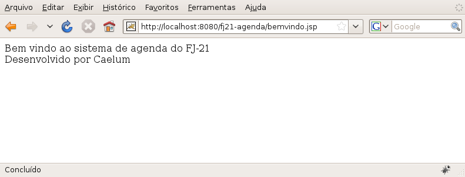
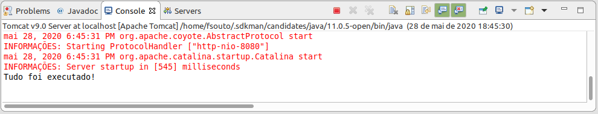
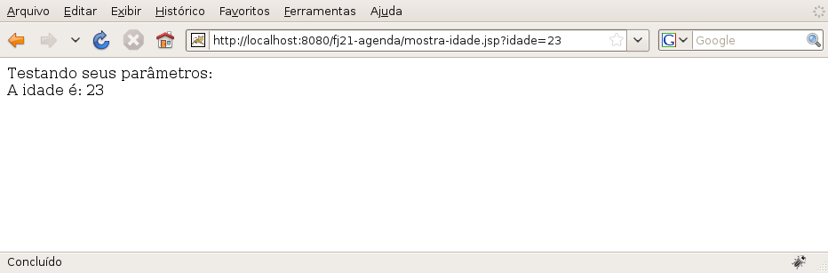

# JavaServer Pages
_"O maior prazer é esperar pelo prazer." -- Gotthold Lessing_

Nesse capítulo, você aprenderá:


* O que é JSP;
* Suas vantagens e desvantagens;
* Escrever arquivos JSP com scriptlets;
* Usar Expression Language.


## Colocando o HTML no seu devido lugar

Até agora, vimos que podemos escrever conteúdo dinâmico através de `Servlets`. No entanto,
se toda hora criarmos `Servlets` para fazermos esse trabalho, teremos muitos problemas na
manutenção das nossas páginas e também na legibilidade do nosso código, pois sempre aparece código
Java misturado com código HTML. Imagine todo um sistema criado com `Servlets` fazendo a
geração do HTML.

Para não termos que criar todos os nossos conteúdos dinâmicos dentro de classes, misturando fortemente
HTML com código Java, precisamos  usar uma tecnologia que podemos usar o HTML de forma direta, e que também
vá possibilitar a utilização do Java. Algo similar ao ASP e PHP.

Essa tecnologia é o **JavaServer Pages** (JSP). O primeiro arquivo JSP que vamos criar é chamado
**bemvindo.jsp**. Esse arquivo poderia conter  simplesmente código HTML, como o código a seguir:

``` html
  <html>
    <body>
      Bem vindo
    </body>  
  </html>
```


Assim, fica claro que uma página JSP nada mais é que um arquivo baseado em HTML, com a extensão `.jsp`.

Dentro de um arquivo JSP podemos escrever também código Java, para que possamos adicionar comportamento
dinâmico em nossas páginas, como declaração de variáveis, condicionais (`if`), loops (`for`, `while`)
entre outros.

Portanto, vamos escrever um pouco de código Java na nossa primeira página. Vamos declarar uma
variável do tipo `String` e inicializá-la com algum valor.

``` html
  <%
    String mensagem = "Bem vindo!";
  %>
```


Para escrever código Java na sua página, basta escrevê-lo entre as tags `<% ` e ` %>`. Esse
tipo de código é chamado de **scriptlet**.

> **Scriptlet**
>
> Scriptlet é o código escrito entre  ` <% ` e ` %> `. Esse nome é composto da palavra _script_
> (pedaço de código em linguagem de script) com o sufixo _let_, que indica algo pequeno.
>
> Como você já percebeu, a Sun possui essa mania de colocar o sufixo _let_ em seus produtos como
> os _scriptlets_,  _servlets_, _portlets_, _midlets_, _applets_ etc...


Podemos avançar mais um pouco e utilizar uma das variáveis já implícitas no JSP: todo
arquivo JSP já possui uma variável chamada `out` (do tipo `JspWriter`) que permite imprimir
para o `response` através do método `println`:

``` html
  <% out.println(nome); %>
```

A variável `out` é um objeto implícito na nossa página JSP e existem outras de acordo com a
especificação. Repare também que sua funcionalidade é semelhante ao `out` que utilizávamos
nas `Servlets` mas sem precisarmos declará-lo antes.

Existem ainda outras possibilidades para imprimir o conteúdo da nossa variável: podemos utilizar um
atalho (muito parecido, ou igual, a outras linguagens de _script_ para a Web):

``` html
  <%= nome %><br/>
```


Isso já é o suficiente para que possamos escrever o nosso primeiro JSP.

> **Comentários**
>
> Os comentários em uma página JSP devem ser feitos como o exemplo a seguir:
> ``` html
>   <%-- comentário em jsp --%>
> ```


## Exercícios: Primeiro JSP
1. Crie o arquivo **WebContent/bemvindo.jsp** com o seguinte conteúdo:

``` html
  <html>
    <body>
      <%-- comentário em JSP aqui: nossa primeira página JSP --%>

      <%
        String mensagem = "Bem vindo ao sistema de agenda do FJ-21!";
      %>
      <% out.println(mensagem); %>

      <br/>

      <%
        String desenvolvido = "Desenvolvido por (SEU NOME AQUI)";
      %>
      <%= desenvolvido %>

      <br/>

      <%
        System.out.println("Tudo foi executado!");
      %>
    </body>
  </html>
```
1. Acesse a URL http://localhost:8080/fj21-agenda/bemvindo.jsp no navegador

  
1. Onde apareceu a mensagem "Tudo foi executado!"?

  É **muito importante** você se lembrar que o código Java é interpretado no servidor,
  portanto apareceu no console do seu Tomcat.

  Verifique o console do seu Tomcat.

  


## Listando os contatos com Scriptlet
Uma vez que podemos escrever qualquer código Java como scriptlet, não fica difícil criar uma
listagem de todos os contatos do banco de dados.

Temos todas as ferramentas necessárias para fazer essa listagem uma vez que já fizemos isso no
capítulo de JDBC.

Basicamente, o código utilizará o `ContatoDao` que criamos anteriormente para imprimir a lista de
`Contato`:

``` html
  <%
  ContatoDao dao = new ContatoDao();
  List<Contato> contatos = dao.getLista();
  
  for (Contato contato : contatos ) {
  %>
    <li><%=contato.getNome()%>, <%=contato.getEmail()%>:
      <%=contato.getEndereco()%></li>
  
  <%
  }
  %>
```

Nesse código ainda falta, assim como no Java puro, importar as classes dos pacotes corretos.


Para fazermos o import das classes, precisamos declarar que aquela página precisa de acesso à
outras classes Java. Para isso, utilizamos diretivas, que possuem a seguinte sintaxe: `<%@ ... %>`.

Repare que ela se parece muito com scriptlet, com a diferença que possui uma **@** logo na abertura.
Essa diretiva é uma diretiva de página, ou seja, uma configuração específica de uma página.

Para isso, utilizamos ` <%@ page %>`. Basta dizermos qual configuração queremos fazer
nessa página, que no nosso caso é importar uma classe para utilizá-la:

``` html
  <%@ page import="br.com.caelum.agenda.dao.ContatoDao" %>
```

O atributo `import` permite que seja especificado qual o pacote a ser importado. Para importar
diversos pacotes, podemos separá-los por vírgulas (vide o exercício).

## Exercícios opcionais: Lista de contatos com scriptlet
1. Crie o arquivo **WebContent/lista-contatos-scriptlet.jsp** e siga:

  * Importe os pacotes necessários. Use o Ctrl+Espaço do Eclipse para ajudar a escrever os pacotes.

``` html
  <%@ page import="java.util.*,
          br.com.caelum.agenda.dao.*,
          br.com.caelum.agenda.modelo.*" %>
```

  * Coloque o código para fazer a listagem. Use bastante o Ctrl+Espaço do Eclipse.

  ``` html
  <html>
    <body>
      <table>
        <%
          ContatoDao dao = new ContatoDao();
          List<Contato> contatos = dao.getLista();

          for (Contato contato : contatos ) {
        %>
          <tr>
            <td><%=contato.getNome() %></td> 
            <td><%=contato.getEmail() %></td>
            <td><%=contato.getEndereco() %></td>
            <td><%=contato.getDataNascimento().getTime() %></td>
          </tr>
        <%
          }
        %>
      </table>
    </body>
  </html>
  ```

  * Teste a url http://localhost:8080/fj21-agenda/lista-contatos-scriptlet.jsp
1. Repare que a data apareceu de uma forma complicada de ler. Tente mostrá-la
  formatada utilizando a classe `SimpleDateFormat`.
1. Coloque cabeçalhos para as colunas da tabela, descrevendo o que cada
  coluna significa.
1. Tente utilizar o quadro a seguir para definir a página padrão de seu site.


> **welcome-file-list**
>
> O arquivo web.xml abaixo diz que os arquivos chamados "bemvindo.jsp" devem ser chamados quando
> um cliente tenta acessar um diretório web qualquer.
>
> O valor desse campo costuma ser "index.html" em outras linguagens de programação.
>
> Como você pode ver pelo arquivo gerado automaticamente pelo WTP, é possível
> indicar mais de um arquivo para ser o seu welcome-file! Mude-o para:
>
> ``` xml
>   <welcome-file-list>
>     <welcome-file>bemvindo.jsp</welcome-file>
>   </welcome-file-list>
> ```
>
> Reinicie o tomcat e acesse a URL:
> http://localhost:8080/fj21-agenda/
> 


## Misturando código Java com HTML
Abrimos o capítulo dizendo que não queríamos misturar código Java com código HTML nas
nossas `Servlets`, pois, prejudicava a legibilidade do nosso código e afetava a
manutenção.

Mas é justamente isso que estamos fazendo agora, só que no JSP, através de Scriptlets.

É complicado ficar escrevendo Java em seu arquivo JSP, não é?

Primeiro, fica tudo mal escrito e difícil de ler. O Java passa a atrapalhar o código HTML em vez de
ajudar. Depois, quando o responsável pelo design gráfico da página quiser alterar algo, terá que conhecer
Java para entender o que está escrito lá dentro. Hmm... não parece uma boa solução.

E existe hoje em dia no mercado muitas aplicações feitas inteiramente utilizando scriptlets
e escrevendo código Java no meio dos HTMLs.

Com o decorrer do curso, vamos evoluir nosso código até um ponto em que não faremos
mais essa mistura.


## EL: Expression language

Para remover um pouco do código Java que fica na página JSP, a Sun desenvolveu uma linguagem chamada
**Expression Language** que é interpretada pelo servlet container.

Nosso primeiro exemplo com essa linguagem é utilizá-la para mostrar parâmetros que o cliente envia
através de sua requisição.

Por exemplo, se o cliente chama a página `testaparam.jsp?idade=24`, o programa deve mostrar a mensagem
que o cliente tem 24 anos.

Como fazer isso? Simples, existe uma variável chamada `param` que, na expression language, é
responsável pelos parâmetros enviados pelo cliente. Para ler o parâmetro chamado **idade** basta
usar `${param.idade}`. Para ler o parâmetro chamado dia devemos usar `${param.dia}`.

A expression language ainda vai ser utilizada para muitos outros casos, não apenas para pegar
parâmetros que vieram do request. Ela é a forma mais elegante hoje em dia para trabalhar no JSP
e será explorada novamente durante os capítulos posteriores.


## Exercícios: parâmetros com a Expression Language
1. Crie uma página chamada **WebContent/digita-idade.jsp** com o conteúdo:

``` html
  <html>
    <body>
      Digite sua idade e pressione o botão:<br />

      <form action="mostra-idade.jsp">
        Idade: <input type="text" name="idade"/> <input type="submit"/>
      </form>
    </body>
  </html>
```
1. Crie um arquivo chamado **WebContent/mostra-idade.jsp** e coloque o código de expression language que
  mostra a idade que foi enviada como parâmetro para essa página:

``` html
  <html>
    <body>
      Testando seus parâmetros:<br />
      A idade é ${param.idade}.
    </body>
  </html>
  ```
1. Teste o sistema acessando a página http://localhost:8080/fj21-agenda/digita-idade.jsp.
  


## Para saber mais: Compilando os arquivos JSP
Os arquivos JSPs não são compilados dentro do Eclipse, por esse motivo na hora que estamos escrevendo
o JSP no Eclipse não precisamos das classes do driver.

Os JSPs são transformados em uma Servlet, que vimos anteriormente, por um compilador JSP (o Tomcat contém
um compilador embutido). Esse compilador JSP pode gerar um código Java que é então compilado para
gerar bytecode diretamente para a servlet.

Então, somente durante a execução de uma página JSP, quando ele é transformado em uma servlet, que
seu código Java é compilado e necessitamos das classes do driver que são procuradas no diretório lib.
