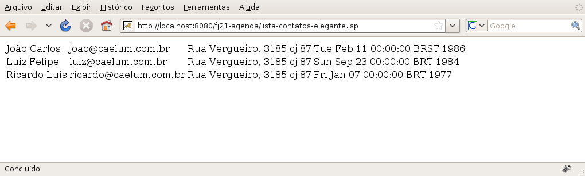

# Usando Taglibs
_"Saber é compreendermos as coisas que mais nos convém." -- Friedrich Nietzsche_

Nesse capítulo, você aprenderá o que são Taglibs e JSTL. E também terá a chance de utilizar
algumas das principais tags do grupo `core` e `fmt`.

## Taglibs
No capítulo anterior, começamos a melhorar nossos problemas com relação à mistura de
código Java com HTML através da `Expression Language`. No entanto, ela sozinha não pode nos
ajudar muito, pois ela não nos permite, por exemplo, instanciar objetos, fazer verificações
condicionais (`if else`), iterações como em um `for` e assim por diante.

Para que possamos ter esse comportamento sem impactar na legibilidade do nosso código,
teremos que escrever esse código nos nossos JSPs numa forma parecida com o que já escrevemos
lá, que é HTML, logo, teremos que escrever código baseado em **Tags**.

Isso mesmo, uma **tag**! A Sun percebeu que os programadores estavam abusando do código Java no JSP e
tentou criar algo mais "natural" (um ponto um tanto quanto questionável da maneira que foi
apresentada no início), sugerindo o uso de tags para substituir trechos de código.

O resultado final é um conjunto de tags (uma **tag library**, ou **taglib**) padrão, que possui, entre
outras tags, a funcionalidade de instanciar objetos através do construtor sem argumentos.

## Instanciando POJOs


Como já foi comentado anteriormente, os Javabeans devem possuir o construtor público sem argumentos
(um típico _Plain Old Java Object_: POJO), getters e setters.


Instanciá-los na nossa página JSP não é complicado. Basta utilizarmos a tag correspondente para
essa função, que no nosso caso é a `<jsp:useBean>`.

Para utilizá-la, basta indicarmos qual a classe queremos instanciar e como se chamará a variável que
será atribuída essa nova instância.

``` html
	<jsp:useBean id="contato" class="br.com.caelum.agenda.modelo.Contato"/>
```

Podemos imprimir o nome do contato (que está em branco, claro...):

``` html
	${contato.nome}
```

Mas, onde está o `getNome()`? A expression language é capaz de perceber sozinha a necessidade de
chamar um método do tipo _getter_, por isso o padrão getter/setter do POJO é tão importante hoje em dia.

Desta maneira, classes como `Contato` são ferramentas poderosas por seguir esse padrão pois diversas
bibliotecas importantes estão baseadas nele: Hibernate, Struts, VRaptor, JSF, EJB etc.

> **Atenção**
>
> Na Expression Language `${contato.nome}` chamará o método `getNome` por padrão. Para que isso
> sempre funcione, devemos colocar o parâmetro em letra minúscula. Ou seja, `${contato.Nome}` não
> funciona.


## JSTL

Seguindo a ideia de melhorar o código Java que precisa de uma maneira ou outra ser escrito na página
JSP, a Sun sugeriu o uso da **JavaServer Pages Standard Tag Library**, a **JSTL**.

> **Observação**
>
> Antes de 2005, JSTL significava _JavaServer Pages Standard Template Library_.


A **JSTL** é a API que encapsulou em tags simples toda a funcionalidade que diversas páginas Web
precisam, como controle de laços (`fors`), controle de fluxo do tipo `if else`, manipulação de
dados XML e a internacionalização de sua aplicação.

Antigamente, diversas bibliotecas foram criadas por vários grupos com funcionalidades similares ao
JSTL (principalmente ao Core), culminando com a aparição da mesma, em uma tentativa da Sun de
padronizar algo que o mercado vê como útil.

Existem ainda outras partes da JSTL, por exemplo aquela que acessa banco de dados e permite escrever
códigos SQL na nossa página, mas se o designer não compreende Java o que diremos de SQL? O uso de
tal parte da JSTL é desencorajado.

A JSTL foi a forma encontrada de padronizar o trabalho de milhares de programadores de páginas JSP.

Antes disso, muita gente programava como nos exemplos que vimos anteriormente, somente com JSPs e
Javabeans, o chamado Modelo 1, que na época fazia parte dos Blueprints de J2EE da Sun (boas práticas)
e nós vamos discutir mais para frente no curso.

### As empresas hoje em dia
Muitas páginas JSP no Brasil ainda possuem grandes pedaços de scriptlets espalhados dentro delas.

Recomendamos a todos os nossos alunos que optarem pelo JSP como camada de visualização, que utilizem
a JSTL e outras bibliotecas de tag para evitar o código incompreensível que pode ser gerado com
scriptlets.

O código das scriptlets mais confunde do que ajuda, tornando a manutenção da página JSP cada vez
mais custosa para o programador e para a empresa.

## Instalação
Para instalar a implementação mais famosa da **JSTL** basta baixar a mesma no site
**http://jstl.java.net/**.

Ao usar o JSTL em alguma página precisamos primeiro definir o cabeçalho. Existem
quatro APIs básicas e vamos aprender primeiro a utilizar a biblioteca chamada de **core**.

## Cabeçalho para a JSTL core
Sempre que vamos utilizar uma taglib devemos primeiro escrever um cabeçalho através de uma tag JSP que
define qual taglib vamos utilizar e um nome, chamado _prefixo_.

Esse prefixo pode ter qualquer valor mas no caso da taglib core da JSTL o padrão da Sun é a letra
**c**. Já a URI (que não deve ser decorada) é mostrada a seguir e não implica em uma requisição pelo
protocolo http e sim uma busca entre os arquivos .jar no diretório lib.

``` html
	<%@ taglib uri="http://java.sun.com/jsp/jstl/core" prefix="c" %>
```

## ForEach
Usando a JSTL core, vamos reescrever o arquivo que lista todos contatos.

O cabeçalho já é conhecido da seção anterior:

``` html
	<%@ taglib uri="http://java.sun.com/jsp/jstl/core" prefix="c" %>
```

Depois, precisamos instanciar e declarar nosso DAO. Ao revisar o exemplo da lista através de
scriptlets, queremos executar o seguinte:


* classe: `br.com.caelum.jdbc.dao.ContatoDao`;
* construtor: sem argumentos;
* variável: DAO.


Já vimos a tag **jsp:useBean**, capaz de instanciar determinada classe através do construtor sem
argumentos e dar um nome (id) para essa variável.

Portanto vamos utilizar a tag `useBean` para instanciar nosso `ContatoDao`:

``` html
	<jsp:useBean id="dao" class="br.com.caelum.agenda.dao.ContatoDao"/>
```

Como temos a variável `dao`, desejamos chamar o método `getLista` e podemos fazer
isso através da EL:

``` html
	${dao.lista}
```

Desejamos executar um loop para cada `contato` dentro da coleção retornada por esse método:


* array ou coleção: dao.lista;
* variável temporária: contato.


No nosso exemplo com scriptlets, o que falta é a chamada do método `getLista` e a iteração:

``` java
	<%
	// ...
	List<Contato> contatos = dao.getLista();
	
	for (Contato contato : contatos ) {
	%>
		<%=contato.getNome()%>, <%=contato.getEmail()%>,
			<%=contato.getEndereco()%>, <%=contato.getDataNascimento() %>
	<%
	}
	%>
```


A JSTL core disponibiliza uma tag chamada `c:forEach` capaz de iterar por uma coleção, exatamente o que
precisamos. No `c:forEach`, precisamos indicar a coleção na qual vamos iterar, através do atributo `items`
e também como chamará o objeto que será atribuído para cada iteração no atributo `var`. O exemplo a seguir
mostra o uso de _expression language_ de uma maneira muito mais elegante:

``` html
    <c:forEach var="contato" items="${dao.lista}">
        ${contato.nome}, ${contato.email},
        ${contato.endereco}, ${contato.dataNascimento} 
    </c:forEach>
```

Mais elegante que o código que foi apresentado usando scriptlets, não?

> **forEach e varStatus**
>
> É possível criar um contador do tipo `int` dentro do seu laço `forEach`. Para isso, basta
> definir o atributo chamado `varStatus` para a variável desejada e utilizar a propriedade `count`
> dessa variável.
>
> ``` html
> 	<table border="1">
> 		<c:forEach var="contato" items="${dao.lista}" varStatus="id">
> 			<tr bgcolor="#${id.count % 2 == 0 ? 'aaee88' : 'ffffff' }" >
> 				<td>${id.count}</td><td>${contato.nome}</td>
> 			</tr>
> 		</c:forEach>
> 	</table>
> ```


## Exercícios: forEach
1. Precisamos primeiro colocar os JARs da JSTL em nossa aplicação.

	* Primeiro, vá ao Desktop, e entre no diretório `21/jars-jstl`
	* Haverá dois jars, javax.servlet.jsp.jstl-x.x.x.jar e javax.servlet.jsp.jstl-api-x.x.x.jar
	* Copie-os (CTRL+C) e cole-os (CTRL+V) dentro de
	**workspace/fj21-agenda/WebContent/WEB-INF/lib**
	* No Eclipse, dê um F5 no seu projeto ou clique com o botão direito do
	mouse sobre o nome do projeto e escolha a opção _Refresh_.

	> **Em casa**
	>
	> Caso você esteja em casa, pode fazer o download da JSTL API e da implementação em:
	> https://jstl.java.net/download.html

	
1. Liste os contatos de `ContatoDao` usando `jsp:useBean` e JSTL.

	* Crie o arquivo `lista-contatos.jsp`, dentro da pasta **WebContent/** usando
	o atalho de novo JSP no Eclipse;

	* Antes de escrevermos nosso código, precisamos importar a taglib JSTL Core. Isso é feito
	com a diretiva `<%@ taglib %>` no topo do arquivo. Usando o recurso de autocompletar
	do Eclipse (inclusive na URL), declare a taglib no topo do arquivo:

	``` html
				<%@ taglib uri="http://java.sun.com/jsp/jstl/core" prefix="c" %>
	```

	* Localize a tag `<body>` no arquivo e implemente o conteúdo da nossa página **dentro
	do body**. Vamos usar uma tabela HTML e as tags `<jsp:useBean/>` e `<c:forEach/>`
	que vimos antes:

	``` html
				<!-- cria o DAO -->
				<jsp:useBean id="dao" class="br.com.caelum.agenda.dao.ContatoDao"/>

				<table>
					<!-- percorre contatos montando as linhas da tabela -->
					<c:forEach var="contato" items="${dao.lista}">
						<tr>
							<td>${contato.nome}</td>
							<td>${contato.email}</td>
							<td>${contato.endereco}</td>
							<td>${contato.dataNascimento.time}</td>
						</tr>
					</c:forEach>
				</table>
	```

	* Acesse http://localhost:8080/fj21-agenda/lista-contatos.jsp
	

	**Repare que após criar uma nova página JSP não precisamos reiniciar o nosso container!**
1. Scriptlets ou JSTL? Qual dos dois é mais fácil entender?


## Exercícios opcionais
1. Coloque um cabeçalho nas colunas da tabela com um título dizendo à que se refere a coluna.
1. Utilize uma variável de status no seu `c:forEach` para colocar duas cores diferentes em linhas
	pares e ímpares. (Utilize como auxílio o `box` imediatamente antes do exercício sobre `forEach`)


## Evoluindo nossa listagem
A listagem dos nossos contatos funciona perfeitamente, mas o nosso cliente ainda não está satisfeito.
Ele quer um pouco mais de facilidade nessa tela, e sugere que caso o usuário tenha e-mail cadastrado,
coloquemos um link no e-mail que quando clicado abra o software de e-mail do computador do usuário para
enviar um novo e-mail para esse usuário. Como podemos fazer essa funcionalidade?

Vamos analisar o problema com calma. Primeiro, percebemos que vamos precisar criar um link para envio
de e-mail. Isso é facilmente conseguido através da tag do HTML `<a>` com o parâmetro
` href="mailto:email@email.com" ` . Primeiro problema resolvido facilmente, mas agora temos outro. Como
faremos a verificação se o e-mail está ou não preenchido?

## Fazendo ifs com a JSTL
Para que possamos fazer essa verificação precisaremos fazer um `if` para sabermos se
o e-mail está preenchido ou não. Mas, novamente, não queremos colocar código Java na nossa página e já
aprendemos que estamos mudando isso para utilizar tags. Para essa finalidade, existe a tag `c:if`,
na qual podemos indicar qual o teste lógico deve ser feito através do atributo `test`. Esse teste
é informado através de _Expression Language_.

Para verificarmos se o e-mail está preenchido ou não, podemos fazer o seguinte:

``` html
	<c:if test="${not empty contato.email}">
		<a href="mailto:${contato.email}">${contato.email}</a>
	</c:if>
```

Podemos também, caso o e-mail não tenha sido preenchido, colocar a mensagem "e-mail não informado", ao
invés de nossa tabela ficar com um espaço em branco. Repare que esse é justamente o caso contrário que
fizemos no nosso `if`, logo, é equivalente ao `else`.

O problema é que não temos a tag `else` na JSTL, por questões estruturais de XML. Uma primeira
alternativa seria fazermos outro `<c:if>` com a lógica invertida. Mas isso não é uma solução muito
elegante. No Java, temos outra estrutura condicional que consegue simular um `if/else`,
que é o `switch/case`.

Para simularmos `switch/case` com JSTL, utilizamos a tag `c:choose` e para cada caso do switch
fazemos `c:when`. O `default` do switch pode ser representado através da tag `c:otherwise`,
como no exemplo a seguir:

``` html
	<c:choose>
		<c:when test="${not empty contato.email}">
			<a href="mailto:${contato.email}">${contato.email}</a>
		</c:when>
		<c:otherwise>
			E-mail não informado
		</c:otherwise>
	</c:choose>
```

## Exercícios: lista de contatos com condicionais
1. Vamos colocar em nossa listagem um link para envio de e-mail caso o mesmo tenha sido
	informado.

	* Abra o arquivo `lista-contatos.jsp` no Eclipse;

	* No momento de imprimir o e-mail do contato, adicione uma verificação para saber
	se o e-mail está preenchido e, caso esteja, adicione um link para envio de e-mail:
	``` html
				<c:forEach var="contato" items="${dao.lista}">
					<tr>
						<td>${contato.nome}</td>
						<td>
							<c:if test="${not empty contato.email}">
								<a href="mailto:${contato.email}">${contato.email}</a>
							</c:if>
						</td>
						<td>${contato.endereco}</td>
						<td>${contato.dataNascimento.time}</td>
					</tr>
				</c:forEach>
	```

	* Acesse a página no navegador pelo endereço
	http://localhost:8080/fj21-agenda/lista-contatos.jsp
	
1. Vamos colocar a mensagem "E-mail não informado" caso o e-mail não tenha sido
	informado

	* Abaixo do novo `if` que fizemos no item anterior, vamos colocar mais um if,
	dessa vez com a verificação contrária, ou seja, queremos saber se está vazio:

	``` html
				<c:forEach var="contato" items="${dao.lista}">
					<tr>
						<td>${contato.nome}</td>
						<td>
							<c:if test="${not empty contato.email}">
								<a href="mailto:${contato.email}">${contato.email}</a>
							</c:if>

							<c:if test="${empty contato.email}">
								E-mail não informado
							</c:if>
						</td>
						<td>${contato.endereco}</td>
						<td>${contato.dataNascimento.time}</td>
					</tr>
				</c:forEach>
	```

	* Caso você não possua nenhum contato sem e-mail, cadastre algum.

	* Acesse a lista-contatos.jsp pelo navegador e veja o resultado final.
	
1. (Opcional) Ao invés de utilizar dois `ifs`, use a tag `c:choose`


## Importando páginas
Um requisito comum que temos nas aplicações Web hoje em dia é colocar cabeçalhos e rodapé nas
páginas do nosso sistema. Esses cabeçalhos e rodapés podem ter informações da empresa, do sistema
e assim por diante. O problema é que, na grande maioria das vezes, **todas** as páginas da nossa
aplicação precisam ter esse mesmo cabeçalho e rodapé. Como poderíamos resolver isso?

Uma primeira alternativa e talvez a mais inocente é colocarmos essas informações em todas as páginas
da nossa aplicação, copiando e colando todo o cabeçalho várias vezes.

Mas o que aconteceria se precisássemos mudar o logotipo da empresa? Teríamos que mudar todas as
páginas, o que não é um trabalho agradável.

Uma alternativa melhor seria isolarmos esse código que se repete em todas as páginas em uma outra
página, por exemplo, `cabecalho.jsp` e todas as páginas da nossa aplicação, apenas dizem que
precisam dessa outra página nela, através de uma tag nova, a `c:import`.

Para utilizá-la, podemos criar uma pagina com o cabeçalho do sistema, por exemplo, a `cabecalho.jsp`:

``` html
	 Nome da empresa
```

E uma página para o rodapé, por exemplo, `rodape.jsp`:
``` html
	Copyright 2010 - Todos os direitos reservados
```

Bastaria que, em todas as nossas páginas, por exemplo, na `lista-contatos.jsp`,
colocássemos ambas as páginas, através da `c:import` como abaixo:

``` html
	<%@ taglib uri="http://java.sun.com/jsp/jstl/core" prefix="c" %>
	<html>
	<body>
	
	<c:import url="cabecalho.jsp" />
	
	<jsp:useBean id="dao" class="br.com.caelum.agenda.dao.ContatoDao"/>
	<table>
		<!-- for -->
		<c:forEach var="contato" items="${dao.lista}">
			<tr>
				<td>${contato.nome}</td>
				<td>${contato.email}</td>
				<td>${contato.endereco}</td>
				<td>${contato.dataNascimento.time}</td>
			</tr>
		</c:forEach>
	</table>
	
	<c:import url="rodape.jsp" />

	</body>
	</html>
```

## Exercícios: cabeçalhos e rodapés
1. Vamos primeiro criar o nosso cabeçalho, utilizando o logotipo da Caelum.

	* Vá no Desktop, entre na pasta `21` e copie o **diretório** `imagens`
	para dentro do diretório `WebContent` do seu projeto. Esse diretório
	possui o logotipo da Caelum.

	Ou você pode usar o que se encontra em:
	http://www.caelum.com.br/imagens/base/caelum-ensino-inovacao.png

	* Crie dentro de `WebContent` um arquivo chamado `cabecalho.jsp`
	com o logotipo do sistema:

	``` html
					 
					<h2>Agenda de Contatos do(a) (Seu nome aqui)</h2>
					<hr /> 			
	```

	* Crie também a página `rodape.jsp`:
	``` html
					<hr />
					Copyright 2010 - Todos os direitos reservados
	```

	* Podemos importar as duas páginas (`cabecalho.jsp` e `rodape.jsp`), dentro
	da nossa `lista-contatos.jsp` usando a tag `c:import` que vimos:

	``` html
				<html>
				<body>
				<%@ taglib uri="http://java.sun.com/jsp/jstl/core" prefix="c" %>

				<c:import url="cabecalho.jsp" />

				<!-- cria a lista -->
				<jsp:useBean id="dao" class="br.com.caelum.agenda.dao.ContatoDao"/>
				<table>
					<!-- for -->
					<c:forEach var="contato" items="${dao.lista}">
						<tr>
							<td>${contato.nome}</td>

							<td>
							<c:if test="${not empty contato.email}">
								<a href="mailto:${contato.email}">${contato.email}</a>
							</c:if>
							<c:if test="${empty contato.email}">
								E-mail não informado
							</c:if>
							</td>

							<td>${contato.endereco}</td>
							<td>${contato.dataNascimento.time}</td>
						</tr>
					</c:forEach>
				</table>

				<c:import url="rodape.jsp" />
				</body>
				</html>
	```

	* Visualize o resultado final acessando no navegador
	`http://localhost:8080/fj21-agenda/lista-contatos.jsp`

	


## Formatação de datas
Apesar da nossa listagem de contatos estar bonita e funcional, ela ainda possui problemas,
por exemplo, a visualização da data de nascimento. Muitas informações aparecem na data,
como horas, minutos e segundos, coisas que não precisamos.

Já aprendemos anteriormente que uma das formas que podemos fazer essa formatação em código
Java é através da classe `SimpleDateFormat`, mas não queremos utilizá-la aqui, pois não
queremos código Java no nosso JSP.

Para isso, vamos utilizar outra Taglib da JSTL que é a taglib de formatação, a `fmt`.

Para utilizarmos a taglib `fmt`, precisamos importá-la, da mesma forma que fizemos com a
tag `core`, através da diretiva de `taglib`, como abaixo:

``` html
	<%@ taglib uri="http://java.sun.com/jsp/jstl/fmt" prefix="fmt" %>
```

Dentro da taglib `fmt`, uma das tags que ela possui é a `formatDate`, que faz com que
um determinado objeto do tipo `java.util.Date` seja formatado para um dado `pattern`.
Então, podemos utilizar a tag `fmt:formatDate` da seguinte forma:

``` html
    <fmt:formatDate value="${contato.dataNascimento.time}"
        pattern="dd/MM/yyyy" />
```

Repare que, na _Expression Language_ que colocamos no `value`, há no final um `.time`.
Isso porque o atributo `value` só aceita objetos do tipo `java.util.Date`, e nossa data de
nascimento é um `java.util.Calendar` que possui um método `getTime()` para chegarmos ao
seu respectivo `java.util.Date`.

> **Como fazer patterns mais complicados?**
>
> Podemos no atributo `pattern` colocar outras informações com relação ao
> objeto `java.util.Date` que queremos mostrar, por exemplo:
>
>
> * `m` - Minutos
> * `s` - Segundos
> * `H` - Horas (0 - 23)
> * `D` - Dia no ano, por exemplo, 230
>
>
> Sugerimos que quando precisar de formatações mais complexas, leia a documentação
> da classe `SimpleDateFormat`, aonde se encontra a descrição de alguns caracteres
> de formatação.


## Exercícios: Formatando a data de nascimento dos contatos
1. Vamos fazer a formatação da data de nascimento dos nossos contatos.

	* Na `lista-contatos.jsp`, importe a taglib `fmt` no topo do arquivo. Use
	o autocompletar do Eclipse para te ajudar a escrever:

	``` html
				<%@ taglib uri="http://java.sun.com/jsp/jstl/fmt" prefix="fmt" %>
	```

	* Troque a Expression Language que mostra a data de nascimento para passar pela
	tag `formatDate` abaixo:

	``` html
            <fmt:formatDate value="${contato.dataNascimento.time}"
                pattern="dd/MM/yyyy" />
	```

	* Acesse a página pelo navegador e veja o resultado final:
	


## Para saber mais: links com `<c:url>`


Muitas vezes trabalhar com links em nossa aplicação é complicado. Por exemplo, no arquivo
`cabecalho.jsp` incluímos uma imagem chamada `caelum.png` que está na pasta `imagens`.

Incluímos esta imagem com a tag HTML `` utilizando o caminho **imagens/caelum.png** que
é um caminho relativo, ou seja, se o `cabecalho.jsp` estiver na raiz do projeto,
o arquivo `caelum.png` deverá estar em uma pasta chamada `imagens` também na raiz do projeto.

Utilizar caminhos relativos muitas vezes é perigoso. Por exemplo, se colocarmos o arquivo
`cabecalho.jsp` em um diretório chamado `arquivos_comuns`, a imagem que tínhamos
adicionado será procurada em um diretório `imagens` dentro do diretório `arquivos_comuns`.
Resultado, a imagem não será exibida.

Poderíamos resolver isso utilizando um caminho absoluto. Ao invés de adicionarmos a imagem
utilizando o caminho `imagens/caelum.png`, poderíamos usar `/imagens/caelum.png`.
Só que utilizando a `/` ele não vai para a raiz da minha aplicação e sim para a raiz
do tomcat, ou seja, ele iria procurar a imagem `caelum.png` em um diretório `imagens`
na raiz do tomcat, quando na verdade o diretório nem mesmo existe.

Poderíamos resolver isso utilizando o caminho `/fj21-tarefas/imagens/caelum.png`.
Nosso problema seria resolvido, entretanto, se algum dia mudássemos o contexto da aplicação
para `tarefas` a imagem não seria encontrada, pois deixamos fixo no nosso jsp qual era
o contexto da aplicação.

Para resolver este problema, podemos utilizar a tag `<c:url>` da JSTL. O uso dela é extremamente
simples. Para adicionarmos o logotipo da caelum no `cabecalho.jsp`, faríamos da seguinte maneira:

``` html
	<c:url value="/imagens/caelum.png" var="imagem"/>
	
```

Ou de uma forma ainda mais simples:

``` html
	"/>
```

O HTML gerado pelo exemplo seria: ``.

## Exercícios opcionais: Caminho absoluto
1. 
	* Abra o arquivo `cabecalho.jsp` e **altere-o** adicionando a tag `<c:url>`:
	``` html
				" /> 
	```

	Como vamos usar a JSTL também nesse novo arquivo de cabeçalho, não deixe de incluir
	a declaração da taglib no início do arquivo. (o comando `<%@ taglib ... %>` semelhante
	ao usado na listagem)

	* Visualize o resultado acessando no navegador
	`http://localhost:8080/fj21-agenda/lista-contatos.jsp`

	* A imagem `caelum.png` continua aparecendo normalmente


Se, algum dia, alterarmos o contexto da nossa aplicação, o cabeçalho continuaria exibindo a imagem
da maneira correta. Usando a tag `<c:url>` ficamos livres para utilizar caminhos absolutos.

## Para saber mais: Outras tags
A JSTL possui além das tags que vimos aqui, muitas outras, e para diversas finalidades.
Abaixo está um resumo com algumas das outras tags da JSTL:


* **c:catch** -  bloco do tipo try/catch
* **c:forTokens** - for em tokens (ex: "a,b,c" separados por vírgula)
* **c:out** - saída
* **c:param** - parâmetro
* **c:redirect** - redirecionamento
* **c:remove** - remoção de variável
* **c:set** - criação de variável


Leia detalhes sobre as taglibs da JSTL (JavaDoc das tags e classes) em:
http://java.sun.com/products/jsp/jstl/reference/api/index.html
