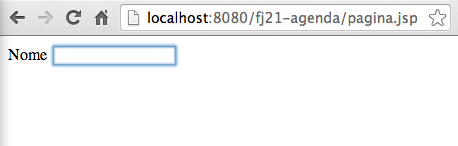

# Tags customizadas com Tagfiles
_"Eu apenas invento e espero que outros apareçam precisando do que inventei" -- R. Buckminster Fuller_

Ao término desse capítulo, você será capaz de:

* criar sua própria taglib através de tagfiles;
* encapsular códigos repetitivos em tags;
* conhecer outras taglibs existentes no mercado.


## Porque eu precisaria de outras tags além da JSTL?

É muito comum, no momento em que estamos desenvolvendo nossos JSPs, cairmos em
situações em que fazemos muita repetição de código. Por exemplo, sempre que criamos
uma caixa de texto, podemos associá-la com um `label`, através do seguinte código:

``` html
    <label for="nomeContato">Nome</label>
    <input type="text" id="nomeContato" name="nome" />
```



Esse código faz com que, se você clicar na palavra Nome, passe o foco para o campo de texto. Mas
repare que temos algo que se repete nesse trecho, que é o `id` do `input` e o atributo `for`
do `label`. Se mudarmos o `id` do `input` teremos que refletir essa alteração no `for` do
label. Além disso, temos que sempre escrever todo esse código.

Não seria mais simples escrevermos `<campoTexto id="nomeContato" name="nome" label="Nome:" />`
e todo aquele código ser gerado para nós?

Um outro exemplo poderia ser quando utilizamos componentes que dependem de _Javascript_, como
um campo que, ao ganhar o foco, mostra um calendário. Toda vez que temos que usar esse componente,
precisamos escrever um pedaço de código JavaScript. Por que não encapsular tudo isso em novas tags
customizadas?

## Calendários com jQuery

Vamos pegar um exemplo prático de possível uso de JavaScript no nosso sistema. Temos no cadastro
de contatos, um campo para data de nascimento. Mas até o momento, o usuário precisa digitar a data
na mão seguindo o formato que especificamos.

E se mostrássemos um calendário em JavaScript para o usuário escolher a data apenas clicando em
um componente já pronto?

Para conseguirmos esse comportamento, podemos utilizar por exemplo os componentes visuais do
**jQuery**, que é uma biblioteca com alguns componentes _JavaScript_.

Entre os diversos componentes que o _jQuery_ possui, um deles é o campo com calendário, também
conhecido por **datepicker**. Para utilizarmos o _datepicker_ do jQuery, precisamos criar um
`input` de texto simples e associá-lo com uma função JavaScript, como no código seguinte:

``` html
  <input id="dataNascimento" type="text">

  <script>
    $("#dataNascimento").datepicker();
  </script>
```

A função JavaScript faz com que o `input` cujo `id` é `dataNascimento` seja um calendário.

Imagine se toda hora que fossemos criar um campo de data tivéssemos que escrever esse código _JavaScript_?
As chances de errarmos esse código é razoável, mas ainda assim, o pior ponto ainda seria perder tempo
escrevendo um código repetitivo, sendo que poderíamos obter o mesmo resultado apenas escrevendo:

``` html
  <campoData id="dataNascimento" />
```

Qual abordagem é mais simples?

## Criando minhas próprias tags com Tagfiles

Para que possamos ter a tag `<campoData>` precisaremos criá-la. Uma das formas que temos de criar
nossas próprias taglibs é criando um arquivo contendo o código que nossa Taglib gerará. Esses arquivos
contendo o código das tags são conhecidos como **tagfiles**.

Tagfiles nada mais são do que pedaços de JSP, com a extensão `.tag`, contendo o código que queremos que
a nossa tag gere.

Vamos criar um arquivo chamado **campoData.tag** com o código que queremos gerar.

``` html
  <input id="dataNascimento" name="dataNascimento">

  <script>
      $("#dataNascimento").datepicker();
  </script>
```

Mas essa nossa tag está totalmente inflexível, pois o `id` e o nome do
campo estão escritos diretamente dentro da tag. O que aconteceria se tivéssemos
dois calendários dentro do mesmo formulário? Ambos teriam o mesmo `name`.

Precisamos fazer com que a nossa tag receba _parâmetros_. Podemos fazer isso
adicionando a diretiva `<%@ attribute %>` na nossa tag, com os parâmetros
`name` representando o nome do atributo e o parâmetro `required`
com os valores `true` ou `false`, indicando se o parâmetro é obrigatório
ou não.

``` html
  <%@ attribute name="id" required="true" %>
```

Repare como é simples. Basta declarar essa diretiva de atributo no começo do nosso tagfile e
temos a capacidade de receber um valor quando formos usar a tag. Imagine usar essa tag
nova no nosso formulário:

``` html
  <campoData id="dataNascimento" />
```

Já que nossa tag sabe receber parâmetros, basta usarmos esse parâmetro nos lugares adequados
através de _expression language_, como no código abaixo:

``` html
  <%@ attribute name="id" required="true" %>

  <input id="${id}" name="${id}" type="text">
  <script>
    $("#${id}").datepicker();
  </script>
```

Para usar nossa tag, assim como nas outras taglibs, precisamos importar nossos tagfiles.
Como não estamos falando de taglibs complexas como a JSTL, mas sim de pequenos arquivos
de tags do nosso próprio projeto, vamos referenciar diretamente a pasta onde nossos arquivos
`.tag` estão salvos.

Nossos tagfiles devem ficar na pasta **WEB-INF/tags/** dentro do projeto e, no momento de usar
as tags, vamos importar com a mesma diretiva `<%@ taglib %>` que usamos antes. A diferença é
que, além de receber o **prefixo** da nova taglib, indicamos a pasta **WEB-INF/tags/** como
localização das tags:

``` html
  <%@taglib tagdir="/WEB-INF/tags" prefix="caelum" %>
```

Aqui decidimos importar a nova taglib sob o prefixo **caelum**, mas poderia ser qualquer nome.
Assim, podemos usar a tag como:

``` html
  <caelum:campoData id="dataNascimento" />
```

Repare que o nome da nossa nova Tag, é o mesmo nome do arquivo que criamos,
ou seja, `campoData.tag` será utilizando como `<caelum:campoData>`.

> **Utilizando bibliotecas Javascript**
>
> Para podermos utilizar bibliotecas _Javascript_ em nossa aplicação precisamos importar o
> arquivo `.js` que contém a biblioteca.
>
> Para fazermos essa importação, basta que no cabeçalho da página que queremos utilizar o
> _Javascript_, ou seja, na Tag `head`, declaremos o seguinte:
>
> ``` html
>   <head>
>    <script src="js/arquivo.js"></script>
>   </head>
> ```
>
> Para saber mais sobre JavaScript, temos os cursos de Web da Caelum:
>
> http://www.caelum.com.br/cursos-web-front-end/


> **Utilizando estilos em CSS**
>
> Para que possamos construir uma interface agradável para o usuário, na maioria das
> vezes somente HTML não é suficiente.
>
> Podemos também utilizar _CSS_ (_Cascading Stylesheet_), que nada mais é que
> um arquivo contendo as definições visuais para sua página. Esses arquivos são
> distribuídos com a extensão `.css` e para que possamos usá-los, precisamos
> também importá-los dentro da tag `head` da nossa página que vai utilizar
> esses estilos. Como abaixo:
>
> ``` html
>   <head>
>    <link href="css/meuArquivo.css" rel="stylesheet">
>   </head>
> ```
>
> A Caelum oferece os treinamentos WD-43 e WD-47 para quem quer dominar as melhores
> técnicas de desenvolvimento Web com semântica perfeita, estilos CSS poderosos e
> JavaScripts corretos e funcionais.
>
> http://www.caelum.com.br/cursos-web-front-end/


## Exercícios: criando nossa própria tag para calendário


1. Vamos criar nossa tag para o campo de calendário com **datepicker**. Para isso
  vamos utilizar a biblioteca javascript jQuery.

  * Vá ao Desktop, e entre na pasta **21/projeto-agenda/**;

  * Copie os diretórios `js` e `css` e cole-os dentro de `WebContent` no
  seu projeto;

  > **Em casa**
  >
  > Se você estiver fazendo de casa, pode achar esses dois arquivos no pacote do JQueryUI em:
  > http://jqueryui.com/download

  
2. Queremos usar JSTL na página de adicionar contatos, a `adiciona-contato.html`.
  Mas temos um problema. Não podemos utilizar as tags ou expression language
  em uma página `HTML`. Para resolvermos isso, vamos trocar sua extensão para `.jsp`

  * Clique com o botão direito em cima do arquivo `adiciona-contato.html` e escolha a
  opção _Rename_ e troque a extensão de `html` para `jsp`, dessa
  forma o arquivo se chamará `adiciona-contato.jsp`.

  
1. Também vamos importar o cabeçalho e o rodapé nessa página, portanto,
  vamos usar o taglib JSTL `core`.

  * Adicione no topo da página:
``` html
  <%@ taglib uri="http://java.sun.com/jsp/jstl/core" prefix="c" %>
```

  * Vamos importar o cabeçalho, depois da tag `<body>` adicione:
``` html
  <c:import url="cabecalho.jsp" />
```

  * Falta o rodapé. Antes de fechar o tag body (`</body>`) adicione:
``` html
  <c:import url="rodape.jsp" />
```

  **Cuidado para não apagar o formulário, precisaremos dele mais para frente.**

  * Acesse http://localhost:8080/fj21-agenda/adiciona-contato.jsp e verifique
  o resultado com o cabeçalho e rodapé.
1. Precisamos importar o jQuery na página `adiciona-contato.jsp`.
  Para isso adicione depois da tag `<html>` e antes da tag `<body>`,
  os estilos _CSS_ e os _Javascripts_

``` html
  <html>
    <head>
      <link href="css/jquery.css" rel="stylesheet">
      <script src="js/jquery.js"></script>
      <script src="js/jquery-ui.js"></script>
    </head>

  <body>

  <!-- Restante da página aqui -->
```
5. Vamos criar a nossa tag para o calendário.

  * Dentro de `WEB-INF` crie um diretório chamado **tags**.

  * Crie um arquivo chamado **campoData.tag** dentro de `WEB-INF/tags/`:

``` html
  <%@ attribute name="id" required="true" %>

  <input type="text" id="${id}" name="${id}" />
  <script>
    $("#${id}").datepicker({dateFormat: 'dd/mm/yy'});
  </script>
```

  * Para utilizá-la, vamos voltar para o `adiciona-contato.jsp` e junto à
  declaração da Taglib `core`, vamos importar nossa nova tag:

``` html
  <%@taglib uri="http://java.sun.com/jsp/jstl/core" prefix="c" %>
  <%@taglib tagdir="/WEB-INF/tags" prefix="caelum" %>
```

  * Basta trocarmos o `input` da data de nascimento pela nossa nova tag:

``` html
  <form action="adicionaContato">
    Nome: <input type="text" name="nome" /><br />
    E-mail: <input type="text" name="email" /><br />
    Endereço: <input type="text" name="endereco" /><br />
    Data Nascimento: <caelum:campoData id="dataNascimento" /><br />

    <input type="submit" value="Gravar"/>
  </form>
```

  * Recarregue a página `adiciona-contato.jsp` e clique no campo
  da data de nascimento. O calendário deve ser aberto, escolha uma data e
  faça a gravação do contato.

  

  * Verifique o código fonte gerado, e repare que o _Javascript_ do calendário
  e o input foram gerados para nós através de nossa Taglib.
1. (opcional) Consulte a documentação do componente **datepicker** do jQuery UI para
  ver mais opções. Você pode acessá-la em:
  http://jqueryui.com/demos/datepicker/

  Consulte, por exemplo, as opções `changeYear` e `changeMonth` para mostrar menus
  mais fáceis para escolher o ano e o mês. Há muitas outras opções também.


## Para saber mais: Outras taglibs no mercado
Muitos dos problemas do dia a dia que nós passamos, alguém já passou antes, portanto,
muitas das vezes, pode acontecer de já existir uma Taglib que resolva o mesmo
problema que você pode estar passando. Portanto, recomendamos que antes de criar
a sua Taglib, sempre verifique se já não existe alguma que resolva seu problema.

O mercado atualmente possui várias Taglibs disponíveis, e para diversas funções,
algumas das mais conhecidas são:


* **Displaytag**: É uma Taglib para geração fácil de tabelas, e pode ser
encontrada em http://displaytag.sf.net

* **Cewolf**: É uma Taglib para geração de gráficos nas suas páginas e
também pode ser encontrada em: http://cewolf.sourceforge.net/new/

* **Waffle Taglib**: Tags para auxiliar na criação de formulários HTML que
é encontrada em: http://waffle.codehaus.org/taglib.html


## Desafio: Colocando displaytag no projeto
1. Adicione a displaytag no seu projeto para fazer a listagem dos contatos.


