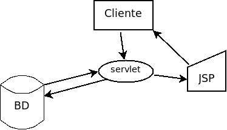
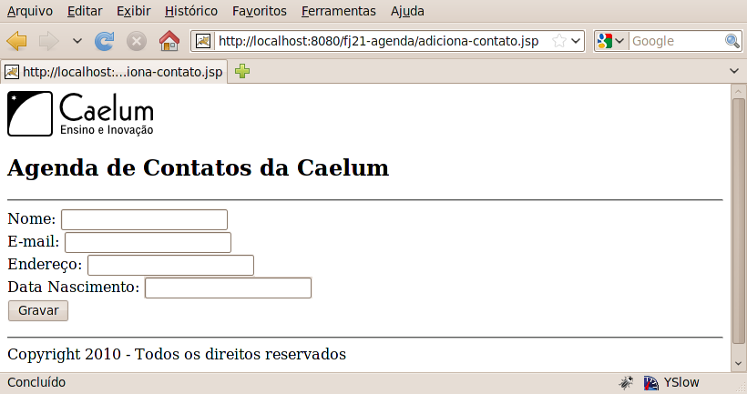
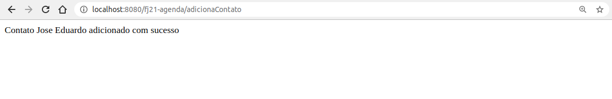
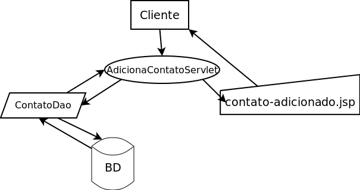
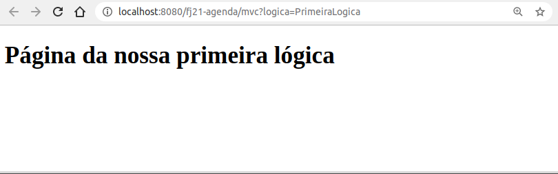

# MVC - Model View Controller
_"Ensinar é aprender duas vezes." -- Joseph Joubert_

Nesse capítulo, você aprenderá:


* O padrão arquitetural MVC;
* A construir um framework MVC simples.


## Servlet ou JSP?


Colocar todo HTML dentro de uma Servlet realmente não nos parece a melhor ideia. O que acontece
quando precisamos mudar o design da página? O designer não vai saber Java para editar a Servlet,
recompilá-la e colocá-la no servidor.

Imagine usar apenas JSP. Ficaríamos com muito _scriptlet_, que é muito difícil de dar
manutenção.

Uma ideia mais interessante é usar o que é bom de cada um dos dois.

O JSP foi feito apenas para apresentar o resultado, e ele não deveria fazer acessos a banco de
dados e nem fazer a instanciação de objetos. Isso deveria estar em código Java, na Servlet.


O ideal então é que a Servlet faça o trabalho árduo, a tal da **lógica de negócio**. E o JSP apenas
apresente visualmente os resultados gerados pela Servlet. A Servlet ficaria então com a lógica de negócios
(ou regras de negócio) e o JSP tem a **lógica de apresentação**.

Imagine o código do método da servlet `AdicionaContatoServlet` que fizemos antes:

``` java
  protected void service(HttpServletRequest request,
          HttpServletResponse response) {

      // log
      System.out.println("Tentando criar um novo contato...");

      // acessa o bean
      Contato contato = new Contato();
      // chama os setters
      ...

      // adiciona ao banco de dados
      ContatoDao dao = new ContatoDao();
      dao.adiciona(contato);

      // ok.... visualização
      out.println("<html>");
      out.println("<body>");
      out.println("Contato " + contato.getNome() +
          " adicionado com sucesso");
      out.println("</body>");
      out.println("</html>");

  }
```

Repare que, no final do nosso método, misturamos o código HTML com Java. O que queremos extrair do
código acima é justamente essas últimas linhas.

Seria muito mais interessante para o programador e para o designer ter um arquivo JSP chamado
`contato-adicionado.jsp` apenas com o HTML:

``` html
  <html>
    <body>
      Contato ${param.nome} adicionado com sucesso
    </body>
  </html>
```

Buscamos uma forma de redirecionar as requisições, capaz de encaminhar essa requisição para um
outro recurso do servidor: por exemplo indo de uma servlet para um JSP.

Para isso, fazemos o **dispatch das requisições**, para que o JSP só seja renderizado depois que
suas regras de negócio, dentro de uma servlet por exemplo, foram executadas.





## Request Dispatcher
Poderíamos melhorar a nossa aplicação se trabalhássemos com o código Java na servlet e o
HTML apenas no JSP.

A API de `Servlets` nos permite fazer tal redirecionamento. Basta conhecermos a URL que queremos
acessar e podemos usar um objeto `RequestDispatcher` para acessar outro recurso Web, seja esse recurso
uma página JSP ou uma servlet:

``` java
  RequestDispatcher rd = request
      .getRequestDispatcher("/contato-adicionado.jsp");
  rd.forward(request,response);
```

Podemos facilmente executar a lógica de nossa aplicação Web em uma servlet e então redirecionar
para uma página JSP, onde você possui seu código HTML e tags que irão manipular os dados trazidos
pela servlet.

> **Forward e include**
>
> O método `forward` só pode ser chamado quando nada foi ainda escrito para a saída. No momento que algo
> for escrito, fica impossível redirecionar o usuário, pois o protocolo HTTP não possui meios de voltar
> atrás naquilo que já foi enviado ao cliente.
>
> Existe outro método da classe `RequestDispatcher` que representa a inclusão de página e não o
> redirecionamento. Esse método se chama `include` e pode ser chamado a qualquer instante para
> acrescentar ao resultado de uma página os dados de outra.


## Exercícios: RequestDispatcher

Vamos evoluir nossa adição de contatos antes puramente usando Servlets para usar o
`RequestDispatcher`.
1. Seguindo a separação aprendida nesse capítulo, queremos deixar em um JSP separado a
  responsabilidade de montar o HTML a ser devolvido para o usuário.

  Crie então um novo arquivo **contato-adicionado.jsp** na pasta _WebContent_:
``` html
  <html>
    <body>
      Contato ${param.nome} adicionado com sucesso
    </body>
  </html>
```
1. **Altere** sua servlet `AdicionaContatoServlet` para que, após a execução da lógica de negócios,
  o fluxo da requisição seja redirecionado para nosso novo JSP.

  **Remova** no fim da classe o código que monta a saída HTML (as chamadas de `out.println`).
  Vamos substituir por uma chamada ao `RequestDispatcher` e exibir o mesmo resultado usando
  o JSP que criamos. A chamada fica no final de nossa servlet:

``` java
  RequestDispatcher rd = request
          .getRequestDispatcher("/contato-adicionado.jsp");
  rd.forward(request,response);
```
1. Teste a URL: http://localhost:8080/fj21-agenda/adiciona-contato.jsp

  
  


### Resultado
Perceba que já atingimos um resultado que não era possível anteriormente.

Muitos projetos antigos que foram escritos em Java utilizavam somente JSP ou servlets e o resultado
era assustador: diferentes linguagens misturadas num único arquivo, tornando difícil a tarefa de manutenção
do código. Com o conteúdo mostrado até esse momento, é possível escrever um código com muito
mais qualidade: cada tecnologia com a sua responsabilidade.


## Melhorando o processo
Aqui temos várias servlets acessando o banco de dados, trabalhando com os DAOs e pedindo para que o
JSP apresente esses dados, o diagrama a seguir mostra a representação do `AdicionaContatoServlet`
após a modificação do exercício anterior.



Temos o problema de ter muitas servlets. Para cada lógica de negócios, teríamos uma servlet
diferente, que significa várias portas de entradas, algo abominável em um projeto de verdade.
Imagine dez classes de modelo, cinco lógicas diferentes, isso totaliza cinquenta formas
diferentes de acesso.

E se quiséssemos fazer um _Log_ das chamadas dessas lógicas? Teríamos que espalhar o código
para esse _Log_ por toda nossa aplicação.

Sabemos da existência de ferramentas para gerar tal código automaticamente, mas isso não resolve o
problema da complexidade de administrar tantas servlets.

Utilizaremos uma ideia que diminuirá bastante o número de portas de entradas em nossa aplicação:
_colocar tudo em uma Servlet só_ e, de acordo com os parâmetros que o cliente usar,
decidimos o que executar. Teríamos aí uma Servlet para controlar essa parte, como o esboço abaixo:

``` java
// Todas as lógicas dentro de uma Servlet
@WebServlet("/sistema")
public class SistemaTodoServlet extends HttpServlet {

  protected void service(HttpServletRequest request,
          HttpServletResponse response) {
      
      String acao = request.getParameter("logica");
      ContatoDao dao = new ContatoDao();
      
      if (acao.equals("AdicionaContato")) {
          Contato contato = new Contato();
          contato.setNome(request.getParameter("nome"));
          contato.setEndereco(request.getParameter("endereco"));
          contato.setEmail(request.getParameter("email"));
          dao.adiciona(contato);
          
          RequestDispatcher rd = 
              request.getRequestDispatcher("/contato-adicionado.jsp");
          rd.forward(request, response);
      } else if (acao.equals("ListaContatos")) {
          // busca a lista no DAO
          // despacha para um jsp
      } else if (acao.equals("RemoveContato")) {
          // faz a remoção e redireciona para a lista
      } 
  }
}
```

Poderíamos acessar no navegador algo como
`http://localhost:8080/<contexto>/sistema?logica=AdicionaContato`.

Mas para cada ação teríamos um `if` / `else if`, tornando a Servlet muito grande,
com toda regra de negócio do sistema inteiro.

Podemos melhorar fazendo _refactoring_ de extrair métodos. Mas continuaríamos com
uma classe muito grande.


Seria melhor colocar cada regra de negócio (como inserir contato, remover contato, fazer relatório etc)
em uma classe separada. Cada ação (regra de negócio) em nossa aplicação estaria em uma classe.

Então vamos extrair a nossa lógica para diferentes classes, para que nossa Servlet pudesse
ter um código mais enxuto como esse:

``` java
  if (acao.equals("AdicionaContato")) {
      new AdicionaContato().executa(request,response);
  } else if (acao.equals( "ListaContato")) {
      new ListaContatos().executa(request,response);
  }
```

E teríamos classes `AdicionaContato`, `ListaContatos`, etc com um método (digamos, `executa`)
que faz a lógica de negócios apropriada.

Porém, a cada lógica nova, lógica removida, alteração etc, temos que alterar essa servlet. Isso é
trabalhoso e muito propenso a erros.

Repare dois pontos no código acima. Primeiro que ele possui o mesmo comportamento de `switch`!
E `switch` em Java quase sempre pode ser substituído com vantagem por polimorfismo, como veremos a
seguir. Outra questão é que recebemos como parâmetro justamente o nome da classe que chamamos em seguida.

Vamos tentar generalizar então, queremos executar o seguinte código:

``` java
  String nomeDaClasse = request.getParameter("logica");
  new nomeDaClasse().executa(request,response);
```

Queremos pegar o nome da classe a partir do parâmetro e instanciá-la. Entretanto não podemos, pois
`nomeDaClasse` é o nome de uma variável e o código acima não é válido. O nosso problema é que
só sabemos o que vamos instanciar em tempo de execução (quando o parâmetro chegar) e não em tempo
de compilação.

Mas a partir do nome da classe nós podemos recuperar um objeto que representará as informações contidas
dentro daquela classe, como por exemplo atributos, métodos e construtores. Para que consigamos esse
objeto, basta utilizarmos a classe `Class` invocando o método `forName` indicando de qual classe
queremos uma representação. Isso nos retornará um objeto do tipo `Class` representando a classe.
Como abaixo:

``` java
  String nomeDaClasse = "br.com.caelum.mvc.logica." +
          request.getParameter("logica");
  Class classe = Class.forName(nomeDaClasse);
```

Ótimo, podemos ter uma representação de `AdicionaContato` ou de `ListaContato` e assim
por diante. Mas precisamos de alguma forma instanciar essas classes.

Já que uma das informações guardadas pelo objeto do tipo `Class` é o construtor, nós podemos
invocá-lo para instanciar a classe através do método `newInstance`.

``` java
  Object objeto = classe.newInstance();
```

E como chamar o método `executa`? Repare que o tipo declarado do nosso objeto é `Object`.
Dessa forma, não podemos chamar o método `executa`. Uma primeira alternativa seríamos fazer
novamente `if/else` para sabermos qual é a lógica que está sendo invocada, como abaixo:

``` java
  String nomeDaClasse = "br.com.caelum.mvc." + 
          request.getParameter("logica");
  Class classe = Class.forName(nomeDaClasse);

  Object objeto = classe.newInstance();

  if (nomeDaClasse.equals("br.com.caelum.mvc.AdicionaContato")) {
      ((AdicionaContato) objeto).executa(request, response);
  } else if (nomeDaClasse.equals("br.com.caelum.mvc.ListaContatos")) {
      ((ListaContatos) objeto).executa(request, response);
  } //e assim por diante
```

Mas estamos voltando para o `if/else` que estávamos fugindo no começo. Isso não é bom.
Todo esse `if/else` é ocasionado por conta do tipo de retorno do método
`newInstance` ser `Object` e nós tratarmos cada uma de nossas lógicas através de
um tipo diferente.

Repare que, tanto `AdicionaContato` quanto `ListaContatos`, são consideradas `Logicas`
dentro do nosso contexto. O que podemos fazer então é tratar ambas como algo que siga
o contrato de `Logica` implementando uma interface de mesmo nome que declare o método
`executa`:

``` java
  public interface Logica {
      void executa(HttpServletRequest req, 
              HttpServletResponse res)
              throws Exception;
}
```

Podemos simplificar nossa `Servlet` para executar a lógica de forma
polimórfica e, tudo aquilo que fazíamos em aproximadamente 8 linhas de código,
podemos fazer em apenas 2:

``` java
  Logica logica = (Logica) classe.newInstance();
  logica.executa(request, response);
```

Dessa forma, uma lógica simples para logar algo no console poderia ser equivalente a:

``` java
  public class PrimeiraLogica implements Logica {
      public void executa(HttpServletRequest req,
              HttpServletResponse res)
              throws Exception {
          System.out.println("Executando a logica e redirecionando...");
          RequestDispatcher rd = req
                  .getRequestDispatcher("primeira-logica.jsp");
          rd.forward(req, res);
      }
  }
```

Alguém precisa controlar então que ação será executada para cada requisição, e que JSP será utilizado.
Podemos usar uma servlet para isso, e então ela passa a ser a servlet controladora da nossa aplicação,
chamando a ação correta e fazendo o dispatch para o JSP desejado.

Melhorando ainda mais nossa servlet controladora, poderíamos deixar nela a responsabilidade de
nos redirecionar para uma página JSP ou para qualquer outra lógica ao final da execução das lógicas,
bastando que o método `executa` retorne um simples `String`, eliminando toda a repetição de
código `RequestDispatcher`.

Começaríamos alterando a assinatura do método `executa` da interface `Logica` que
era `void` e agora retornará `String`:

``` java
  public interface Logica {
    String executa(HttpServletRequest req, HttpServletResponse res) 
        throws Exception;

  }
```

Depois faríamos as lógicas retornarem um `String` com o nome do **.jsp** que deve ser chamado
ao final das suas execuções.

``` java
  public class PrimeiraLogica implements Logica {
      public String executa(HttpServletRequest req,
              HttpServletResponse res)
              throws Exception {
          System.out.println("Executando a logica e redirecionando...");
          return "primeira-logica.jsp";
      }
  }
```

Por fim, a servlet controladora deve receber esse `String` e implementar o código de
`RequestDispatcher`:

``` java
  @WebServlet("/sistema")
  public class ControllerServlet extends HttpServlet {

    protected void service(HttpServletRequest request,
        HttpServletResponse response) 
          throws ServletException, IOException {

      String parametro = request.getParameter("logica");
      String nomeDaClasse = "br.com.caelum.mvc.logica." + parametro;

      try {
        Class<?> classe = Class.forName(nomeDaClasse);
        Logica logica = (Logica) classe.newInstance();

        // Recebe o String após a execução da lógica
        String pagina = logica.executa(request, response);

        // Faz o forward para a página JSP
        request.getRequestDispatcher(pagina).forward(request, response);

      } catch (Exception e) {
        throw new ServletException(
            "A lógica de negócios causou uma exceção", e);
      }
    }
  }
```

## Retomando o _design pattern_ Factory
Note que o método `forName` da classe `Class` retorna um objeto do tipo `Class`, mas esse objeto
é novo? Foi reciclado através de um cache desses objetos?

Repare que não sabemos o que acontece exatamente dentro do método `forName`, mas ao invocá-lo e a
execução ocorrer com sucesso, sabemos que a classe que foi passada em forma de `String` foi lida e
inicializada dentro da virtual machine.

Na primeira chamada a `Class.forName` para determinada classe, ela é inicializada. Já em uma
chamada posterior, `Class.forName` devolve a classe que já foi lida e está na memória, tudo isso sem
que afete o nosso código.

Esse exemplo do `Class.forName` é ótimo para mostrar que qualquer código que isola a instanciação
através de algum recurso diferente do construtor é uma **factory**.


## Exercícios: Criando nossas lógicas e a servlet de controle
1. Crie a sua interface no pacote `br.com.caelum.mvc.logica`:

``` java
  public interface Logica {
      String executa(HttpServletRequest req,
              HttpServletResponse res) throws Exception;
  }
```
1. Crie uma implementação da interface `Logica`, nossa classe `PrimeiraLogica`, também
  no pacote `br.com.caelum.mvc.logica`:

``` java
  public class PrimeiraLogica implements Logica {
      public String executa(HttpServletRequest req,
              HttpServletResponse res) throws Exception {

          System.out.println("Executando a logica ...");

          System.out.println("Retornando o nome da página JSP ...");
return "primeira-logica.jsp";

      }
  }
```
1. Faça um arquivo JSP chamado `primeira-logica.jsp` dentro do diretório `WebContent`:
``` html
  <html>
    <body>
      <h1> Página da nossa primeira lógica </h1>
    </body>
  </html>
```
1. Vamos escrever nossa Servlet que coordenará o fluxo da nossa aplicação.

  Crie sua servlet chamada `ControllerServlet` no pacote `br.com.caelum.mvc.servlet`:

``` java
  @WebServlet("/mvc")
  public class ControllerServlet extends HttpServlet {
      protected void service(HttpServletRequest request,
              HttpServletResponse response) 
              throws ServletException, IOException {

          String parametro = request.getParameter("logica");
          String nomeDaClasse = "br.com.caelum.mvc.logica." + parametro;

          try {
              Class classe = Class.forName(nomeDaClasse);

              Logica logica = (Logica) classe.newInstance();
              String pagina = logica.executa(request, response);

              request.getRequestDispatcher(pagina).forward(request, response);

          } catch (Exception e) {
              throw new ServletException(
                "A lógica de negócios causou uma exceção", e);
          }
      }
  }
```
1. Teste a url http://localhost:8080/fj21-agenda/mvc?logica=PrimeiraLogica

  


## Exercícios: Criando uma lógica para remover contatos
1. Crie uma nova classe chamada `RemoveContatoLogica` no mesmo pacote
  `br.com.caelum.mvc.logica`. Devemos implementar a interface `Logica` e
  durante sua execução receberemos um `id` pelo _request_ e removeremos o
  contato no banco a partir deste `id`.

``` java
  public class RemoveContatoLogica implements Logica {

    public String executa(HttpServletRequest req, HttpServletResponse res)
        throws Exception {

      long id = Long.parseLong(req.getParameter("id"));

      Contato contato = new Contato();
      contato.setId(id);

      ContatoDao dao = new ContatoDao();
      dao.exclui(contato);

      System.out.println("Excluindo contato... ");

      return "lista-contatos.jsp";
    }

  }
```
1. Na página `lista-contatos.jsp`, vamos acrescentar uma coluna na tabela
  que lista os contatos com um link chamando a lógica de remoção e passando o `id`
  do contato:

``` html
  <!-- código omitido -->

  <c:forEach var="contato" items="${dao.lista}">
    <tr>

      <!-- código omitido -->

      <td>
        <a href="mvc?logica=RemoveContatoLogica&id=${contato.id}">Remover</a>
      </td>
    </tr>
  </c:forEach>

  <!-- código omitido -->
```
1. Teste a logica de remoção acessando
  http://localhost:8080/fj21-agenda/lista-contatos.jsp e clicando
  em algum link **Remover**.


## Fazendo a lógica para listar os contatos
Agora que todo nosso processamento está passando pela Servlet controladora e conseguimos
organizar nosso código em camadas bem definidas, nos deparamos com uma situação que
ainda está um pouco distante do ideal.

Se olharmos a página `lista-contatos.jsp` veremos que para fazer a listagem
dos contatos funcionar estamos criando uma instância da classe `ContatoDao` para
utilizá-la depois no `<c:forEach>` recuperando uma lista de contatos.

``` html
  <jsp:useBean id="dao" class="br.com.caelum.agenda.dao.ContatoDao" />

  <table>
    <c:forEach var="contato" items="${dao.lista}">
      <tr>
        <td>${contato.nome}</td>
        <!-- código omitido -->
      </tr>
    </c:forEach>
  </table>
```

Instanciar objetos da camada _Model_ na camada _View_ não é considerada uma boa
prática na arquitetura MVC (_antipattern_).

Podemos resolver facilmente isso tranferindo essa responsabilidade de montar a lista
de contatos para uma lógica `ListaContatosLogica` e depois passá-la pronta direto para o
JSP pelo _request_.

Para guardarmos algo na requisição, precisamos invocar o método `.setAttribute()` no
_request_. Passamos para esse método uma identificação para o objeto que estamos
guardando na requisição e também passamos o próprio objeto para ser guardado no _request_.

``` java
  public class ListaContatosLogica implements Logica {

    public String executa(HttpServletRequest req, HttpServletResponse res)
          throws Exception {

        // Monta a lista de contatos
        List<Contato> contatos = new ContatoDao().getLista();

        // Guarda a lista no request
        req.setAttribute("contatos", contatos);

        return "lista-contatos.jsp";
    }
  }
```

Agora é só ajustar a página `lista-contatos.jsp` para não instanciar mais o
`ContatoDao`, removendo a linha
`<jsp:useBean id="dao" class="br.com.caelum.agenda.dao.ContatoDao" />`, e depois
fazer com que o `<c:forEach>` use a lista de contatos que foi colocada no _request_:

``` html
  <c:forEach var="contato" items="${contatos}">
```

## Exercícios: Lógica para listar contatos
1. Crie uma nova classe chamada `ListaContatosLogica` no mesmo pacote
  `br.com.caelum.mvc.logica`. Devemos implementar nela a interface `Logica` e,
  durante sua execução vamos criar uma lista de contatos através de uma instância
  da classe `ContatoDao`, guardá-la no _request_ e retornar para a servlet
  controladora:

``` java
    public class ListaContatosLogica implements Logica {

      public String executa(HttpServletRequest req, HttpServletResponse res)
          throws Exception {

        List<Contato> contatos = new ContatoDao().getLista();

        req.setAttribute("contatos", contatos);

        return "lista-contatos.jsp";
      }
    }
```

1. Agora, vamos modificar a página `lista-contatos.jsp` para não instanciar
  mais `ContatoDao` na _View_, removendo a linha
  `<jsp:useBean id="dao" class="br.com.caelum.agenda.dao.ContatoDao" />`, e alterar
  o `<c:forEach>` para usar a lista de contatos que foi colocada pela lógica no
  _request_ ao invés de `${dao.lista}`:

``` java
  <c:forEach var="contato" items="${contatos}">
```

1. Agora podemos testar chamando:
  `http://localhost:8080/fj21-agenda/mvc?logica=ListaContatosLogica`
1. Depois dessas alterações, será necessário alterar o retorno da classe
  `RemoveContatoLogica` pois agora a chamada direta do
  `lista-contatos.jsp` não é mais possível. Devemos agora chamar
  a lógica que lista os contatos:

``` java
  public class RemoveContatoLogica implements Logica {

    public String executa(HttpServletRequest req, HttpServletResponse res)
        throws Exception {

      // código omitido

      return "mvc?logica=ListaContatosLogica";
    }

  }
```


## Escondendo nossas páginas
Como alteramos nossa listagem para ser acessada pela lógica `ListaContatosLogica`,
se acessarmos a jsp `lista-contatos.jsp` diretamente pelo navegador, a página não
mostrará nenhum contato. Precisamos então sempre passar pela lógica, que por sua vez
disponibilizará a listagem para a página.

Portanto, não devemos permitir que o usuário acesse diretamente nossa página. Para
impossibilitar este acesso direto, colocaremos nossas páginas dentro do diretório
**WEB-INF/jsp**.

Agora que estamos usando MVC, uma boa prática é não deixarmos os usuários acessarem
nossas páginas diretamente, e sim passando sempre por uma lógica.

Nossa lógica de listagem ficará da seguinte forma:

``` java
  public class ListaContatosLogica implements Logica {

    public String executa(HttpServletRequest req, HttpServletResponse res)
        throws Exception {

      List<Contato> contatos = new ContatoDao().getLista();

      req.setAttribute("contatos", contatos);

      return "/WEB-INF/jsp/lista-contatos.jsp";
  }
```

Além disso, se quisermos aplicar este mesmo conceito para as demais jsps,
precisaremos alterar as demais lógicas correspondentes acrescentando o diretório
`WEB-INF/jsp` antes do nome da página.

## Exercícios opcionais
1. Crie uma lógica chamada `AlteraContatoLogica` e teste a mesma através de um link na listagem
  da `lista-contatos.jsp`. Lembre-se, antes de chamar essa lógica é preciso criar
  uma outra lógica que mostre os dados do contato em uma nova página, permitindo assim a alteração
  dos dados, e só depois, no clique de um botão, que a alteração será de fato efetivada.
1. Crie a lógica de adicionar contatos (`AdicionaContatoLogica`). Repare que ela é bem parecida com a
  `AlteraContatoLogica`. Crie um formulário de adição de novo contato.
  Coloque um link para adicionar novos contatos dentro do `lista-contatos.jsp`.
1. **Desafio**: As lógicas de adição e de alteração ficaram muito parecidas. Tente criar uma versão de uma
  dessas lógicas que faça as duas. Dica: A única diferença entre as duas é a presença ou não
  do parâmetro Id.
1. **Desafio**: Altere seu projeto para que nenhuma jsp seja acessível diretamente,
  colocando-as no diretório **WEB-INF/jsp**. Modifique também suas lógicas de acordo.
  OBS: Deverá ser criada uma nova lógica para a visualização do formulário de adição
  de contatos.


## Model View Controller
Generalizando o modelo acima, podemos dar nomes a cada uma das partes dessa nossa arquitetura. Quem
é responsável por apresentar os resultados na página web é chamado de Apresentação (**View**).


A servlet (e auxiliares) que faz os dispatches para quem deve executar determinada tarefa é chamada
de Controladora (**Controller**).


As classes que representam suas entidades e as que te ajudam a armazenar e buscar os dados são
chamadas de Modelo (**Model**).


Esses três formam um padrão arquitetural chamado de **MVC**, ou **Model View Controller**. Ele pode
sofrer variações de diversas maneiras. O que o MVC garante é a separação de tarefas, facilitando
assim a reescrita de alguma parte, e a manutenção do código.


O famoso **Struts** ajuda você a implementar o **MVC**, pois tem uma controladora já pronta, com uma
série de ferramentas para te auxiliar. O **Hibernate** pode ser usado como **Model**, por exemplo. E
como **View** você não precisa usar só **JSP**, pode usar a ferramenta **Velocity**, por exemplo.

## Lista de tecnologias: camada de controle
Há diversas opções para a camada de controle no mercado. Veja um pouco sobre algumas delas:


* **Struts Action** - o controlador mais famoso do mercado Java, é utilizado principalmente por
ser o mais divulgado e com tutoriais mais acessíveis. Possui vantagens características do MVC e
desvantagens que na época ainda não eram percebidas. É o controlador pedido na maior parte das
vagas em Java hoje em dia. É um projeto que não terá grandes atualizações pois a equipe dele se
juntou com o WebWork para fazer o Struts 2, nova versão do Struts incompatível com a primeira e
totalmente baseada no WebWork.

* **VRaptor** - desenvolvido inicialmente por profissionais da Caelum e baseado em diversas ideias
dos  controladores mencionados acima, o VRaptor usa o conceito de favorecer Convenções em vez de
Configurações para minimizar o uso de XML e anotações em sua aplicação Web.

* **JSF** - JSF é uma especificação Java para frameworks MVC. Ele é baseado em componentes e
possui várias facilidades para desenvolver a interface gráfica. Devido ao fato de ser um padrão
oficial, ele é bastante adotado. O JSF é ensinado em detalhes no nosso curso FJ-26.

* **Spring MVC** - é uma parte do _Spring Framework_ focado em implementar um controlador MVC.
É fácil de usar em suas últimas versões e tem a vantagem de se integrar a toda a estrutura do
Spring com várias tecnologias disponíveis.


## Lista de tecnologias: camada de visualização
Temos também diversas opções para a camada de visualização. Um pouco sobre algumas delas:


* **JSP** - como já vimos, o JavaServer Pages, temos uma boa ideia do que ele é, suas vantagens e
desvantagens. O uso de _taglibs_ (a JSTL por exemplo) e expression language é muito importante
se você escolher JSP para o seu projeto. É a escolha do mercado hoje em dia.

* **Velocity** - um projeto antigo, no qual a EL do JSP se baseou, capaz de fazer tudo o que você
precisa para a sua página de uma maneira extremamente compacta. Indicado pela Caelum para conhecer
um pouco mais sobre outras opções para camada de visualização.

* **Freemarker** - similar ao Velocity e com ideias do JSP - como suporte a taglibs - o freemarker
vem sendo cada vez mais utilizado, ele possui diversas ferramentas na hora de formatar seu texto
que facilitam muito o trabalho do designer.

* **Sitemesh** - não é uma alternativa para as ferramentas anteriores mas sim uma maneira de criar
templates para seu site, com uma ideia muito parecida com o _struts tiles_, porém genérica:
funciona inclusive com outras linguagens como PHP etc.


Em pequenas equipes, é importante uma conversa para mostrar exemplos de cada uma das tecnologias acima
para o designer, afinal quem vai trabalhar com as páginas é ele. A que ele preferir, você usa, afinal
todas elas fazem o mesmo de maneiras diferentes. Como em um projeto é comum ter poucos designers
e muitos programadores, talvez seja proveitoso facilitar um pouco o trabalho para aqueles.

## Discussão em aula: os padrões Command e Front Controller

