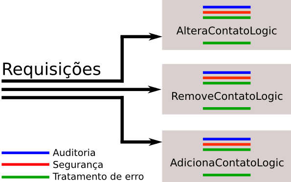
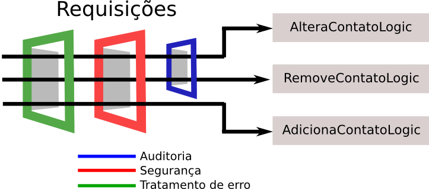
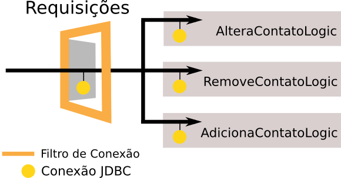

# Recursos importantes: Filtros
_"A arte nunca está terminada, apenas abandonada." -- Leonardo Da Vinci_

Ao término desse capítulo, você será capaz de:

* criar classes que filtram a requisição e a resposta;
* guardar objetos na requisição;
* descrever o que é injeção de dependências;
* descrever o que é inversão de controle;


## Reduzindo o acoplamento com Filtros

Em qualquer aplicação surgem requisitos que não são diretamente relacionados com a regra de negócio.
Um exemplo clássico desses requisitos não funcionais é a auditoria (_Logging_). Queremos logar as
chamadas de uma lógica da nossa aplicação. Outros exemplos são autorização, tratamento de erro ou
criptografia. Existem vários outros, mas o que todos eles tem em comum é que não são relacionados com as
regras de negócios.

A pergunta como implementar estas funcionalidades, nos vem a cabeça. A primeira ideia seria colocar o código diretamente
na classe que possui a lógica. A classe seguinte mostra através de pseudocódigo as chamadas para fazer auditoria e
autorização:

``` java
public class RemoveContatoLogic implements Logica {
        
   public void executa(HttpServletRequest request,
        HttpServletResponse response) 
        throws Exception {

        // auditoria
        Logger.info("acessando remove contato logic");

        // autorização
        if(!usuario.ehCliente()) {
            request.getRequestDispatcher("/acessoNegado.jsp")
                    .forward(request,response);
        }

        // toda lógica para remover o contato aqui
        // ...
    }
}
```

Podemos ver que além da lógica é preciso implementar os outros requisitos, mas não só apenas na lógica
que altera o contato, também é necessário colocar o mesmo código nas lógicas que adiciona, remove ou
faz a listagem dos contatos. Isso pode piorar pensando que existem
muito mais requisitos não funcionais, como resultado o código aumenta em cada lógica.
Desse jeito criamos um acoplamento muito forte entre a logica e a implementação
dos requisitos não funcionais. O grande problema é que os mesmos ficam espalhados
em todas as lógicas. A imagem abaixo ilustra esse acoplamento:




A API de Servlets nos provê um mecanismo para tirar esse acoplamento e isolar esse comportamento,
que são os **Filtros**. Filtros são classes que permitem que executemos código antes da requisição
e também depois que a resposta foi gerada.

Uma boa analogia é pensar que as lógicas são quartos em uma casa. Para acessar um quarto é preciso
passar por várias portas. As portas são os filtros, onde você passa na ida e na volta. Cada filtro encapsula apenas
uma responsabilidade, ou seja um filtro para fazer auditoria, outro para fazer a segurança etc.
Então é possível usar vários filtros em conjunto. Uma porta também pode ficar fechada, caso o usuário
não possua acesso a lógica, ou seja, o filtro pode negar a execução de uma lógica. Veja a imagem seguinte que mostra
os filtros aplicados no exemplo anterior:



A grande vantagem é que cada requisito fica em um lugar só e conseguimos desacoplar nossas lógicas.

Para criarmos filtros utilizando a API de Servlets do Java EE 5, temos as mesmas dificuldades que temos
quando vamos definir `Servlets`. Para cada filtro é necessário criarmos a classe que implementa a interface
`javax.servlet.Filter` e depois declararmos o filtro no `web.xml`, além de termos que declarar para
quais URL's aquele filtro será aplicado.

Configuração de um filtro no `web.xml`:
``` xml
		<filter>
			<filter-name>meuFiltro</filter-name>
			<filter-class>br.com.caelum.filtro.MeuFiltro</filter-class>
		</filter>
	
		<filter-mapping>
			<filter-name>meuFiltro</filter-name>
			<url-pattern>/*</url-pattern>
		</filter-mapping>
```

Mas para definirmos um filtro usando a nova API de Servlets do Java EE 6, basta apenas criarmos uma
classe que implementa a interface `javax.servlet.Filter` e anotarmos a classe com `@WebFilter`.
Podemos aproveitar e passar como parâmetro na anotação o padrão de requisições que serão filtradas:

``` java
		@WebFilter("/oi") 
		public class MeuFiltro implements Filter { 
			public void doFilter(ServletRequest req,
					ServletResponse res, FilterChain chain) { 
				// ... 
			} 
		}
```

Desta forma indicamos que todas as requisições vindas a partir de `/oi` serão filtradas e, portanto,
o filtro será aplicado em cada requisição.

É possível usar um filtro mais especifico. Por exemplo, podemos filtrar todas as requisições
para paginas JSPs:

``` java
	@WebFilter("/*.jsp")
	public class MeuFiltro implements Filter { 
		public void doFilter(ServletRequest req,
				ServletResponse res, FilterChain chain) { 
			// ... 
		} 
	}
```

Ou um filtro mais amplo, filtrando TODAS as requisições da aplicação:

``` java
	@WebFilter("/*")
	public class MeuFiltro implements Filter { 
		public void doFilter(ServletRequest req,
				ServletResponse res, FilterChain chain) { 
			// ... 
		} 
	}
```

Ao implementar a interface `Filter`, temos que implementar 3 métodos: `init`, `destroy` e `doFilter`.

Os métodos `init` e `destroy` possuem a mesma função dos métodos de mesmo nome da `Servlet`, ou seja,
executar algo quando o seu filtro é carregado pelo container e quando é descarregado pelo container.

O método que fará todo o processamento que queremos executar é o `doFilter`, que recebe
três parâmetros: `ServletRequest`, `ServletResponse` e `FilterChain`.

``` java
	@WebFilter("/*")
	public class FiltroTempoDeExecucao implements Filter {
	    
	    // implementação do init e destroy

	    public void doFilter(ServletRequest request,
	            ServletResponse response, FilterChain chain)
	            throws IOException, ServletException {
	        
	        // todo o processamento vai aqui
	    }
	}
```

Perceba a semelhança desse método com o método `service` da classe `Servlet`. A ideia
do filtro é também processar requests, mas ele poderá fazer isso de maneira mais genérica para vários
tipos de requests. Mas um filtro vai além de um servlet, com um filtro podemos também fechar "a porta".
Esse poder vem do argumento `FilterChain` (a cadeia de filtros). Ele nos permite indicar ao container
que o request deve prosseguir seu processamento. Isso é feito com uma chamada do método `doFilter`
da classe `FilterChain`:

``` java
	public void doFilter(ServletRequest request,
	        ServletResponse response, FilterChain chain)
	        throws IOException, ServletException {
	    
	    // passa pela porta
	    chain.doFilter(request, response);
	}
```

Um filtro não serve para processar toda a requisição. A ideia é ele _interceptar_ vários _requests_
semelhantes, executar algo, mas depois permitir que o processamento normal do _request_ prossiga
através das Servlets e JSPs normais.

Qualquer código colocado antes da chamada `chain.doFilter(request,response)` será executado na ida,
qualquer código depois na volta. Com isso podemos fazer um verificação de acesso antes da lógica, ou
abrir um recurso (conexão ou transação) antes e na volta fechar o mesmo. Um filtro é ideal para fazer
tratamento de error ou medir o tempo de execução.

A única coisa que precisamos fazer para que o nosso filtro funcione é registrá-lo, para que o container saiba
que ele precisa ser executado. Fazemos isso de forma simples, usando atributos da anotação `@WebFilter`.
Através dos atributos, declaramos o filtro e quais URLs ou Servlets serão filtradas.

O atributo **filterName** define um nome (ou _alias_) para o filtro. Se não definirmos o atributo `filterName`
para nosso filtro, o nome dele será o nome completo da classe, da mesma forma que acontece com as `Servlets`.
Para definirmos quais URL passarão pelo nosso filtro, podemos fazê-lo de maneira similar à anotação
`@WebServlet`. Se quisermos definir aquele filtro para apenas uma URL, passamos através do parâmetro
na anotação `@WebFilter` como foi feito no exemplo acima -`@WebFilter("/oi")`. Mas, se
quisermos definir que mais de uma URL será filtrada, podemos usar o atributo `urlPatterns`:

``` java
		@WebFilter(filterName = "MeuFiltro", ulrPatterns = {"/oi", "/ola"}) 
		public class MeuFiltro implements Filter { 
			public void doFilter(ServletRequest req, 
					ServletResponse res, FilterChain chain) { 
				// ... 
			} 
		}
```

Podemos ainda configurar quais servlets serão filtrados por aquele filtro declarando seus nomes no
atributo `servletNames`. Por exemplo:

``` java
		@WebFilter(filterName = "MeuFiltro", 
				servletNames = {"meuServlet", "outroServlet"}) 
		public class MeuFiltro implements Filter { 
			public void doFilter(ServletRequest req, 
					ServletResponse res, FilterChain chain) { 
				// ... 
			} 
		}
```

> **Outras anotações**
>
> Existem outras anotações presentes na API Servlets 3.0:
>
>
> * **@WebListener** - Utilizada para definir Listeners de eventos que podem ocorrer em
> vários pontos da sua aplicação; equivale ao **<listener>** de hoje;
>
> * **@WebInitParam** - Utilizada para especificar parâmetros de inicialização que podem ser
> passados para `Servlets` e `Filtros`. Pode ser passada como parâmetro para as anotações
> `@WebServlet` e `@WebFilter`; equivale ao **<init-param>** de hoje;
>
> * **@MultipartConfig** - Utilizada para definir que um determinado `Servlet` receberá
> uma requisição do tipo `mime/multipart`.
>
>


## Exercícios opcionais: Filtro para medir o tempo de execução


1. Vamos criar o nosso filtro para medir o tempo de execução de uma requisição.

	* Crie uma nova classe chamada `FiltroTempoDeExecucao` no pacote `br.com.caelum.agenda.filtro`
	e faça ela implementar a interface `javax.servlet.Filter`
	* Anote-a com `@WebFilter` e diga que TODAS as requisições para a nossa aplicação devem
	ser filtradas (`@WebFilter("/*")`).
	* Deixe os métodos `init` e `destroy` vazios e implemente o `doFilter`:
	``` java
		    @WebFilter("/*")
            public class FiltroTempoDeExecucao implements Filter {
                public void doFilter(ServletRequest request,
                        ServletResponse response, FilterChain chain)
                        throws IOException, ServletException {

                    long tempoInicial = System.currentTimeMillis();

                    chain.doFilter(request, response);

                    long tempoFinal = System.currentTimeMillis();
                    String uri = ((HttpServletRequest)request).getRequestURI();	
					String parametros = ((HttpServletRequest) request)
							.getParameter("logica");
					System.out.println("Tempo da requisicao de " + uri 
							+ "?logica="
							+ parametros + " demorou (ms): " 
							+ (tempoFinal - tempoInicial));

                }
                // métodos init e destroy omitidos
            }
	```

	* Reinicie o servidor e acesse
	**http://localhost:8080/fj21-agenda/mvc?logica=ListaContatosLogic**

	Procure a saída no console.


## Problemas na criação das conexões


Nossa aplicação de agenda necessita, em vários momentos, de uma conexão com o banco de dados e, para isso,
o nosso `DAO` invoca em seu construtor a `ConnectionFactory` pedindo para a mesma uma nova conexão. Mas
em qual lugar ficará o fechamento da conexão?

``` java
public class ContatoDao {
	private Connection connection;

	public ContatoDao() {
		this.connection = new ConnectionFactory().getConnection();
	}
	
	// métodos adiciona, remove, getLista etc
	// onde fechamos a conexão?
}
```

Até o momento, não estamos nos preocupando com o fechamento das conexões com o banco de dados. Isso é uma
péssima prática para uma aplicação que vai para produção. Estamos deixando conexões abertas e
sobrecarregando o servidor de banco de dados, que pode aguentar apenas um determinado número de conexões
abertas, o que fará com que sua aplicação pare de funcionar subitamente.

Outro problema que temos ao seguir essa estratégia de adquirir conexão no construtor dos `DAOs` é quando
queremos usar dois `DAOs` diferentes, por exemplo `ContatoDao` e `FornecedorDao`. Ao instanciarmos
ambos os `DAOs`, vamos abrir duas conexões, enquanto poderíamos abrir apenas uma conexão para fazer as
duas operações. De outra forma fica impossível realizar as operações numa única transação.

## Tentando outras estratégias

Já percebemos que não é uma boa ideia colocarmos a criação da conexão no construtor dos nossos `DAOs`.
Mas qual é o lugar ideal para criarmos essa conexão com o banco de dados?

Poderíamos criar a conexão dentro de cada método do `DAO`, mas nesse caso, se precisássemos usar dois
métodos diferentes do `DAO` em uma mesma operação, novamente abriríamos mais de uma conexão. Dessa forma,
abrir e fechar as conexões dentro dos métodos dos `DAOs` também não nos parece uma boa alternativa.

Precisamos, de alguma forma, criar a conexão e fazer com que essa mesma conexão  possa ser usada por todos
os seus `DAOs` em uma determinada requisição. Assim, podemos criar nossas conexões com o banco de dados
dentro de nossas `Servlets` (ou lógicas, no caso do nosso framework MVC visto no capítulo anterior) e
apenas passá-las para o `DAO` que vamos utilizar. Para isso, nossos `DAOs` deverão ter um construtor
que receba `Connection`.

Vejamos:

``` java
	public class ContatoDao {
		private Connection connection;
		
		public ContatoDao(Connection connection) {
			this.connection = connection;
		}
		
		// métodos adiciona, remove, getLista etc
	}
```
``` java
    public class AdicionaContatoLogic implements Logica {
        public String executa(HttpServletRequest request,
                HttpServletResponse response) {
            Contato contato = // contato montado com os dados do request
            
            Connection connection = new ConnectionFactory()
                    .getConnection();
            
            // passa conexão pro construtor
            ContatoDao dao = new ContatoDao(connection);
            dao.adiciona(contato);
            
            connection.close();

            // retorna para o JSP
        }
	}
```

Isso já é uma grande evolução com relação ao que tínhamos no começo mas ainda não é uma solução muito boa.
Acoplamos com a `ConnectionFactory` todas as nossas lógicas que precisam utilizar `DAOs`. E, em
orientação a objetos, não é uma boa prática deixarmos nossas classes com acoplamento alto.

> **Injeção de Dependências e Inversão de Controle**
>
> Ao não fazermos mais a criação da conexão dentro do `ContatoDao` mas sim recebermos a `Connection` da
> qual dependemos através do construtor, dizemos que o nosso `DAO` não tem mais o controle sobre a criação
> da `Connection` e, por isso, estamos **Invertendo o Controle** dessa criação. A única coisa que o nosso
> `DAO` diz é que ele depende de uma `Connection` através do construtor e, por isso, o nosso
> `DAO` precisa que esse objeto do tipo `Connection` seja recebido, ou seja, ele espera que a **dependência
> seja injetada**.
>
> **Injeção de Dependências** e **Inversão de Controle** são conceitos muito importantes nas aplicações
> atuais e nós as estudaremos com mais detalhes ainda no curso.


## Reduzindo o acoplamento com Filtros


Não queremos também que a nossa lógica conheça a classe `ConnectionFactory` mas, ainda assim, precisamos
que ela possua a conexão para que possamos repassá-la para o `DAO`.


Para diminuirmos esse acoplamento, queremos que, sempre que chegar uma requisição para a nossa aplicação,
uma conexão seja aberta e, depois que essa requisição for processada, ela seja fechada. Também podemos
adicionar o tratamento a transação aqui, se acharmos necessário. Precisamos então interceptar toda requisição
para executar esses procedimentos.

Como já visto os **Filtros** permitem que executemos código antes da requisição e também depois que a
resposta foi gerada. Ideal para abrir uma conexão antes e fechar na volta.

Vamos então implementar um filtro com esse comportamento:

``` java
	@WebFilter("/*")
	public class FiltroConexao implements Filter {
	    // implementação do init e destroy, se necessário

	    public void doFilter(ServletRequest request, 
	            ServletResponse response, FilterChain chain)
	            throws IOException, ServletException {
	        
	        // abre uma conexão 
	        Connection connection = new ConnectionFactory()
	                .getConnection();

	        // indica que o processamento do request deve prosseguir
	        chain.doFilter(request, response);

	        // fecha conexão 
	        connection.close();		
		}
	}
```


Com a conexão aberta, precisamos então fazer com que a requisição saia do nosso filtro e vá para o
próximo passo, seja ele um outro filtro, ou uma Servlet ou um JSP. Dessa forma, nossa lógica de negócio
pode executar normalmente. Para isso, usamos o argumento `FilterChain` que nos permite indicar ao
container que o request deve prosseguir seu processamento. Isso é feito com uma chamada ao `doFilter`
do `FilterChain`:

Até agora, conseguimos abrir uma conexão no começo dos requests, prosseguir o processamento
do request normalmente e fechar a conexão apos da execução. Mas nossas lógicas vão executar, digamos,
manipulações de Contatos e vão precisar da conexão aberta no filtro. Mas como acessá-la? Como, dentro de uma Servlet,
pegar um objeto criado dentro de um filtro, uma outra classe?

A ideia é associar (pendurar) de alguma forma a conexão criada ao request atual. Isso porque tanto o filtro quanto
a Servlet estão no mesmo request e porque, como definimos, as conexões vão ser abertas por requests.



Para guardarmos algo na requisição, precisamos invocar o método `setAttribute` no `request`.
Passamos para esse método uma identificação para o objeto que estamos guardando na requisição e
também passamos o próprio objeto para ser guardado no `request`.

``` java
    public void doFilter(ServletRequest request,
            ServletResponse response, FilterChain chain) {

        Connection connection = new ConnectionFactory()
                .getConnection();
        
        // "pendura um objeto no Request"		
        request.setAttribute("connection", connection);
        
        chain.doFilter(request, response);

        connection.close();
    }
```

Ao invocarmos o `doFilter`, a requisição seguirá o seu fluxo normal levando o objeto _connection_ junto.
O que o usuário requisitou será então executado até a resposta ser gerada (por uma Servlet ou JSP). Após isso,
a execução volta para o ponto imediatamente abaixo da invocação do `chain.doFilter`. Ou seja, através de um
filtro conseguimos executar algo **antes** do request ser processado e **depois** da resposta ser gerada.

Pronto, nosso Filtro é o único ponto da nossa aplicação que criará conexões.

Repare como usamos o _wildcard_ no parâmetro da anotação para indicar que todas as requisições serão
filtradas e, portanto, terão uma conexão aberta já disponível.

Só falta na nossa lógica pegarmos a conexão que guardamos no `request`. Para isso basta
invocarmos o método `getAttribute` no `request`. Nossa lógica ficará da seguinte
maneira:

``` java
	public class AdicionaContatoLogic implements Logica {
	    public String executa (HttpServletRequest request,
	            HttpServletResponse response) 
	            throws Exception {

	        Contato contato = // contato montado com os dados do request

	        // buscando a conexão do request
	        Connection connection = (Connection) request
	                .getAttribute("connection");
	        
	        ContatoDao dao = new ContatoDao(connection);
	        dao.adiciona(contato);

	        // faz o return do JSP como de costume
	    }
	}
```

Uma outra grande vantagem desse desacoplamento é que ele torna o nosso código mais fácil de se
testar unitariamente, assunto que aprendemos e praticamos bastante no curso **FJ-22**.

## Exercícios: Filtros
1. Vamos criar o nosso filtro para abrir e fechar a conexão com o banco de dados

	* Crie uma nova classe chamada `FiltroConexao` no pacote `br.com.caelum.agenda.filtro`
	e faça ela implementar a interface `javax.servlet.Filter`

	* Anote-a com `@WebFilter("/*")` para registrar o filtro no _container_ e fazer com
	que todas as requisições passem por ele:

	* Deixe os métodos `init` e `destroy` vazios e implemente o `doFilter`:
	``` java
		public void doFilter(ServletRequest request, 
			ServletResponse response, FilterChain chain) 
			throws IOException, ServletException {

            try {
                Connection connection = new ConnectionFactory()
                        .getConnection();

                // pendurando a connection na requisição			
                request.setAttribute("conexao", connection);

                chain.doFilter(request, response);

                connection.close();
            } catch (SQLException e) {
                throw new ServletException(e);
            }
        }
	```
1. Crie um construtor no seu `ContatoDao` que receba `Connection` e armazene-a no atributo:
	``` java
		public class ContatoDao {
			private Connection connection;

			public ContatoDao(Connection connection) {
				this.connection = connection;
			}

			// outro construtor e métodos do DAO				
		}
	```
1. Na sua `RemoveContatoLogic`, criada no capítulo anterior, busque a conexão no `request`,
	e repasse-a para o `DAO`. Procure na lógica a criação do `DAO` e faça as alterações:

	``` java
        public class RemoveContatoLogic implements Logica {
            public String executa(HttpServletRequest request,
                    HttpServletResponse response) 
                    throws Exception {

                // ...	

                // (procure o ContatoDao no código existente) 
                // busca a conexão pendurada na requisição
                Connection connection = (Connection) request
                        .getAttribute("conexao");

                // passe a conexão no construtor
                ContatoDao dao = new ContatoDao(connection); 

                // ...
            }
        }
	```

	Ou você pode fazer essa mesma modificação na nossa antiga `AdicionaContatoServlet`.
1. Remova um contato na sua aplicação e verifique que tudo continua funcionando
	normalmente.

	


