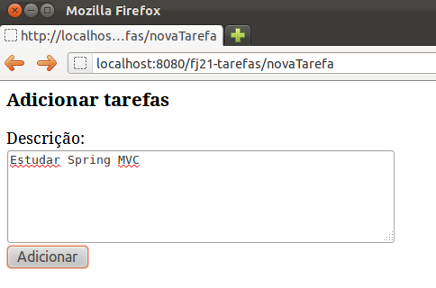
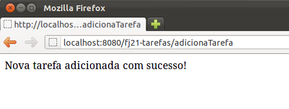
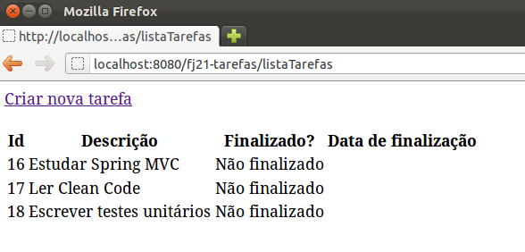
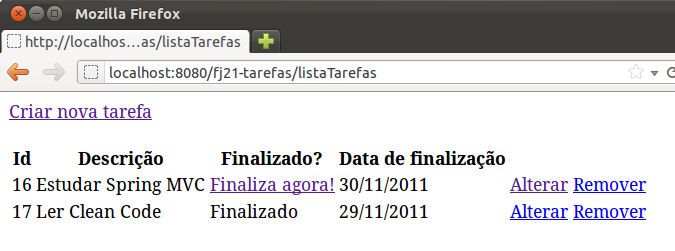

# Spring MVC
_"Um homem pinta com seu cérebro e não com suas mãos." -- Michelangelo_

Nesse capítulo, você aprenderá:


* Porque utilizar frameworks;
* Como funciona o framework Spring MVC;
* As diferentes formas de se trabalhar com o Spring MVC.


## Porque precisamos de frameworks MVC?


Quando estamos desenvolvendo aplicações, em qualquer linguagem, queremos nos preocupar
com infraestrutura o mínimo possível. Isso não é diferente quando trabalhamos com uma
aplicação Web. Imagine termos que lidar diretamente com o protocolo HTTP a todo momento
que tivermos que desenvolver uma funcionalidade qualquer. Nesse ponto, os containers e
a API de Servlets encapsulam o protocolo para que não precisemos lidar diretamente com ele,
mas mesmo assim existe muito trabalho repetitivo que precisamos fazer para que possamos
desenvolver nossa lógica.

Um exemplo desse trabalho repetitivo que fazíamos era a conversão da data. Como o protocolo
HTTP sempre interpreta tudo como texto, é preciso transformar essa data em um objeto do tipo
`Calendar`. Mas sempre que precisamos de uma data temos essa mesma conversão usando a
`SimpleDateFormat`.

Outro exemplo é, que para gravarmos um objeto do tipo `Contato`, precisamos pegar na API
de `Servlets` parâmetro por parâmetro para montar um objeto do tipo `Contato` invocando
os setters adequados.

Não seria muito mais fácil que nossa lógica recebesse de alguma forma um objeto do tipo
`Contato` já devidamente populado com os dados que vieram na requisição? Nosso trabalho
seria apenas, por exemplo invocar o `ContatoDao` passando o `Contato` para ser adicionado.


O grande problema é que estamos atrelados a API de `Servlets` que ainda exige muito trabalho
braçal para desenvolvermos nossa lógica. E, justamente para resolver esse problema, começaram a
surgir os frameworks MVC, com o objetivo de diminuir o impacto da API de `Servlets` em nosso
trabalho e fazer com que passemos a nos preocupar exclusivamente com a lógica de negócios, que
é o código que possui valor para a aplicação.

## Um pouco de história


Logo se percebeu que o trabalho com Servlets e JSPs puros não era tão produtivo e organizado.
A própria Sun começou a fomentar o uso do padrão MVC e de patterns como _Front Controller_.
Era muito comum as empresas implementarem esses padrões e criarem soluções baseadas em mini-frameworks
caseiros.

Mas logo se percebeu que o retrabalho era muito grande de projeto para projeto, de empresa para
empresa. Usar MVC era bem interessante, mas reimplementar o padrão todo a cada projeto começou
a ser inviável.

O Struts foi um dos primeiros frameworks MVC com a ideia de se criar um controlador reutilizável entre
projetos. Ele foi lançado no ano 2000 com o objetivo de tornar mais simples a criação de aplicações Web
com a linguagem Java ao disponibilizar uma série de funcionalidades já prontas.

Isso fez com que muitas pessoas o utilizassem para desenvolver suas aplicações, tornando-o rapidamente
a principal solução MVC no mercado Java. Uma das consequências disso é que hoje em dia ele é um dos
mais utilizados no mercado.

No entanto, hoje, ele é visto como um framework que demanda muito trabalho, justamente por ter sido
criado há muito tempo, quando muitas das facilidades da linguagem Java ainda não existiam.

Por isso surgiram outros frameworks MVC. A comunidade do Struts, por exemplo, uniu forças com a de
outro framework que começava a ganhar espaço no mercado, que era o WebWork. Ambas as
comunidades se fundiram e desenvolveram o **Struts 2**, que vem a ser uma versão mais simples
de se trabalhar do que o Struts 1, e com ainda mais recursos e funcionalidades.

Um dos frameworks mais famosos no mercado é o Spring MVC. Spring é um framework que
inicialmente não foi criado para o desenvolvimento web. Na essência o Spring é um container leve que visa
fornecer serviços para sua aplicação como por exemplo o gerenciamento de objetos ou transação. Mas com o
tempo a comunidade Spring entendeu que o Struts era ultrapassado e começou criar um framework MVC próprio.
O Spring MVC é um framework moderno que usa os recursos atuais da linguagem além de usar todo poder do
container Spring. Nesse capítulo veremos as funcionalidades desse framework poderoso.

> **Struts 1**
>
> Embora bastante antigo, o Struts 1 ainda é usado em muitas empresas. Os conceitos e fundamentos
> são muito parecidos entre as versões, mas a versão antiga é mais trabalhosa e possui formas
> particulares de uso.


> **Struts 2**
>
> Apesar do nome famoso, o Struts 2 nunca foi tão utilizado quanto o Struts 1. Enquanto o Struts 1
> era pioneiro na época e se tornou o padrão no desenvolvimento web Java, o Struts 2 era uma escolha
> entre vários frameworks MVC que ofereciam as mesmas facilidades.


## Configurando o Spring MVC
Para que possamos aprender o Spring MVC, vamos criar um sistema de _lista de tarefas_. E o primeiro
passo que precisamos dar é ter o Spring MVC para adicionarmos em nossa aplicação. Spring MVC vem junto
com as bibliotecas do framework Spring que podemos encontrar no site https://spring.io/. Lá,
é possível encontrar diversas documentações e tutoriais, além dos JARs do projeto.

Uma vez que adicionamos os JARs do Spring MVC em nosso projeto dentro do diretório `WEB-INF/lib`,
precisamos declarar um Servlet, que fará o papel de _Front Controller_ da nossa aplicação,
recebendo as requisições e as enviando às lógicas corretas. Para declararmos a Servlet do Spring MVC,
basta adicionarmos no `web.xml` da nossa aplicação:

``` xml
    <servlet>
        <servlet-name>Spring MVC Dispatcher Servlet</servlet-name>
        <servlet-class>
            org.springframework.web.servlet.DispatcherServlet
        </servlet-class>
        <init-param>
            <param-name>contextConfigLocation</param-name>
            <param-value>
                /WEB-INF/spring-context.xml
            </param-value>
        </init-param>
        <load-on-startup>1</load-on-startup>
    </servlet>

    <servlet-mapping>
        <servlet-name>Spring MVC Dispatcher Servlet</servlet-name>
        <url-pattern>/</url-pattern>
  </servlet-mapping>
```

Repare que é uma configuração normal de Servlet, com `servlet-class` e `url-pattern`,
como as que fizemos antes. Tem apenas um elemento novo, o `init-param`. Este parâmetro é
uma configuração que pode ser passada para o servlet pelo `web.xml`. Aqui definimos o nome
do arquivo de configuração do framework Spring, o `spring-context.xml`. Quando o Servlet é
carregado, ele vai procurar esse `spring-context.xml` dentro da pasta `WEB-INF`.

### XML específico do Spring

O framework Spring possui sua própria configuração XML. O Spring, por ser muito mais do que um controlador MVC,
poderia ser utilizado em ambientes não Web, ou seja nem sempre o Spring pode se basear no `web.xml`.
Por este motivo, mas não somente este, o Spring definiu o seu próprio XML com várias opções para configurar a aplicação.

A primeira coisa que faremos nesse arquivo é habilitar o uso de anotações do Spring MVC e configurar pacote base da
aplicação web para o Spring achar as nossas classes:

``` xml
  <mvc:annotation-driven />
  <context:component-scan base-package="br.com.caelum.tarefas" />
```

Além disso, é preciso informar ao Spring o local onde colocaremos os arquivos JSP. Para isso Spring MVC oferece
uma classe especial que recebe o nome da pasta dos JSPs e a extensão dos arquivos. Vamos criar todos os JSPs na
pasta `/WEB-INF/views/`:

``` xml
  <bean 
      class="org.springframework.web.servlet.view.InternalResourceViewResolver">
      <property name="prefix" value="/WEB-INF/views/"/>
      <property name="suffix" value=".jsp"/>
  </bean>
```

Isso já é suficiente para começar com o Spring MVC. O arquivo completo, com todos os cabeçalhos, fica então como:

``` xml
  <?xml version="1.0" encoding="UTF-8"?>
  <beans xmlns="http://www.springframework.org/schema/beans"
    xmlns:xsi="http://www.w3.org/2001/XMLSchema-instance"
    xmlns:context="http://www.springframework.org/schema/context"
    xmlns:mvc="http://www.springframework.org/schema/mvc"
    xsi:schemaLocation="http://www.springframework.org/schema/mvc
      http://www.springframework.org/schema/mvc/spring-mvc-3.0.xsd
      http://www.springframework.org/schema/beans
      http://www.springframework.org/schema/beans/spring-beans-3.0.xsd
      http://www.springframework.org/schema/context
      http://www.springframework.org/schema/context/spring-context-3.0.xsd">

    <context:component-scan base-package="br.com.caelum.tarefas" />
    <mvc:annotation-driven />

    <bean class="org.springframework.web.servlet.view.InternalResourceViewResolver">
      <property name="prefix" value="/WEB-INF/views/"/>
      <property name="suffix" value=".jsp"/>
    </bean>

  </beans>
```

## Criando as lógicas
No nosso framework MVC que desenvolvemos anteriormente, para criarmos nossas lógicas, criávamos
uma classe que implementava uma interface. Existem diversas abordagens seguidas pelos frameworks
para possibilitar a criação de lógicas. Passando por declaração em um arquivo XML, herdando
de alguma classe do framework e, a partir do Java 5, surgiram as anotações, que são uma forma de
introduzir metadados dentro de nossas classes.


O Spring MVC permite criar as lógicas de formas diferentes, usando convenções ou declarar tudo no
XML, porém na versão 3 a maneira indicada é utilizando anotações.

## A lógica Olá Mundo!


Para criarmos nossa primeira lógica, vamos criar uma classe chamada `OlaMundoController`.
Nela vamos colocar métodos que são as ações (`Action`). O sufixo `Controller` não é obrigatório
para o Spring MVC porém é uma convenção do mercado. Como utilizaremos Spring MVC baseado em anotações,
**é obrigatório** que o seu `Controller` esteja dentro do pacote `br.com.caelum.tarefas` ou em
um subpacote. No nosso caso, criaremos a classe dentro do pacote: `br.com.caelum.tarefas.controller`.

Dentro dessa nossa nova classe, vamos criar um método que imprimirá algo no console e, em seguida,
irá redirecionar para um JSP com a mensagem "Olá mundo!". A classe deve ser anotada com `@Controller`,
uma anotação do Spring MVC. Ela indica ao Spring que os métodos dessa classe são ações(`Action`).
Podemos criar um método de qualquer nome dentro dessa classe, desde que ele esteja com a anotação
`@RequestMapping`. A anotação `@RequestMapping` recebe um atributo chamado `value` que indica
qual será a URL utilizada para invocar o método, como esse atributo já é o padrão não precisamos definir. Portanto, se colocarmos o valor `olaMundoSpring`
acessaremos o método dentro do nosso `@Controller` pela URL http://localhost:8080/fj21-tarefas/olaMundoSpring.

Vamos chamar o método `execute`, mas novamente poderia ser qualquer nome. Esse método deve retornar uma
`String` que indica qual JSP deve ser executado após a lógica. Por exemplo, podemos retornar "ok" para enviar o
usuário para uma página chamada `ok.jsp`. O método nao deve retornar o sufixo da página, já que isso foi
configurado no XML do Spring. Também lembrando que o Spring MVC procura as páginas JSP dentro da pasta
`WEB-INF/views`.

Dessa forma, teríamos a seguinte classe:
``` java
  @Controller
  public class OlaMundoController {

    @RequestMapping("/olaMundoSpring")
    public String execute() {
        System.out.println("Executando a lógica com Spring MVC");
        return "ok";
    }
  }
```

Um ponto importante a se notar é que podemos criar outros métodos que respondam por outras URL's, ou seja,
vários ações dentro dessa classe (dentro do mesmo `@Controller`). Bastaria que nós utilizássemos
novamente a anotação `@RequestMapping` esses métodos.

Por fim, só precisamos criar o JSP que mostrará a mensagem "Olá mundo!". Basta criar o arquivo
`ok.jsp` dentro da pasta `WEB-INF/views/`, que mapeamos anteriormente no XML do Spring.

O JSP terá o seguinte conteúdo:
``` html
  <html>
    <body>
      <h2>Olá mundo com Spring MVC!</h2>
    </body>
  </html>
```

Podemos acessar nosso método pela URL http://localhost:8080/fj21-tarefas/olaMundoSpring.
O que acontece é que após a execução do método o Spring MVC verifica qual foi o resultado
retornado pelo seu método e procura despachar a requisição para a página indicada.


## Para saber mais: Configurando o Spring MVC em casa
Caso você esteja em casa acesse a pasta **21/projeto-tarefas** e copie todos os arquivos das pastas `mysql`, `logging`, `spring framework` e `servlet` e cole dentro da pasta do `WEB-INF/lib` de um novo **Dynamic Web Project**. Todos os jars necessários estão listados a seguir:

 * commons-logging-1.x.jar
 * jakarta.servlet-api-4.0.x.jar
 * log4j-1.2-api-2.13.x.jar
 * mysql-connector-java-8.0.x.jar
 * slf4j-api-2.0.x-alpha0.jar
 * slf4j-log4j12-2.0.x-alpha0.jar
 * spring-aop-5.x.x.RELEASE.jar
 * spring-aspects-5.x.x.RELEASE.jar
 * spring-beans-5.x.x.RELEASE.jar
 * spring-context-5.x.x.RELEASE.jar
 * spring-core-5.x.x.RELEASE.jar
 * spring-expression-5.x.x.RELEASE.jar
 * spring-jdbc-5.x.x.RELEASE.jar
 * spring-web-5.x.x.RELEASE.jar
 * spring-webmvc-5.x.x.RELEASE.jar

Você também pode optar por seguir o exercício a seguir no qual criaremos um novo projeto do tipo **Dynamic Web Project** e importaremos todas as dependências listadas acima através de um arquivo compactado.

## Exercícios: Configurando o Spring MVC e testando a configuração
1. Vamos configurar o Spring MVC em um novo projeto.

* Crie um novo projeto web: **File** -> **New** -> **Project...** -> **Dynamic Web Project**
 chamado `fj21-tarefas`.
* Na aba **Servers**, clique com o botão direito no Tomcat e vá em **Add and Remove...**:

* Basta selecionar o nosso projeto `fj21-tarefas` e clicar em **Add**:

* Vamos começar importando as classes que serão necessárias ao nosso projeto, como o
 modelo de `Tarefas` e o `DAO`.

* Clique com o botão direito no projeto `fj21-tarefas` e escolha a opção
 `Import`.
* Selecione General -> Archive File
* Escolha o arquivo `projeto-tarefas.zip` que está em
 `21/projeto-tarefas/` e confirme a importação.

* Abra o arquivo `web.xml` para fazermos a declaração do servlet
 do Spring MVC:

``` xml
  <servlet>
      <servlet-name>springmvc</servlet-name>
      <servlet-class>
          org.springframework.web.servlet.DispatcherServlet
      </servlet-class>
      <init-param>
          <param-name>contextConfigLocation</param-name>
          <param-value>/WEB-INF/spring-context.xml</param-value>
      </init-param>
      <load-on-startup>1</load-on-startup>
  </servlet>

  <servlet-mapping>
      <servlet-name>springmvc</servlet-name>
      <url-pattern>/</url-pattern>
  </servlet-mapping>
```
1. Vamos fazer um simples Olá Mundo, para testarmos nossa configuração:

* Crie uma nova classe chamada `OlaMundoController` no pacote `br.com.caelum.tarefas.controller`

* Adicione nessa classe o seguinte conteúdo:
``` java
  @Controller
  public class OlaMundoController {

      @RequestMapping("/olaMundoSpring")
      public String execute() {
        System.out.println("Executando a lógica com Spring MVC");
        return "ok";
      }
    }
```

 Dica: Use `Ctrl+Shift+O` para importar as classes.

* Precisamos preparar a camada de visualização. Crie uma pasta **views** para nossos JSPs
 que deve ficar dentro da pasta `WebContent/WEB-INF`.

* Falta o JSP que será exibido após a execução da nossa lógica.
 Crie o JSP **`ok.jsp`** no diretório `WebContent/WEB-INF/views`
 do projeto com o conteúdo:

 ``` html
  <html>
    <body>
      <h2>Olá mundo com Spring MVC!</h2>
    </body>
  </html>
 ```

* Reinicie o Tomcat e acesse no seu navegador o endereço `http://localhost:8080/fj21-tarefas/olaMundoSpring`.
 O resultado deve ser algo parecido com:
 


## Adicionando tarefas e passando parâmetros

Vamos começar a criar o nosso sistema de tarefas. Guardaremos uma descrição da tarefa, e uma
indicação informando se a tarefa já foi finalizada ou não e quando foi finalizada. Esse sistema é
composto pelo seguinte modelo:

``` java
  public class Tarefa {
      private Long id;
      private String descricao;
      private boolean finalizado;
      private Calendar dataFinalizacao;

      //getters e setters
  }
```

Vamos criar a funcionalidade de adição de novas tarefas. Para isso, teremos uma tela contendo um
formulário com campos para serem preenchidos. Queremos que, ao criarmos uma nova tarefa, a mesma
venha por padrão como não finalizada e, consequentemente, sem a data de finalização definida.
Dessa forma, nosso formulário terá apenas o campo `descricao`. Podemos criar um JSP chamado
`formulario.jsp` contendo somente o campo para descrição:

``` html
  <html>
    <body>
      <h3>Adicionar tarefas</h3>
      <form action="adicionaTarefa" method="post">
        Descrição: <br />
        <textarea name="descricao" rows="5" cols="100"></textarea><br />

        <input type="submit" value="Adicionar">
      </form>
    </body>
  </html>
```

O nosso form, ao ser submetido, chama uma ação, um método dentro de um `@Controller` que responde
pela URL `adicionaTarefa`. Esse método precisa receber os dados da requisição e gravar a tarefa
que o usuário informou na tela. Vamos chamar esse método `adiciona` e colocar dentro da classe
`TarefasController`:

``` java
  @Controller
  public class TarefasController {

      @RequestMapping("adicionaTarefa")
      public String adiciona() {
          JdbcTarefaDao dao = new JdbcTarefaDao();
          dao.adiciona(tarefa);
          return "tarefa-adicionada";
      }
  }
```

Mas, como montaremos o objeto `tarefa` para passarmos ao nosso `DAO`? Dentro dessa nossa
classe `TarefasController` em nenhum momento temos um `HttpServletRequest` para pegarmos
os parâmetros enviados na requisição e montarmos o objeto `tarefa`.

Uma das grandes vantagens de frameworks modernos é que eles conseguem **popular os objetos** para
nós. Basta que de alguma forma, nós façamos uma ligação entre o campo que está na tela com o
objeto que queremos popular. E com o Spring MVC não é diferente.

Essa ligação é feita através da criação de um parâmetro do método `adiciona`. Esse
parâmetro é o objeto que deverá ser populado pelo Spring MVC com os dados que vieram da requisição.
Portanto, vamos criar no nosso método um novo parâmetro chamado `tarefa`:
``` java
  @Controller
  public class TarefasController {

      @RequestMapping("adicionaTarefa")
      public String adiciona(Tarefa tarefa) {
          JdbcTarefaDao dao = new JdbcTarefaDao();
          dao.adiciona(tarefa);
          return "tarefa-adicionada";
      }
  }
```

Queremos que o campo de texto que criamos no nosso formulário preencha a descrição dessa
tarefa. Para fazermos isso, basta darmos o nome com o caminho da propriedade que queremos
definir. Portanto, se dentro do objeto `tarefa` queremos definir a propriedade `descricao`,
basta nomearmos o `input` com `descricao`. O Spring MVC cria o objeto `tarefa` para nós
e preenche esse objeto com os dados da requisição, nesse caso com o parâmetro `descricao` da
requisição. Como a classe `Tarefa` é um JavaBean e possui construtor sem argumentos e getters/setters
isso não será problema.

Por fim, basta exibirmos a mensagem de confirmação de que a criação da tarefa foi feita com
sucesso. Criamos o arquivo `tarefa-adicionada.jsp` com o seguinte conteúdo HTML:
``` html
  <html>
    <body>
      Nova tarefa adicionada com sucesso!
    </body>
  </html>
```

### Melhorar a organização dos arquivos JSPs

A nossa aplicação terá várias páginas relacionadas com uma ou mais tarefas. Queremos organizar a nossa aplicação
desde início e separar os arquivos JSPs relacionadas em subpastas. Ou seja, todas as páginas JSP relacionadas
com o modelo tarefa ficarão na pasta `tarefa`. Por isso, vamos criar uma nova pasta `tarefa` dentro da pasta
`WEB-INF/views` para os JSPs que o `TarefasController` vai usar. Por padrão, o Spring MVC não procura
em subpastas, procura apenas na pasta `views`. Vamos mudar o retorno do método `adiciona`
e devolver o nome da subpasta e o nome da página JSP. Nesse caso o retorno fica como `tarefa/adicionada`.

Por tanto, o código completo do método `adiciona` fica:

``` java
  @Controller
  public class TarefasController {

      @RequestMapping("adicionaTarefa")
      public String adiciona(Tarefa tarefa) {
          JdbcTarefaDao dao = new JdbcTarefaDao();
          dao.adiciona(tarefa);
          return "tarefa/adicionada";
      }
  }
```

Na pasta `WEB-INF/views/tarefa` também deve ficar o formulário para adicionar uma tarefa. Como discutimos antes,
todos os JSPs da tarefa na mesma subpasta. Porém aqui surge um novo problema: É preciso carregar o JSP
no navegador, mas o acesso direto ao pasta `WEB-INF` é proibido pelo servlet-container e consequentemente
não é possível acessar o formulário. Para resolver isso vamos criar uma nova ação (um novo método) dentro da classe
`TarefasController` que tem a finalidade de chamar o formulário apenas. O método usa também a anotação
`@RequestMappping` e retorna um `String` para chamar o formulário.

Abaixo o código completo do `TarefasController` com os dois métodos:
``` java
  @Controller
  public class TarefasController {

      @RequestMapping("novaTarefa")
      public String form() {
          return "tarefa/formulario";
      }


      @RequestMapping("adicionaTarefa")
      public String adiciona(Tarefa tarefa) {
          JdbcTarefaDao dao = new JdbcTarefaDao();
          dao.adiciona(tarefa);
          return "tarefa/adicionada";
      }
  }
```

A estrutura das pasta `WEB-INF` fica como:

```
  WEB-INF
    -views
      -tarefa
          -formulario.jsp
          -adicionada.jsp
```


Para chamar o formulário usaremos a URL: http://localhost:8080/fj21-tarefas/novaTarefa

## Exercícios: Criando tarefas

Vamos criar o formulário e nossa ação para fazer a gravação das tarefas.
1. O primeiro passo é criar nosso formulário para adicionar uma tarefa.
  Para isso crie uma pasta **tarefa** dentro da pasta **`WebContent/WEB-INF/views`**. Dentro da pasta **tarefa** adicione um novo arquivo **formulario.jsp**.

``` html
  <html>
    <body>
      <h3>Adicionar tarefas</h3>
      <form action="adicionaTarefa" method="post">
        Descrição: <br />
        <textarea name="descricao" rows="5" cols="100"></textarea><br />
        <input type="submit" value="Adicionar">
      </form>
    </body>
  </html>
```
1. Agora precisamos um método (action) dentro de um `@Controller` para acessar o JSP.
  Crie uma nova classe no pacote `br.com.caelum.tarefas.controller` chamada `TarefasController`.

  Nossa classe precisa ter um método para acessar o JSP. Vamos chamar o método **form()** e
  usar a anotação **@RequestMapping**:
``` java
  @Controller
  public class TarefasController {

      @RequestMapping("novaTarefa")
      public String form() {
          return "tarefa/formulario";
      }

  }
```

  Use `Ctrl+Shift+O` para importar as classes.
1. Ainda falta o método que realmente adiciona a tarefa no banco de dados. Esse método é
  chamado pelo nosso formulário e recebe uma tarefa como parâmetro. Ele novamente usa
  a anotação `@RequestMapping` para definir a URL.

  Dentro da classe `TarefasController` crie o método `adiciona`
  que recebe uma tarefa. No método usamos a `JdbcTarefaDao` para persistir os dados.
  O retorno do método define o local e nome do JSP.

  O código deve ficar:
``` java
  @RequestMapping("adicionaTarefa")
  public String adiciona(Tarefa tarefa) {
      JdbcTarefaDao dao = new JdbcTarefaDao();
      dao.adiciona(tarefa);
      return "tarefa/adicionada";
  }
```
1. E, por fim, criamos o arquivo **adicionada.jsp** na pasta **tarefa** que mostrará uma
  mensagem de confirmação de que a tarefa foi efetivamente adicionada.

``` html
  <html>
    <body>
      Nova tarefa adicionada com sucesso!
    </body>
  </html>
```
1. Reinicie o Tomcat.

  Acesse no seu navegador o endereço `http://localhost:8080/fj21-tarefas/novaTarefa`
  e adicione uma nova tarefa.

  
  

  Caso aconteça uma exceção informando que a tabela não está criada, crie-a com o script abaixo e
  tente inserir novamente a tarefa. Abra o terminal e digite:

```bash
  mysql -u root
```

  Lembrando que, se houver senha para logar com o banco, é preciso escrever
  `mysql -u root -p` e, em seguida, digitar a senha do banco de dados.

  Dentro do MySQL, digite:
``` sql
  use fj21;
```
  Em seguida, digite:
``` sql
  create table tarefas (
    id BIGINT NOT NULL AUTO_INCREMENT,
    descricao VARCHAR(255),
    finalizado BOOLEAN,
    dataFinalizacao DATE,
    primary key (id)
  );
```

(Dica: todo código usado para crição da estrutura do banco de dados encontra-se no arquivo
 `criacao-tableas.sql` na pasta **21/projeto-tarefas/mysql**)


## Incluindo validação no cadastro de tarefas


Já conseguimos adicionar novas tarefas em nossa aplicação. Porém, o que impede algum
usuário desatento incluir uma tarefa sem descrição? Até agora, nada. Nós queremos que um usuário
não seja capaz de adicionar uma tarefa sem descrição, para isso precisamos incluir algum mecanismo
de _validação_ em nossa ação de adicionar tarefas. A validação deve ser executada
no lado do servidor, afim de garantir que os dados serão validados em um lugar
onde o usuário não consiga interferir.

### Validando programaticamente

A maneira mais fácil de validar a tarefa é usar vários `if`s no método `adiciona`
da classe `TarefasController` antes de chamar `dao.adiciona(tarefa)`, executando a
validação programaticamente. O código seguinte mostra a ideia:

``` java
  @RequestMapping("adicionaTarefa")
  public String adiciona(Tarefa tarefa) {

      if(tarefa.getDescricao() == null || tarefa.getDescricao().equals("")) {
          return "tarefa/formulario";
      }

      JdbcTarefaDao dao = new JdbcTarefaDao();
      dao.adiciona(tarefa);
      return "tarefa/adicionada";
  }
```

O problema aqui é quanto mais atributos na tarefa mais `if`s teremos.
É provável também que vamos repetir um `if` ou outro quando validarmos
a tarefa em métodos diferentes, por exemplo, para adicionar ou alterar
a tarefa. Sabemos que copiar e colar código não é uma boa maneira de reaproveitar código.
O que precisamos é de algum artifício que seja igual para qualquer método,
algo que ajude na validação dos dados.

## Validação com Bean Validation

A partir do Java EE 6 temos uma especificação que resolve este problema. A JSR 303,
também conhecida como Bean Validation, define uma série de anotações e uma API para criação
de validações para serem utilizadas em Java Beans, que podem ser validados agora em
qualquer camada da aplicação.

Com o Bean Validation declaramos através de anotações as regras de validação dentro do nosso
modelo, por exemplo, na nossa tarefa:
``` java
  public class Tarefa {

      private Long id;

      @Size(min=5)
      private String descricao;

      private boolean finalizado;
      private Calendar dataFinalizacao;

      //...
  }
```

Pronto! Com essas anotações, qualquer objeto do tipo `Tarefa` pode ser
validado na camada de controller. Só falta avisar o Spring MVC que realmente
queremos executar a validação. Isso é feito pela anotação `Valid` que devemos
usar na antes do parâmetro da ação:
``` java
  @RequestMapping("adicionaTarefa")
  public String adiciona(@Valid Tarefa tarefa) {
      JdbcTarefaDao dao = new JdbcTarefaDao();
      dao.adiciona(tarefa);
      return "tarefa/adicionada";
  }
```

Como estamos falando de Spring MVC, antes da chamada do método é executada a validação,
ou seja será verificado se a descrição da tarefa não está vazia. Se estiver, será
lançada uma exceção do tipo `ConstraintViolationException` que possui a descrição do
erro.

Não queremos mostrar uma exceção para o usuário e sim apenas voltar para o formulário
para mostrar uma mensagem que a validação falhou. O Spring MVC pode guardar o resultado
(os erros de validação) em um objeto do tipo `BindingResult`. Assim não será lançado um exceção.
Este objeto `BindingResult` se torna um parâmetro da ação. Então só é preciso perguntar
para ele se existe um erro de validação e se existir, voltar para o formulário. Veja o
código:

``` java
  @RequestMapping("adicionaTarefa")
  public String adiciona(@Valid Tarefa tarefa, BindingResult result) {

      if(result.hasFieldErrors("descricao")) {
        return "tarefa/formulario";
      }

      JdbcTarefaDao dao = new JdbcTarefaDao();
      dao.adiciona(tarefa);
      return "tarefa/adicionada";
  }
```

No código acima verificamos se existe um de erro validação relacionado com o atributo
`descricao` da tarefa. Também podemos conferir se existe algum erro de validação,
mais genérico:

``` java
  @RequestMapping("adicionaTarefa")
  public String adiciona(@Valid Tarefa tarefa, BindingResult result) {

      if(result.hasErrors()) {
          return "tarefa/formulario";
      }
      //...
  }

```


### Mostrando as mensagens de validação

Para exibir as mensagens de validação no JSP usamos um tag especial que o
Spring MVC oferece. O tag se chama **form:errors**:

``` html
  <form:errors path="tarefa.descricao" />
```

O atributo _path_ indica com que atributo essa mensagem está relacionada.


Abaixo está o código completo do formulário _formulario.jsp_ da pasta `tarefa`.
Repare que é preciso importar o taglib do Spring MVC:

``` html
  <%@ taglib uri="http://www.springframework.org/tags/form" prefix="form" %>
  <html>
    <body>
      <h3>Adicionar tarefas</h3>
      <form action="adicionaTarefa" method="post">
        Descrição:
                <br/>
        <textarea rows="5" cols="100" name="descricao"></textarea>
                <br/>
        <form:errors path="tarefa.descricao" cssStyle="color:red"/>
                <br/>
        <input type="submit" value="Adicionar"/>
      </form>
    </body>
  </html>
```

### Mensagens internacionalizadas

Para deixar as mensagens de nossa aplicação mais fáceis de alterar, é comum criar um arquivo separado
do HTML que possui apenas mensagens. Este arquivo é normalmente chamado _mensagens.properties_
ou _messages.properties_.

Na pasta _WEB-INF_ do projeto podemos então criar este arquivo com o seguinte conteúdo:

```
tarefa.adicionada.com.sucesso=Tarefa adicionada com sucesso! 
...
```

Repare que definimos as mensagens em um estilo de: `<chave>=<valor>`.

O Spring MVC pode carregar automaticamente este arquivo, desde que a linha abaixo seja
incluída no arquivo _spring-context.xml_:

``` xml
  <bean id="messageSource" class=
      "org.springframework.context.support
      .ReloadableResourceBundleMessageSource">
      <property name="basename" value="/WEB-INF/mensagens" />
  </bean>
```

Basta então usar a taglib `fmt` para mostra mensagens do arquivo `mensagens.properties` na página HTML:

``` html
  <fmt:message key="tarefa.adicionada.com.sucesso"/>
```

### Personalizando as mensagens de erros

Podemos ainda personalizar as mensagens de validação do Bean Validation, escrevendo nossas mensagens
dentro do atributo `message` das anotações:

``` java
  public class Tarefa {

      private Long id;


      @Size(min=5, message="Descrição deve ter pelo menos 5 carateres")
      private String descricao;
      //...
  }
```

Para não deixar as mensagens de validação espalhadas em nossas classes, podemos isolar estas mensagens
no arquivo padrão de mensagens do Bean Validation, chamado **`ValidationMessages.properties`**:

```
tarefa.descricao.pequena=Descrição deve conter pelo menos {min} caracteres
...
```

O arquivo deve ficar dentro da pasta **src**. Depois podemos referenciar as chaves das mensagens
dentro das anotações também pelo atributo `message`:

``` java
  public class Tarefa {

      private Long id;

      @Size(min=5, message="{tarefa.descricao.pequena}")
      private String descricao;
  }
```


## Exercícios: Validando tarefas
1. Para configurar o framework _Bean Validation_ é preciso copiar cinco jars.
  * Primeiro, acesse a pasta do arquivos do curso, mais específicamente **21/projeto-tarefas/validator**.

  * Haverá cinco JARs:
     * classmate-1.3.X.jar
     * hibernate-validator-6.1.X.Final.jar
     * jakarta.el-3.0.X.jar
     * jakarta.validation-api-2.0.X.jar
     * jboss-logging-3.3.X.Final.jar

  * Copie-os (CTRL+C) e cole-os (CTRL+V) dentro do _workspace_ do eclipse na pasta
  `fj21-tarefas/WebContent/WEB-INF/lib`
2. Abra a classe `Tarefa`. Nela é preciso definir as regras de validação através das anotações
  do framework _Bean validation_. A atributo **descricao** deve ter pelo menos 5 caracteres:

``` java
  public class Tarefa {

      private Long id;

      @Size(min=5)
      private String descricao;
```
1. Abra a classe `TarefasController` e procure o método **`adiciona`**. Coloque a anotação **`@Valid`**
  na frente do parâmetro `Tarefa tarefa` e adicione o parâmetro `BindingResult` na assinatura do método.

  Além disso, no mesmo método, adicione a verificação se há erros de validação. O método completo fica:

``` java
  @RequestMapping("adicionaTarefa")
  public String adiciona(@Valid Tarefa tarefa, BindingResult result) {

      if(result.hasFieldErrors("descricao")) {
        return "tarefa/formulario";
      }

      JdbcTarefaDao dao = new JdbcTarefaDao();
      dao.adiciona(tarefa);
      return "tarefa/adicionada";
  }
```
1. Abra o JSP **`formulario.jsp`** (da pasta `WEB-INF/views/tarefa`).
  Adicione no início da página a declaração da taglib do Spring MVC:

``` html
  <%@ taglib uri="http://www.springframework.org/tags/form" prefix="form" %>
```

  Dentro do HTML adicione a tag **form:errors** acima do tag _form_. Adicione
  apenas o tag _form:errors_:

``` html
  <form:errors path="tarefa.descricao"/>
  <form action="adicionaTarefa" method="post">
```
1. Reinicie o Tomcat e acesse no seu navegador o endereço `http://localhost:8080/fj21-tarefas/novaTarefa`
  Envie uma requisição SEM preencher a descrição da tarefa, a mensagem de validação deve aparecer.

  


## Listando as tarefas e disponibilizando objetos para a view
Como já conseguimos adicionar tarefas em nossa aplicação, precisamos saber o que foi adicionado. Para
isso precisamos criar uma nova funcionalidade que lista as tarefas. A função dessa ação será invocar
o `JdbcTarefaDao` para conseguir a lista das tarefas que estão no banco de dados. Podemos adicionar um
novo método dentro da classe `TarefasController`:

``` java
  @RequestMapping("listaTarefas")
  public String lista() {
      JdbcTarefaDao dao = new JdbcTarefaDao();
      List<Tarefa> tarefas = dao.lista();
      return "tarefa/lista";
  }
```

Essa lista de tarefas deverá ser disponibilizada para o JSP fazer sua exibição. Para que possamos
disponibilizar um objeto para o JSP, temos que alterar o retorno do método `lista`. A ideia é que o
Spring MVC não só recebe o nome da página JSP (`tarefa/lista`) quando chama o método `lista`,
o Spring MVC também recebe os dados para o JSP. Os dados para a exibição na tela e o nome da página
JSP foram encapsulados pelo Spring MVC em uma classe especial que se chama **`ModelAndView`**.
Vamos criar um objeto do tipo `ModelAndView` e preencher esse modelo com nossa lista de tarefas e
definir o nome da página JSP. O método `lista` deve retornar esse objeto, não mais apenas um
`String`. Veja como fica o código:

``` java
  @RequestMapping("listaTarefas")
  public ModelAndView lista() {
      JdbcTarefaDao dao = new JdbcTarefaDao();
      List<Tarefa> tarefas = dao.lista();

      ModelAndView mv = new ModelAndView("tarefa/lista");
      mv.addObject("tarefas", tarefas);
      return mv;
  }
```

Dessa forma, será disponibilizado para o JSP um objeto chamado `tarefas`
que pode ser acessado via _Expression Language_ como `${tarefas}`.
Poderíamos em seguida iterar sobre essa lista utilizando a Tag `forEach`
da JSTL core.

Vendo o código da ação `lista`  pode aparecer estranho instanciar uma classe
do framework Spring (`ModelAndView`) dentro do nosso controlador. Isso até influencia
negativamente a testabilidade do método. Por isso, O Spring MVC dá uma outra opção,
oferece uma alternativa ao uso da classe `ModelAndView`. Na nossa ação podemos receber
um objeto que representa o modelo para o nosso JSP. Spring MVC pode passar um parâmetro
para o método do controlador que tem a função do modelo. Esse modelo podemos preencher
com a lista de tarefas. Assim também continuaremos devolver uma String como retorno do método
que indica o caminho para o JSP:

``` java
  @RequestMapping("listaTarefas")
  public String lista(Model model) {
      JdbcTarefaDao dao = new JdbcTarefaDao();
      List<Tarefa> tarefas = dao.lista();
      model.addAttribute("tarefas", tarefas);
      return "tarefa/lista";
  }
```

Dessa maneira não é preciso instanciar o modelo, e sim apenas disponibilizar a lista.

## Exercícios: Listando tarefas
1. Vamos criar a listagem das nossas tarefas mostrando se a mesma já foi finalizada ou
  não.

  * Na classe `TarefasController` adicione o método `lista` que
  recebe um **`Model`** como parâmetro:
``` java
  @RequestMapping("listaTarefas")
  public String lista(Model model) {
      JdbcTarefaDao dao = new JdbcTarefaDao();
      model.addAttribute("tarefas", dao.lista());
      return "tarefa/lista";
  }
```

  * Para fazer a listagem, vamos precisar da JSTL (iremos fazer um `forEach`), portanto
  precisamos importá-la. Primeiro, entre no diretório dos arquivos do curso e depois em **21/projeto-tarefas/jstl**.

  * Haverão dois JARs:
    * jakarta.servlet.jsp.jstl-1.2.x.jar
    * jakarta.servlet.jsp.jstl-api-1.2.x.jar.

  * Copie-os (CTRL+C) e cole-os (CTRL+V) dentro do _workspace_ do eclipse na pasta
  `fj21-tarefas/WebContent/WEB-INF/lib`

  * No Eclipse, dê um F5 no seu projeto. Pronto, a JSTL já está em nosso projeto.

  * Crie o JSP que fará a exibição das tarefas dentro da pasta `WebContent/WEB-INF/views/tarefa`.
  Chame-o de `lista.jsp` e adicione o seguinte conteúdo:

``` html
  <%@ taglib uri="http://java.sun.com/jsp/jstl/core" prefix="c" %>
  <%@ taglib uri="http://java.sun.com/jsp/jstl/fmt" prefix="fmt" %>
  <html>
  <body>

    <a href="novaTarefa">Criar nova tarefa</a>

    <br /> <br />

    <table>
      <tr>
        <th>Id</th>
        <th>Descrição</th>
        <th>Finalizado?</th>
        <th>Data de finalização</th>
      </tr>
      <c:forEach items="${tarefas}" var="tarefa">
        <tr>
          <td>${tarefa.id}</td>
          <td>${tarefa.descricao}</td>
          <c:if test="${tarefa.finalizado eq false}">
            <td>Não finalizado</td>
          </c:if>
          <c:if test="${tarefa.finalizado eq true}">
            <td>Finalizado</td>
          </c:if>
          <td>
            <fmt:formatDate
              value="${tarefa.dataFinalizacao.time}"
              pattern="dd/MM/yyyy"/>
          </td>
        </tr>
      </c:forEach>
    </table>
  </body>
  </html>
```

  * Reinicie o Tomcat e acesse o endereço http://localhost:8080/fj21-tarefas/listaTarefas
  e veja o resultado.
  


## Redirecionando a requisição para outra ação

Tarefas podem ser adicionadas por engano, ou pode ser que não precisemos mais dela, portanto,
queremos removê-las. Para fazer essa remoção, criaremos um link na listagem que acabamos de
desenvolver que, ao ser clicado, invocará a nova ação para a remoção de tarefas passando
o código da tarefa para ser removida.

O link pode ser feito com HTML na lista de tarefas da seguinte forma:

``` html
  <td><a href="removeTarefa?id=${tarefa.id}">Remover</a></td>
```

Podemos desenvolver um método para fazer a remoção. A lógica não possui nenhuma novidade,
basta recuperarmos o parâmetro como aprendemos nesse capítulo e invocarmos
o `DAO` para fazer a remoção:

``` java
  @RequestMapping("removeTarefa")
  public String remove(Tarefa tarefa) {
      JdbcTarefaDao dao = new JdbcTarefaDao();
      dao.remove(tarefa);
      return "para onde ir???";
  }
```

A questão é: Para qual lugar redirecionar o usuário após a exclusão?

Poderíamos criar um novo JSP com uma mensagem de confirmação da remoção, mas usualmente isso
não costuma ser bom, porque precisaríamos navegar até a lista das tarefas novamente caso tenhamos
que remover outra tarefa. Seria muito mais agradável para o usuário que ele fosse redirecionado
direto para a lista das tarefas.

Uma das formas que poderíamos fazer esse redirecionamento é enviar o usuário diretamente para a
página que lista as tarefas (`tarefa/lista.jsp`). Mas, essa não é uma boa abordagem, porque
precisaríamos, outra vez, disponibilizar a lista das tarefas para o JSP, algo que já fazemos na
ação de listar as tarefas, o método `lista` na classe `TarefasController`.

Já que o método `lista` faz esse trabalho, poderíamos, ao invés de redirecionar a execução
para o JSP, enviá-la para essa ação. Para isso, o retorno do método deve ser um pouco modificado.
Vamos continuar devolvendo uma `String` mas essa `String` deve indicar que queremos chamar
uma outra ação. Podemos fazer um redirecionamento na lado do servidor (_forward_) ou
pelo navegador, no lado do cliente (_redirect_).

Para fazer um redirecionamento no lado do servidor basta usar o prefixo _forward_ no retorno:

``` java
  @RequestMapping("removeTarefa")
  public String remove(Tarefa tarefa) {
      JdbcTarefaDao dao = new JdbcTarefaDao();
      dao.remove(tarefa);
      return "forward:listaTarefas";
  }
```

Para fazer um redirecionamento no lado do cliente usamos o prefixo _redirect_:

``` java
  @RequestMapping("removeTarefa")
  public String remove(Tarefa tarefa) {
      JdbcTarefaDao dao = new JdbcTarefaDao();
      dao.remove(tarefa);
      return "redirect:listaTarefas";
  }
```


## Exercícios: Removendo e alterando tarefas
1. Vamos fazer a funcionalidade de remoção de tarefas.

  * Adicione no arquivo `lista.jsp` uma coluna com um link que ao ser clicado
  invocará a `Action` para remover tarefa.
``` html
  <td><a href="removeTarefa?id=${tarefa.id}">Remover</a></td>
```

  * Crie um novo método **remove** na classe `TarefasController` com o código:

``` java
  @RequestMapping("removeTarefa")
  public String remove(Tarefa tarefa) {
      JdbcTarefaDao dao = new JdbcTarefaDao();
      dao.remove(tarefa);
      return "redirect:listaTarefas";
  }
```

  * Acesse a lista de tarefas em http://localhost:8080/fj21-tarefas/listaTarefas e
  remova algumas tarefas.
1. Criaremos a tela para fazer a alteração das tarefas, como por exemplo, marcá-la como
  finalizada e definirmos a data de finalização.

  * Primeiro vamos criar um novo link na nossa listagem que enviará o usuário para a tela
  contendo os dados da tarefa selecionada:
``` html
  <td><a href="mostraTarefa?id=${tarefa.id}">Alterar</a></td>
```

  * Vamos criar uma nova ação que dado um `id`, devolverá a `Tarefa` correspondente
  para um JSP, que mostrará os dados para que a alteração possa ser feita.

  Crie um novo método `mostra` na classe `TarefasController`:

``` java
  @RequestMapping("mostraTarefa")
  public String mostra(Long id, Model model) {
      JdbcTarefaDao dao = new JdbcTarefaDao();
      model.addAttribute("tarefa", dao.buscaPorId(id));
      return "tarefa/mostra";
  }
```

  * Crie o JSP `mostra.jsp` dentro da pasta `views/tarefa`
  para mostrar a tarefa escolhida:
``` html
  <%@ taglib prefix="fmt" uri="http://java.sun.com/jsp/jstl/fmt" %>

  <html>
    <body>
      <h3>Alterar tarefa - ${tarefa.id}</h3>
      <form action="alteraTarefa" method="post">

        <input type="hidden" name="id" value="${tarefa.id}" />

        Descrição:<br />
        <textarea name="descricao" cols="100" rows="5">
          <!-- {tarefa.descricao} -->
        </textarea>
        <br />

        Finalizado? <input type="checkbox" name="finalizado"
          value="true" ${tarefa.finalizado? 'checked' : '' }/> <br />

        Data de finalização: <br />
        <input type="text" name="dataFinalizacao"
          value="<fmt:formatDate
          value="${tarefa.dataFinalizacao.time}"
          pattern="dd/MM/yyyy" />"/>
        <br />

        <input type="submit" value="Alterar"/>

      </form>
    </body>
  </html>
```

  * Para o Spring MVC saber converter automaticamente a data no formato brasileiro para um
  `Calendar` é preciso usar a anotação `@DateTimeFormat`. Abra a classe `Tarefa` e
  adicione a anotação acima do atributo `dataFinalizacao`:

``` java
  @DateTimeFormat(pattern="dd/MM/yyyy")
  private Calendar dataFinalizacao;
```

  * Falta criar um método que cuidará da alteração da tarefa. Na classe
  `TarefasController` adicione esse método:
``` java
  @RequestMapping("alteraTarefa")
  public String altera(Tarefa tarefa) {
      JdbcTarefaDao dao = new JdbcTarefaDao();
      dao.altera(tarefa);
      return "redirect:listaTarefas";
  }
```
  * Acesse a lista de tarefas em http://localhost:8080/fj21-tarefas/listaTarefas e
  altere algumas tarefas.


## Desafio - Calendário
1. Adicione o campo com calendário que fizemos no capítulo de criação de Tags
  em nosso projeto e utilize-o no formulário de alteração.

  


## Melhorando a usabilidade da nossa aplicação


Sempre que precisamos finalizar uma tarefa, precisamos entrar na tela de alteração
da tarefa que queremos e escolher a data de finalização. Essa data de finalização
na maioria das vezes é a própria data atual.

Para facilitar a usabilidade para o usuário, vamos adicionar um novo link na nossa tabela
que se chamará _"Finalizar agora"_. Ao clicar nesse link, uma ação será invocada
para finalizarmos a tarefa no dia atual.

A questão é que não queremos navegar para lugar algum ao clicarmos nesse link. Queremos
permanecer na mesma tela, sem que nada aconteça, nem seja recarregado.

Ou seja, de alguma forma precisamos mandar a requisição para a ação, mas ainda assim
precisamos manter a página do jeito que ela estava ao clicar no link. Podemos fazer isso
através de uma técnica chamada AJAX, que significa _Asynchronous Javascript and XML_.

AJAX nada mais é do que uma técnica que nos permite enviar requisições assíncronas, ou seja,
manter a página que estava aberta intacta, e recuperar a resposta dessa requisição para
fazermos qualquer processamento com eles. Essas respostas costumam ser XML, HTML ou um formato
de transferência de dados chamado JSON (_Javascript Object Notation_).

Para realizarmos uma requisição AJAX, precisamos utilizar Javascript. E no curso vamos utilizar
o suporte que o jQuery nos fornece para trabalhar com AJAX.

Para fazermos uma requisição para um determinado endereço com o jQuery, basta definirmos qual
método utilizaremos para enviar essa requisição (POST ou GET). O jQuery nos fornece duas funções:
`$.post` e `$.get`, cada uma para cada método.

Para as funções basta passarmos o endereço que queremos invocar, como por exemplo:
``` javascript
  $.get("minhaPagina.jsp")
```

Nesse caso, estamos enviando uma requisição via GET para o endereço `minhaPagina.jsp`.

Sabendo isso, vamos criar um link que invocará uma função Javascript e fará requisição AJAX para
uma ação que finalizará a tarefa:
``` html
  <td><a href="#" onclick="finalizaAgora(${tarefa.id})">
    Finalizar agora
  </a></td>
```

Vamos criar a função `finalizaAgora` que recebe o id da tarefa que será finalizada e
a passará como parâmetro para a ação:
``` html
  <script type="text/javascript">
    function finalizaAgora(id) {
      $.get("finalizaTarefa?id=" + id);
    }
  </script>
```

Por fim, basta criarmos a nossa ação que receberá o parâmetro e invocará um método do `JdbcTarefaDao`
para fazer a finalização da tarefa. No entanto, a requisição que estamos fazendo não gerará resposta
nenhuma e nós sempre retornamos uma String o resultado que determina qual JSP será exibido. Dessa vez,
não exibiremos nem um JSP e nem invocaremos outra `Action`. O protocolo HTTP sempre retorna um código
indicando qual é o estado dessa resposta, ou seja, se foi executado com sucesso, se a página não foi
encontrada, se algum erro aconteceu e assim por diante.

O protocolo HTTP define que o código 200 indica que a execução ocorreu com sucesso, portanto, vamos
apenas indicar na nossa resposta o código, sem devolver nada no corpo da nossa resposta. Para setar
o código da resposta programaticamente precisamos do objeto `HttpServletResponse`. Podemos receber
a resposta HTTP como parâmetro de qualquer método que é uma ação. Com a resposta na mão podemos chamar
o método `setStatus(200)`.

Dessa forma, poderíamos ter um método na classe `TarefasController` para fazer a finalização
da tarefa com o seguinte código:


``` java
  @RequestMapping("finalizaTarefa")
  public void finaliza(Long id, HttpServletResponse response) {
      JdbcTarefaDao dao = new JdbcTarefaDao();
      dao.finaliza(id);
      response.setStatus(200);
  }
```

O primeiro parâmetro é a id da tarefa que vem através da requisição, o segundo é a resposta para
setar o código HTTP.

Quando estamos usando um Framework MVC como o Spring, queremos que toda a parte de manipulação
de `request` e `response` fique por conta do framework. Da forma que mostramos antes é possível
obter o resultado que esperamos, mas manipular o status da resposta é uma tarefa que não queremos
fazer diretamente. O Spring nos ajuda nessa tarefa, fazendo com que o retorno do nosso método
seja _HTTP 200_, exceto em caso de alguma exception. Para isso, precisamos usar uma annotation chamada
`@ResponseBody`. Como o próprio nome da annotation fala, tudo que for retornado, será o corpo
da nossa resposta. Ou se nada for retornado, então a resposta será vazia porém o status HTTP será 200.
Nosso código pode ficar mais enxuto e sem a manipulação do response:

``` java
  @ResponseBody
  @RequestMapping("finalizaTarefa")
  public void finaliza(Long id) {
      JdbcTarefaDao dao = new JdbcTarefaDao();
      dao.finaliza(id);
  }
```


## Utilizando AJAX para marcar tarefas como finalizadas

Através do jQuery, podemos enviar uma requisição AJAX para o servidor, e na ação vamos manipular a resposta
e setar apenas o status 200. Também seria útil notificar o usuário da aplicação que a requisição finalizou
com sucesso. O jQuery já fornece um jeito muito simples de implementar isso. É preciso adicionar no JavaScript
uma função que é chamada quando a requisição termina com sucesso (status 200).

``` xml
  <script type="text/javascript">
    function finalizaAgora(id) {
      $.get("finalizaTarefa?id=" + id, function(dadosDeResposta) {
          alert("Tarefa Finalizada!");
        });
    }
  </script>
```

Repare que `$.get` recebe mais uma função como parâmetro (também chamado _callback de sucesso_).
Nela, definimos apenas um simples _alert_ para mostrar uma mensagem ao usuário. Também é  possível
manipular o HTML da página dinamicamente. O jQuery oferece recursos poderosos
para alterar qualquer  elemento HTML dentro do navegador.

Por exemplo, podemos selecionar um elemento da página pela `id` e mudar o conteúdo desse elemento:

``` javascript
  $("#idDoElementoHTML").html("Novo conteúdo HTML desse elemento");
```

Para o nosso exemplo, então é interessante atualizar a coluna da tarefa para indicar que
ela foi finalizada:

``` xml
  $("#tarefa_"+id).html("Tarefa finalizada");
```


Leia mais sobre o jQuery na documentação:

http://api.jquery.com/jQuery.get/
http://api.jquery.com/id-selector/

## Configurar o Spring MVC para acessar arquivos comuns

O controlador do Spring MVC, ou seja o servlet no `web.xml`, foi configurado para receber **todas**
as requisições incluindo essas que foram enviadas para receber o conteúdo de arquivos comuns como
imagens, css ou scripts. Queremos que o controlador não atenda essas requisições que não são para ações.
Para isso é preciso adicionar no arquivo `spring-context.xml` um mapeamento que informa ao Spring MVC
que ele deve ignorar todo acesso a conteúdo estático.

``` xml
  <mvc:default-servlet-handler/>
```


## Exercícios: Ajax
1. Abra o arquivo `spring-context.xml` e acrescente:

``` xml
  <mvc:default-servlet-handler/>
```
  Na pasta `WebContent` crie uma nova pasta **`resources`**, vamos colocar nela tudo relativo
  a conteúdo estático do nosso sistema.
1. Vamos adicionar AJAX na nossa aplicação. Para isso, utilizaremos o jQuery que
  precisamos importar para nosso projeto e em nossas páginas.

  * Vá até a pasta de arquivos do curso, em **21/projeto-agenda/**;
  * Copie o diretório `js` e cole-o dentro de `WebContent/resources` no
  seu projeto fj21-tarefas; Caso você esteja em casa, faça o download
  em https://jquery.com/download/

  * Precisamos importar o jQuery em nossa página de listagem. Para isso,
  adicione logo após a Tag `<html>` o seguinte código no arquivo `lista.jsp`:
``` html
  <head>
    <script type="text/javascript" src="resources/js/jquery.js"></script>
  </head>
```
  * Pronto, importamos o jQuery para nossa aplicação.
1. Caso a tarefa não esteja finalizada, queremos que ela possua um novo link que
  se chamará "Finalizar agora". Ao clicar nele, será chamada via AJAX uma `Action` que
  marcará a tarefa como finalizada e a data de hoje será marcada como a data de finalização
  da mesma.

  * Altere a coluna que mostra a tarefa como **não** finalizada
  no arquivo `lista.jsp`. Adicione um link que ao ser clicada,
  chamará uma função Javascript passando o `id` da tarefa para finalizar.
  Também adicione uma id para cada elemento `<td>`.

  No arquivo procure o _c:if_ para tarefas não finalizadas,
  altere o elemento `td` dentro _c:if_:
``` html
  <c:if test="${tarefa.finalizado eq false}">
    <td id="tarefa_${tarefa.id}">
        <a href="#" onClick="finalizaAgora(${tarefa.id})">
        Finaliza agora!
        </a>
    </td>
  </c:if>
```

  * Crie a função Javascript `finalizaAgora` para chamar a ação que criaremos
  a seguir via uma requisição POST:
``` html
<!-- Começo da página com o import do Javascript -->
  <body>
    <script type="text/javascript">
      function finalizaAgora(id) {
        $.post("finalizaTarefa", {'id' : id}, function() {
          // selecionando o elemento html através da
          // ID e alterando o HTML dele
          $("#tarefa_"+id).html("Finalizado");
        });
      }
    </script>

    <a href="novaTarefa">Criar nova tarefa</a>
    <br /> <br />

    <table>
    <!-- Resto da página com a tabela -->
```
1. Vamos criar o método para finalizar a tarefa. Após o mesmo ser executado, ele não deverá
  nos redirecionar para lugar nenhum, apenas indicar que a execução ocorreu com sucesso.

  * Abra a classe `TarefasController`
  Adicione o método `finaliza` com o conteúdo:
``` java
  @ResponseBody
  @RequestMapping("finalizaTarefa")
  public void finaliza(Long id) {
      JdbcTarefaDao dao = new JdbcTarefaDao();
      dao.finaliza(id);
  }
```
  * Acesse a listagem http://localhost:8080/fj21-tarefas/listaTarefas e clique no novo
  link para finalizar tarefa. A tela muda sem precisar uma atualização inteira da página.

  
  
1. (Opcional, Avançado) No mesmo estilo do exercício anterior, use o jQuery
  para acionar o método `removeTarefa` quando clicado em um botão
  de "_excluir_". Para isso, crie uma nova coluna na tabela com um link
  que o onClick vai chamar o endereço associado a `removeTarefa`, e
  via AJAX devemos remover a linha da tabela. Pra isso você pode usar
  um recurso poderoso do jQuery e pedir que seja escondida a linha de onde veio
  o clique:

``` javascript
  $(elementoHtml).closest("tr").hide();
```

  Dessa maneira você nem precisaria usar `id`s nas `tr`s.

  


## Para saber mais: Alterando valor da data com AJAX

Agora ao finalizar nossa tarefa via AJAX o usuário tem um feedback na alteração
do HTML de _Não Finalizado_ para _Finalizado_. Porém todas as tarefas finalizadas
possuem a coluna de data de finalização preenchidas, menos as que acabamos de finalizar.

Para resolver esse problema, de alguma forma o nosso Controller deveria passar uma
data para nosso jQuery. Mas como?
Uma solução possível seria escrevê-la direto no response. Algo parecido com isso:

``` java
  @RequestMapping("finalizaTarefa")
  public void finaliza(Long id, HttpServletResponse response) throws IOException {
      JdbcTarefaDao dao = new JdbcTarefaDao();
      dao.finaliza(id);
      Date dataDeFinalizacao = dao.buscaPorId(id).getDataFinalizacao().getTime();
      String data = new SimpleDateFormat("dd/MM/yyyy").format(dataDeFinalizacao);
      response.getWriter().write(data);
      response.setStatus(200);
  }
```

Resolve nosso problema mas ainda assim teríamos que ficar trabalhando direto em
um camada mais baixa que são as classes de `HTTPServletRequest` e `HTTPServletResponse`.
Agora além de finalizar uma tarefa nossa action tem as
responsabilidades de buscar pela data finalizada, formatar a data, escrever no response
e mudar o status para `200`. Responsabilidade de mais, não é mesmo?

Retornar uma JSP já nos traz o benefício do status `200`, necessário para nossa função
de callback no jQuery. Sabendo disso usaremos uma JSP para renderizar a data formatada.
Mas antes é preciso passar essa data a nossa JSP, ou simplesmente passar uma `Tarefa` para
ela e depois fazer com que a Action retorne a `String` referente a JSP.


``` java
  @RequestMapping("finalizaTarefa")
  public String finaliza(Long id, Model model) {
      JdbcTarefaDao dao = new JdbcTarefaDao();
      dao.finaliza(id);
      model.addAttribute("tarefa", dao.buscaPorId(id));
      return "tarefa/dataFinalizada";
  }
```

Agora só falta realmente criarmos o arquivo `dataFinalizada` na pasta
`/WEB-INF/views/tarefa` e formatar a data usando a tag <fmt>.

``` html

  <%@ taglib uri="http://java.sun.com/jsp/jstl/fmt" prefix="fmt" %>

  <fmt:formatDate value="${tarefa.dataFinalizacao.time}" pattern="dd/MM/yyyy" />

```

Legal, já renderizamos uma data formatada e por consequência o status `200` é enviado
para o jQuery. Só que até agora não fizemos nada com essa data que o JSP renderizou.
Para que se pegue algo enviado pelo nosso servidor, a função de callback deve receber
um parâmetro com esse conteúdo. Vamos executar um `alert` com esta variável.

``` javascript
  <script type="text/javascript">
    function finalizaAgora(id) {
      $.post("finalizaTarefa", {'id' : id}, function(resposta) {
        $("#tarefa_"+id).html("Finalizado");
        alert(resposta);
      });
    }
  </script>
```

A execução desse `alert` nos mostra a data, falta apenas inseri-la em lugar apropriado.
Vamos usar a mesma estratégia que usamos para mudar de _Não Finalizado_ para _Finalizado_,
atrelando um id a nossa `<td>` referente ao campo de de data.

``` html
  <td id="tarefa_data_${tarefa.id}">
    <fmt:formatDate value="${tarefa.dataFinalizacao.time}" pattern="dd/MM/yyyy" />
  </td>
```

Fazendo isso basta trocarmos o conteúdo do `<td>` na função.

``` javascript
  <script type="text/javascript">
    function finalizaAgora(id) {
      $.post("finalizaTarefa", {'id' : id}, function(resposta) {
        $("#tarefa_"+id).html("Finalizado");
        $("#tarefa_data_"+id).html(resposta);
      });
    }
  </script>
```

O nosso desafio foi cumprido de forma elegante, mas ainda assim poderíamos melhorar
o nosso código. A função de callback do AJAX tem que modificar dois `<td>`'s e isso tornaria
repetitivo para modelos com mais alterações que a nossa `Tarefa`. Sabendo que a função
recebe apenas um parâmetro de resposta, teríamos mais problemas ao ter que passar mais
de um parâmetro a ela. Como resolver esta questão?
Uma solução viável é passar a própria `<tr>`, completa, com as alteração necessárias. Para isso uma
alteração na JSP se faz necessária.

``` html
  <%@ taglib uri="http://java.sun.com/jsp/jstl/fmt" prefix="fmt" %>
  ...
  <td>${tarefa.id}</td>
  <td>${tarefa.descricao}</td>
  <td>Finalizada</td>
  <td>
    <fmt:formatDate value="${tarefa.dataFinalizacao.time}" pattern="dd/MM/yyyy" />
  </td>
  <td><a href="removeTarefa?id=${tarefa.id}">Remover</a></td>
  <td><a href="mostraTarefa?id=${tarefa.id}">Alterar</a></td>
```

Uma alteração no nome do aquivo `dataFinalizada.jsp` seria mais do que recomendada,
já que agora não possui apenas uma data e sim todas as alterações de uma `<tr>`.
Vamos renomeá-lo para `finalizada.jsp`. Sem esquecer de modificar o retorno da action
de _tarefa/dataFinalizada_ para _tarefa/finalizada_:

``` java
  @RequestMapping("finalizaTarefa")
  public String finaliza(Long id, Model model) {
      ...
      return "tarefa/finalizada";
  }
```

Agora que retornamos uma `<tr>` com todas as alterações vamos modificar a função de callback,
para que ela apenas modifique o conteúdo da `<tr>` correspondente a tarefa finalizada. Para
isso é preciso diferenciar um `<tr>` do outro. Vamos utilizar agora um id na própria `<tr>` e
removeremos os ids desnecessários dos `<td>`'s.

``` html
  <table>
    ...
    <c:forEach items="${tarefas}" var="tarefa">
      <tr id="tarefa_${tarefa.id}">
        <td>${tarefa.id}</td>
        <td>${tarefa.descricao}</td>

        <c:if test="${tarefa.finalizado eq true}">
          <td>Finalizado</td>
        </c:if>

        <c:if test="${tarefa.finalizado eq false}">
          <td>
            <a href="#" onClick="finalizaAgora(${tarefa.id})">
              Finalizar
            </a>
          </td>
        </c:if>

        <td>
          <fmt:formatDate
            value="${tarefa.dataFinalizacao.time}"
            pattern="dd/MM/yyyy" />
        </td>

        <td><a href="removeTarefa?id=${tarefa.id}">Remover</a></td>
        <td><a href="mostraTarefa?id=${tarefa.id}">Alterar</a></td>

      </tr>

    </c:forEach>
    ....

  </table>
```

E por último, falta mudar a função de callback para que esta modifique o conteúdo do `<tr>`.

``` javascript
  ...
  $.post("finalizaTarefa", {'id' : id}, function(resposta) {
    $("#tarefa_"+id).html(resposta);
  });
  ...
```

Agora sim, temos um código simples e fácil de manter. Tudo o que um bom programador
gostaria de encontrar.

## Exercícios Opcionais: Melhorando nosso AJAX
1. Vamos buscar uma tarefa e passá-la para nossa JSP através do Model.
  Abra o `TarefasController.java` e modifique a action
  que finaliza uma tarefa para o que segue:

``` java
  @RequestMapping("finalizaTarefa")
  public String finaliza(Long id, Model model) {
      JdbcTarefaDao dao = new JdbcTarefaDao();
      dao.finaliza(id);
      model.addAttribute("tarefa", dao.buscaPorId(id));
      return "tarefa/finalizada";
  }
```
1. Agora falta criarmos o arquivo `finalizada.jsp` dentro do diretório:
  `/WEB-INF/views/tarefa/`. Que deverá ter o seguinte conteúdo da <tr>
  relacionada a tarefa finalizada.

``` html
  <%@ taglib uri="http://java.sun.com/jsp/jstl/fmt" prefix="fmt"%>
  ...
  <td>${tarefa.id}</td>
  <td>${tarefa.descricao}</td>
  <td>Finalizada</td>
  <td><fmt:formatDate value="${tarefa.dataFinalizacao.time}"
      pattern="dd/MM/yyyy" /></td>
  <td><a href="removeTarefa?id=${tarefa.id}">Remover</a></td>
  <td><a href="mostraTarefa?id=${tarefa.id}">Alterar</a></td>
```
1. Por último devemos modificar o arquivo `tarefa/lista.jsp` para que ele tenha
  um identificador de cada linha, ou seja, elemento <tr> da tabela.
  De maneira análoga ao que foi feito no exercício anterior vamos concatenar
  com o `id` da tarefa um valor de `tarefa_`. Lembre-se de remover os ids
  dos outros <td>'s já que eles não serão necessários e podem estar com o mesmo
  nome do identificador da <tr>.

``` html
  ....
  <c:forEach items="${tarefas}" var="tarefa">
  <tr id="tarefa_${tarefa.id}">
    <td>${tarefa.id}</td>
    <td>${tarefa.descricao}</td>

    <c:if test="${tarefa.finalizado eq true}">
      <td>Finalizado</td>
    </c:if>

    <c:if test="${tarefa.finalizado eq false}">
      <td >
        <a href="#" onClick="finalizaAgora(${tarefa.id})">
          Finalizar
        </a>
      </td>
    </c:if>

    <td>
      <fmt:formatDate
        value="${tarefa.dataFinalizacao.time}"
        pattern="dd/MM/yyyy" />
    </td>
    ....
  </tr>
  .....
```
1. E agora para fazer uso do conteúdo renderizado pela JSP, é necessário
  que a função de callback do AJAX receba como parâmetro esse conteúdo.
  Vamos alterar a função do `finalizaAgora` no mesmo arquivo `lista.jsp`,
  para o que segue:

``` html
  <script type="text/javascript">
    function finalizaAgora(id) {
      $.post("finalizaTarefa", {'id' : id}, function(resposta) {
        $("#tarefa_"+id).html(resposta);
      });
    }
</script>
```
1. Reinicie o servidor e verifique que agora ao clicar no link `Finalizar` o usuário
  tem a alteração tanto de _Não Finalizada_ para _Finalizada_ quando uma mudança
  na data de finalização.

