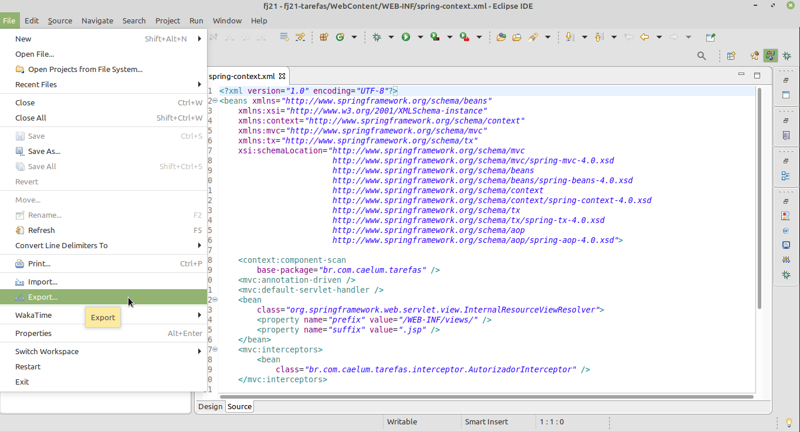
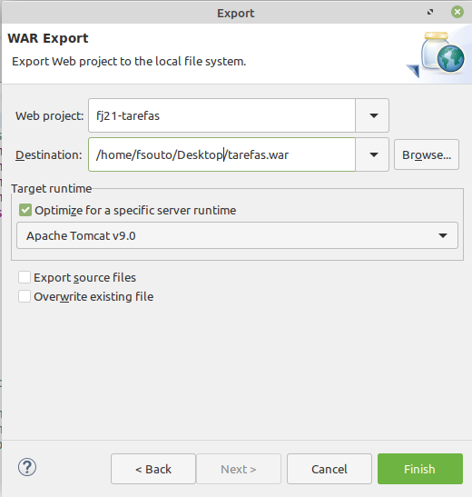
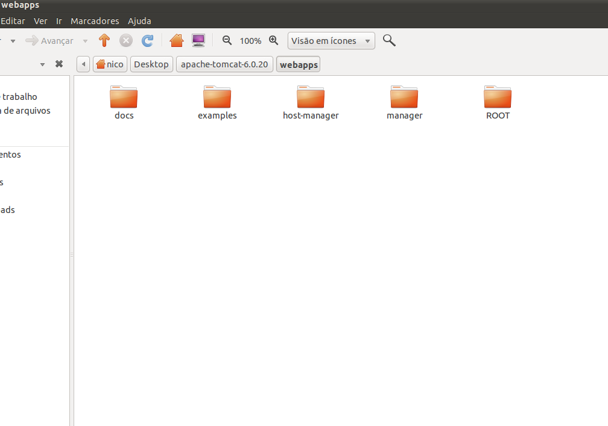
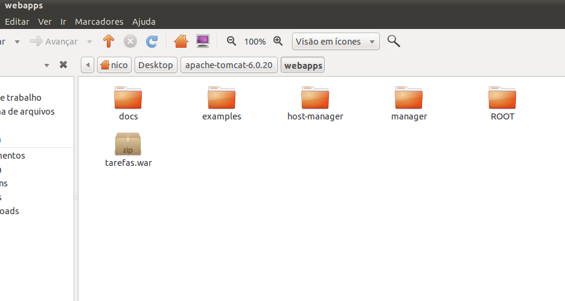

# Spring IoC e deploy da aplicação

_"Fazer troça da filosofia é, na verdade, filosofar" -- Blaise Pascal_

Nesse capítulo, você aprenderá:


* O que é um container de inversão de controller
* Como gerenciar qualquer objeto e injetar dependências com o Spring
* Implantar sua aplicação em qualquer container.


## Menos acoplamento com inversão de controle e injeção de dependências

Na nossa classe `TarefasController` usamos o `JdbcTarefaDao` para executar os métodos mais comuns
no banco de dados relacionado com a `Tarefa`. Em cada método do controller criamos um `JdbcTarefaDao`
para acessar o banco. Repare no código abaixo quantas vezes instanciamos o DAO na mesma classe:

``` java
  @Controller
  public class TarefasController {

    @RequestMapping("mostraTarefa")
    public String mostra(Long id, Model model) {
        JdbcTarefaDao dao = new JdbcTarefaDao();
        model.addAttribute("tarefa", dao.buscaPorId(id));
        return "tarefa/mostra";
    }

    @RequestMapping("listaTarefas")
    public String lista(Model model) {
        JdbcTarefaDao dao = new JdbcTarefaDao();
        model.addAttribute("tarefas", dao.lista());
        return "tarefa/lista";
    }

    @RequestMapping("adicionaTarefa")
    public String adiciona(@Valid Tarefa tarefa, BindingResult result) {

        if(result.hasFieldErrors("descricao")) {
            return "tarefa/formulario";
        }

        JdbcTarefaDao dao = new JdbcTarefaDao();
        dao.adiciona(tarefa);
        return "tarefa/adicionada";
    }

    //outros métodos remove, altera e finaliza também criam a JdbcTarefaDao
  }
```

A classe `TarefasController` instancia um objeto do tipo `JdbcTarefaDao` manualmente. Estamos
repetindo a criação do DAO em cada método. Podemos melhorar o código, criar o `JdbcTarefaDao`
no construtor da classe `TarefasController` e usar um atributo. Assim podemos apagar todas as
linhas de criação do DAO:

``` java
  @Controller
  public class TarefasController {

      private JdbcTarefaDao dao;

      public TarefasController() {
          this.dao = new JdbcTarefaDao();
      }

      @RequestMapping("mostraTarefa")
      public String mostra(Long id, Model model) {
          //dao já foi criado
          model.addAttribute("tarefa", dao.buscaPorId(id));
          return "tarefa/mostra";
      }

      @RequestMapping("listaTarefas")
      public String lista(Model model) {
          //dao já foi criado
          model.addAttribute("tarefas", dao.lista());
          return "tarefa/lista";
      }

    //outros métodos também aproveitam o atributo dao

  }
```

O nosso código melhorou, pois temos menos código para manter, mas há mais um problema. Repare que continuamos
responsáveis pela criação do DAO. A classe que faz uso deste DAO está intimamente ligada com a maneira
de instanciação do mesmo, fazendo com que ela mantenha um alto grau de **acoplamento**.


Dizemos que a classe `TarefasController` tem uma **dependência** com o `JdbcTarefaDao`. Vários métodos
dela dependem do `JdbcTarefaDao`. No código acima continuamos a dar `new`  diretamente na implementação
`JdbcTarefaDao` para usá-la. **Nossa aplicação cria a dependência, chamando diretamente a classe específica.**

O problema em gerenciar a dependência diretamente na aplicação fica evidente se analisamos a classe
`JdbcTarefaDao`. Se a classe precisar de um processo de construção mais complicado, precisaremos
nos preocupar com isso em todos os lugares onde criamos o `JdbcTarefaDao`.

Para entender isso vamos verificar o construtor do DAO:

``` java
  public class JdbcTarefaDao {

      private final Connection connection;

      public JdbcTarefaDao() {
          try {
              this.connection = new ConnectionFactory().getConnection();
          } catch (SQLException e) {
              throw new RuntimeException(e);
          }
      }
      //métodos omitidos
  }
```

Repare que aqui existe o mesmo problema. O DAO também resolve a sua dependência e cria através da
`ConnectionFactory`, a conexão. Estamos acoplados à classe `ConnectionFactory` enquanto apenas queremos uma
conexão. A classe está com a responsabilidade de procurar a dependência. Essa responsabilidade deve estar em
outro lugar. Para melhorar, vamos então declarar a dependência em um lugar natural que é o construtor.
O código fica muito mais simples e não precisa mais da `ConnectionFactory`:

``` java
  public class JdbcTarefaDao {

      private final Connection connection;

      public JdbcTarefaDao(Connection connection) {
          this.connection = connection;
      }

      //métodos omitidos
  }
```

Já com essa pequena mudança, não podemos criar o `JdbcTarefaDao` sem nos preocuparmos com a conexão antes.
Veja como ficaria o código da classe `TarefasController`:

``` java
  @Controller
  public class TarefasController {

      private JdbcTarefaDao dao;

      public TarefasController() {
          try {
              Connection connection = new ConnectionFactory().getConnection();
              this.dao = new JdbcTarefaDao(connection);
          } catch (SQLException e) {
              throw new RuntimeException(e);
          }
      }
      //métodos omitidos
  }
```

A classe `TarefasController` não só criará o DAO, como também a conexão. Já discutimos que não queremos
ser responsáveis, então vamos agir igual ao `JdbcTarefaDao` e declarar a dependência no construtor.
Novamente vai simplificar demais o nosso código:

``` java
  @Controller
  public class TarefasController {

      private JdbcTarefaDao dao;

      public TarefasController(JdbcTarefaDao dao) {
          this.dao = dao;  
      }

      //métodos omitidos
  }
```

Assim cada classe delega a dependência para cima e não se responsabiliza pela criação. Quem for usar essa
classe `TarefasController`, agora, vai precisar satisfazer as dependências. Mas quem no final se
preocupa com a criação do DAO e com a conexão?

## Container de Injeção de dependências

O padrão de projetos **Dependency Injection (DI)** (Injeção de dependências), procura resolver esses problemas.
A ideia é que a classe não mais resolva as suas dependências por conta própria mas apenas declara que
depende de alguma outra classe. E de alguma outra forma que não sabemos ainda, alguém resolverá essa
dependência para nós. Alguém pega o controle dos objetos que liga (ou amarra) as dependências. Não estamos
mais no controle, há algum container que gerencia as dependências e amarra tudo. Esse container já
existia e já usamos ele sem saber.

Repare que com `@Controller` já definimos que a nossa classe faz parte do Spring MVC, mas a anotação vai
além disso. Também definimos que queremos que o Spring controle o objeto. Spring é no fundo um container
que dá _new_ para nós e também sabe resolver e ligar as dependências. Por isso, o Spring também
é chamado **Container IoC** (_Inversion of Control_) ou **Container DI**.

Essas são as principais funcionalidades de qualquer container de inversão de controle/injeção de dependência.
O Spring é um dos vários outros containers disponíveis no mundo Java. Segue uma pequena lista com os
containers mais famosos:


* **Spring IoC** ou só **Spring** base de qualquer projeto Spring, popularizou DI e o desenvolvimento com POJOs
* **JBoss Seam 2** Container DI que se integra muito bem com JSF, principalmente na versão 1.2 do JSF
* **Guice** Container DI criado pelo Google que favoreceu configurações programáticas sem XML
* **CDI** Especificação que entrou com o Java EE 6, fortemente influenciado pelo JBoss Seam e Guice
* **Pico** Container muito leve e flexível, foi pioneiro nessa área
* **EJB 3** Container Java EE com um suporte limitado ao DI


## Container Spring IoC

O Spring Container sabe criar o objeto, mas também liga as dependências dele. Como o Spring está no controle,
ele administra todo o ciclo da vida. Para isso acontecer será preciso definir pelo menos duas configurações:


* declarar o objeto como componente
* ligar a dependência


Para receber o DAO em nosso controlador, usaremos a anotação **`@Autowired`** acima do construtor
(_wire_ - amarrar). Isso indica ao Spring que ele precisa resolver e _**injetar**_ a dependência:

``` java
  @Controller
  public class TarefasController {

      private JdbcTarefaDao dao;

      @Autowired
      public TarefasController(JdbcTarefaDao dao) {
          this.dao = dao;  
      }

      //métodos omitidos
  }
```

Para o Spring conseguir criar o `JdbcTarefaDao` vamos declarar a classe como componente.
Aqui o Spring possui a anotação **`@Repository`** que deve ser utilizada nas classes como o DAO.
Além disso, vamos também amarrar a conexão com `@Autowired`. Veja o código similar a classe
`TarefasController`:

``` java
  @Repository
  public class JdbcTarefaDao {

      private final Connection connection;

      @Autowired
      public JdbcTarefaDao(Connection connection) {
          this.connection = connection;
      }

      //métodos omitidos
  }
```

Ao usar `@Autowired` no construtor, o Spring tenta descobrir como abrir uma conexão,
mas claro que o Container não faz ideia com qual banco queremos nos conectar. Para
solucionar isso o Spring oferece uma configuração de XML que define um provedor de
conexões. No mundo JavaEE, este provedor é chamado **`DataSource`** e abstrai as
configurações de Driver, URL, etc da aplicação.

Sabendo disso, devemos declarar um `DataSource` no XML do Spring, dentro do
`spring-context.xml`:

``` xml
  <bean id="mysqlDataSource" class="org.apache.commons.dbcp2.BasicDataSource">
      <property name="driverClassName" value="com.mysql.jdbc.Driver"/>
      <property name="url" value="jdbc:mysql://localhost/fj21"/>
      <property name="username" value="root"/>
      <property name="password" value="<SENHA DO BANCO AQUI>"/>
  </bean>
```

Definimos um **bean** no XML. Um _bean_ é apenas um sinônimo para _componente_.
Ao final, cada _bean_ se torna um objeto administrado pelo Spring. Para o Spring Container,
a `mysqlDataSource`, o `JdbcTarefaDao` e `TarefasController` são todos componentes(ou _beans_)
que foram ligados/amarrados. Ou seja, um depende ao outro. O Spring vai criar todos e
administrar o ciclo da vida deles.

Com a `mysqlDataSource` definida, podemos injetar ela na `JdbcTarefaDao` para recuperar a conexão JDBC:


``` java
  @Repository
  public class JdbcTarefaDao {

      private final Connection connection;

      @Autowired
      public JdbcTarefaDao(DataSource dataSource) {
          try {
              this.connection = dataSource.getConnection();
          } catch (SQLException e) {
              throw new RuntimeException(e);
          }
      }

      //métodos omitidos
  }
```

Pronto! Repare que no nosso projeto o _controlador -- depende do --> dao que -- depende do --> datasource_.
O Spring vai primeiro criar a `mysqlDataSource`, depois o DAO e no final o controlador. Ele é o responsável
pela criação de toda a cadeia de dependências.

> **Spring IoC**
>
> Vimos apenas uma parte do poderoso framework Spring. A inversão de controle não só se limita a injeção
> de dependências, o Spring também sabe assumir outras preocupações comuns entre aplicações de negócios,
> como por exemplo, tratamento de transação ou segurança.
>
> Além disso, é comum integrar outros frameworks e bibliotecas com Spring. Não é raro encontrar projetos
> que usam controladores MVC como Struts ou JSF com Spring. O Spring é muito flexível e sabe gerenciar
> qualquer componente, seja ele  simples, como uma classe do nosso projeto, ou um framework sofisticado
> como o **Hibernate**. O treinamento FJ-27 mostra como aproveitar o melhor do Spring.


## Outras formas de injeção

Vimos como injetar uma dependência com Spring usando o construtor da classe junto com a anotação `@Autowired`.
O construtor é um **ponto de injeção** que deixa claro que essa dependência é obrigatória já que não há como instanciar o objeto sem passar pelo seu construtor.

Há outros pontos de injeção como, por exemplo, o _atributo_. Podemos usar a anotação `@Autowired` diretamente
no atributo. Assim o construtor não é mais necessário, por exemplo podemos injetar o `JdbcTarefaDao` na
classe `TarefasController`:

``` java
  @Controller
  public class TarefasController {

      @Autowired
      private JdbcTarefaDao dao;

      //sem construtor
  }
```

Outra forma é criar um método dedicado para dependência, normalmente é usado um _setter_
aplicando a anotação em cima do método:

``` java
  @Controller
  public class TarefasController {

      private JdbcTarefaDao dao;

      //sem construtor

      @Autowired
      public void setTarefaDao(JdbcTarefaDao dao) {
          this.dao = dao;
      }
  }
```

Há vantagens e desvantagens de cada forma, mas em geral devemos favorecer o construtor já que isso é o
lugar natural para a dependência. No entanto é importante conhecer os outros pontos de injeção pois alguns
frameworks/bibliotecas exigem o construtor sem parâmetro, obrigando o desenvolvedor usar o atributo ou método.
Como veremos no apêndice até mesmo o Spring precisa em alguns casos o construtor sem argumentos.

> **Para saber mais: @Inject**
>
> A injeção de dependência é um tópico bastante difundido na plataforma Java. Existem vários
> container com esse poder, tanto que isso é o padrão para a maioria dos projetos Java hoje em dia.
>
> CDI (Context e Dependency Injection, JSR-299) é a especificação que está se popularizando. O Spring só dá
> suporte limitado ao CDI mas aproveita as anotações padronizadas pela especificação JSR-330. Dessa maneira
> basta adicionar o JAR da especificação (`java.inject`) no classpath e assim podemos substituir a
> anotação `@Autowired` com `@Inject`:
>
> ``` java
> @Controller
> public class TarefasController {
>
> 	private JdbcTarefaDao dao;
>
> 	@Inject
> 	public TarefasController(JdbcTarefaDao dao) {
>         this.dao = dao;
>     }
>
>     //métodos omitidos
> }
> ```


## Exercícios: Inversão de controle com o Spring Container
1. Para configurar a `Datasource` é preciso copiar dois JARs.
  * Primeiro, vá ao Desktop, e entre no diretório **21/datasource**.

  * Haverá dois JARs:
    * `commons-dbcp2-2.7.x.jar`
    * `commons-pool2-2.8.x.jar`.

  * Copie-os (CTRL+C) e cole-os (CTRL+V) dentro de `workspace/fj21-tarefas/WebContent/WEB-INF/lib`

2. No arquivo `spring-context.xml` adicione a configuração da `Datasource`:

  (Dica: um exemplo dessa configuração encontra-se em `21/datasource/spring-context-confs.xml`)
``` xml
  <bean id="mysqlDataSource" class="org.apache.commons.dbcp2.BasicDataSource">
      <property name="driverClassName" value="com.mysql.jdbc.Driver"/>
      <property name="url" value="jdbc:mysql://localhost/fj21"/>
      <property name="username" value="root"/>
      <property name="password" value=""/>
  </bean>
```

  Repare que definimos as propriedades da conexão, igual a antiga classe `ConnectionFactory` e lembre-se que o usuário **root**  está configurado com a senha `""` (aspas vazias).
3. Vamos configurar a classe `JdbcTarefaDao` como componente (_Bean_) do Spring. Para isso, adicione
  a anotação `@Repository` em cima da classe:

``` java
  @Repository
  public class JdbcTarefaDao {
      ...
  }
```

  Use `Ctrl+Shift+O` para importar a anotação.
4. Além disso, altere o construtor da classe `JdbcTarefaDao`. Use a anotação `@Autowired`
  em cima do construtor e coloque a `DataSource` no construtor. Através dela
  obteremos uma nova conexão. A classe `DataSource` vem do package `javax.sql`.

  Altere o construtor da classe `JdbcTarefaDao`:
``` java
  @Autowired
  public JdbcTarefaDao(DataSource dataSource) {
      try {
          this.connection = dataSource.getConnection();
      } catch (SQLException e) {
          throw new RuntimeException(e);
      }
  }
```

  Ao alterar o construtor vão aparecer erros de compilação na classe `TarefasController`.
1. Abra a classe `TarefaController`. Nela vamos criar um atributo para a `JdbcTarefaDao`
  e gerar o construtor que recebe o DAO, novamente usando a anotação `@Autowired`:
``` java
  @Controller
  public class TarefasController {

      private final JdbcTarefaDao dao;

      @Autowired
      public TarefasController(JdbcTarefaDao dao) {
          this.dao = dao;  
      }
  }  
```

1. Altere todos os métodos que criam uma instância da classe `JdbcTarefaDao`. São justamente esse
  métodos que possuem erros de compilação.

  Remova todas as linhas como:

``` java
  JdbcTarefaDao dao = new JdbcTarefaDao();
```

  Por exemplo, o método para listar as tarefas fica como:

``` java
  @RequestMapping("listaTarefas")
  public String lista(Model model) {
      model.addAttribute("tarefas", dao.lista());
      return "tarefa/lista";
  }
```

  Arrume os outros erros de compilação, apague todas as linhas que instanciam a classe `JdbcTarefaDao`.
1. Reinicie o Tomcat e acesse a aplicação. Tudo deve continuar funcionando.
1. (opcional) A classe `ConnectionFactory` ainda é necessária?


## Aprimorando o visual através de CSS


Melhoramos gradativamente a nossa aplicação modificando classes e utilizando frameworks, tudo no
lado do servidor, mas o que o usuário final enxerga é o HTML gerado que é exibido em seu navegador.
Utilizamos algumas tags para estruturar as informações, mas nossa apresentação ainda deixa a desejar.
Não há atrativo estético.

Para aprimorar o visual, vamos aplicar **CSS** nas nossas páginas. _CSS_ é um acrônimo para
_Cascading Style Sheets_, que podemos traduzir para **Folhas de Estilo em Cascata**. Os estilos
definem o layout, por exemplo, a cor, o tamanho, o posicionamento e são declarados para um determinado
elemento HTML. O _CSS_ altera as propriedades visuais daquele elemento e, por cascata, todos os seus
elementos filhos. Em geral, o HTML é usado para estruturar conteúdos da página
(tabelas, parágrafos, div etc) e o CSS formata e define a aparência.

### Sintaxe e inclusão de CSS

A sintaxe do CSS tem uma estrutura simples: é uma declaração de propriedades e valores separados por
um sinal de dois pontos(:), e cada propriedade é separada por um sinal de ponto e vírgula(;),
da seguinte maneira:

``` css
  background-color: yellow;
  color: blue;
```

Como estamos declarando as propriedades visuais de um elemento em outro lugar do nosso documento,
precisamos indicar de alguma maneira a qual elemento nos referimos. Fazemos isso utilizando
um **seletor CSS**.

No exemplo a seguir, usaremos o seletor `p`, que alterará todos os parágrafos do documento:

```
  p {
    color: blue;
    background-color: yellow;
  }
```

### Declaração no arquivo externo

Existem várias lugares que podemos declarar os estilos, mas o mais comum é usar um arquivo externo,
com a extensão `.css`. Para que seja possível declarar nosso CSS em um arquivo à parte,
precisamos indicar em nosso documento HTML uma ligação entre ele e a folha de estilo.

A indicação de uso de uma folha de estilos externa deve ser feita dentro da tag `<head>`
do nosso documento HTML:

``` html
  <!DOCTYPE html>
  <html>
    <head>
      <link type="text/css" rel="stylesheet" href="tarefas.css">
    </head>
    <body>
      <p>
        O conteúdo desta tag será exibido em azul com fundo amarelo!
      </p>

    </body>
  </html>
```

E dentro do arquivo `tarefas.css`:

``` css
  p {
    color: blue;
    background-color: yellow;
  }
```

> **Programação Front-end**
>
> A preocupação com a organização do código não é exclusiva do programador back-end,
> isto é, aquele que processa seu código no servidor.
>
> Há também o programador front-end, aquele responsável pelo código que roda no
> navegador do cliente, que também deve se preocupar com a organização de seu código,
> inclusive com a apresentação através de CSS e de um HTML bem estruturado.
>
> A Caelum oferece os treinamentos WD-43 e WD-47 para quem quer dominar as melhores
> técnicas de desenvolvimento Web com semântica perfeita, estilos CSS poderosos e
> JavaScripts corretos e funcionais.


## Exercícios opcionais: Aplicando CSS nas páginas
1. No seu projeto, crie uma nova pasta **css** dentro da pasta `WebContent/resources`.

1. Vá ao Desktop e entre no diretório **21/projeto-tarefas/css**. Copie o arquivo **tarefas.css** (`CTRL+C`)
  para a pasta `WebContent/resources/css` (`CTRL+V`).

1. Abra a página `formulario-login.jsp` que está dentro da pasta `WebContent/WEB-INF/views`.

1. Na página JSP, adicione um cabeçalho(`<head></head>`) com o link para o arquivo CSS. Adicione o cabeçalho
  entre da tag `<html>` e `<body>`:

``` html
  <head>
    <link type="text/css" href="resources/css/tarefas.css" rel="stylesheet" />
  </head>
```
  Através do link definimos o caminho para o arquivo CSS.

  Cuidado: _Na página deve existir apenas um cabeçalho_ (`<head></head>`).

5. Reinicie o Tomcat e chama a página de login:

  http://localhost:8080/fj21-tarefas/loginForm

  A página já deve aparecer com um visual novo.

1. Aplique o mesmo arquivo CSS em todas as outras páginas. Tenha cuidado para não repetir o cabeçalho, algumas
  páginas já possuem a tag `<head>`, outras não.

  Verifique o resultado na aplicação.

  


## Deploy do projeto em outros ambientes

Geralmente, ao desenvolvermos uma aplicação Web, possuímos um ambiente de desenvolvimento com um servidor
que está em nossas máquinas locais. Depois que o desenvolvimento está finalizado e nossa aplicação está
pronta para ir ao ar, precisamos enviá-la para um ambiente que costumamos chamar de **ambiente de
produção**. Esse processo de disponibilizarmos nosso projeto em um determinado ambiente é o que chamamos
de **deploy** (implantação).

O servidor de produção é o local no qual o projeto estará hospedado e se tornará acessível para os usuários
finais.

Mas como fazemos para enviar nosso projeto que está em nossas máquinas locais para um servidor externo?


O processo padrão de deploy de uma aplicação web em Java é o de criar um arquivo com extensão `.war`,
que nada mais é que um arquivo `zip` com o diretório base da aplicação sendo a raiz do zip.

No nosso exemplo, todo o conteúdo do diretório WebContent pode ser incluído em um arquivo `tarefas.war`.
Após compactar o diretório, efetuaremos o _deploy_.

No Tomcat, basta copiar o arquivo .war no diretório **TOMCAT/webapps/**. Ele será descompactado pelo container
e um novo contexto chamado **tarefas** estará disponível. Repare que o novo contexto gerado pelo Tomcat adota
o mesmo nome que o seu arquivo `.war`, ou seja, nosso arquivo chamava-se `tarefas.war` e o contexto se chama
`tarefas`.

Ao colocarmos o `war` no Tomcat, podemos acessar nossa aplicação pelo navegador através do endereço:
`http://localhost:8080/tarefas/loginForm`


## Exercícios: Deploy com war

1. Vamos praticar criando um `war` e utilizando-o, mas, antes de começarmos, certifique-se
  de que o Tomcat esteja no ar.

  * Clique com o botão direito no projeto e vá em Export
  

  * Digite na busca **war file**

  * Clique no botão Browse e escolha a pasta do seu usuário e o nome **tarefas.war**.
  

  * Clique em Finish

  Pronto, nosso war está criado!
2. Vamos instalar nosso war!

  * Abra o File Browser

  * Clique da direita no arquivo `tarefas.war` e escolha **Cut**(Recortar).

  * Vá para o diretório **apache-tomcat**, Certifique-se de que seu Tomcat esteja rodando, para isso acesse o diretório **bin/** do tomcat via terminal e execute o script `startup.sh`.

  * Acesse o diretório **webapps**.
  

  * Cole o seu arquivo aqui: (**Edit** -> **Paste**). Repare que o diretório `tarefas` foi
  criado.
  

  * Podemos acessar o projeto através da URL:
  http://localhost:8080/tarefas/loginForm


## Discussão em aula: lidando com diferentes nomes de contexto

